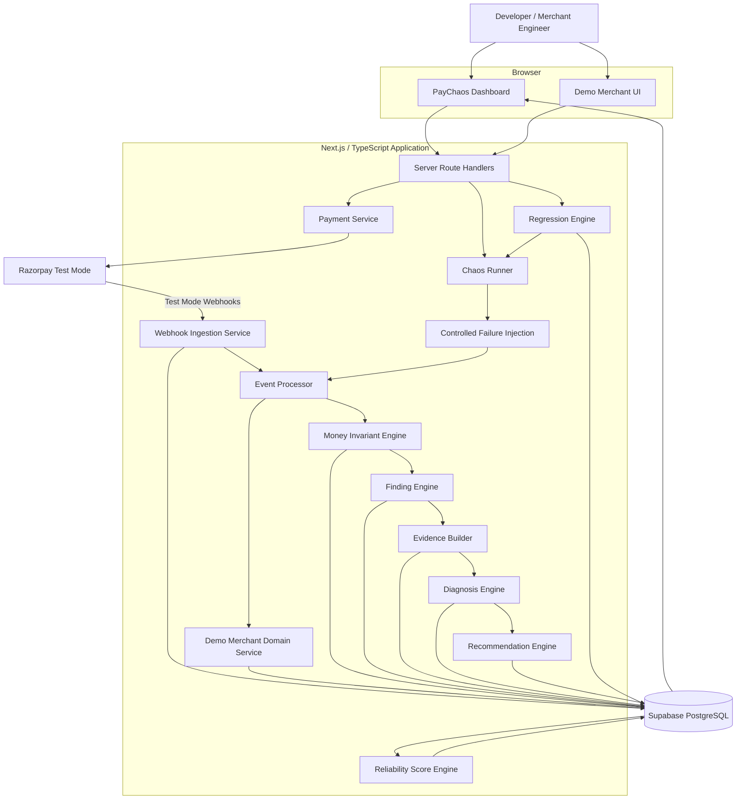
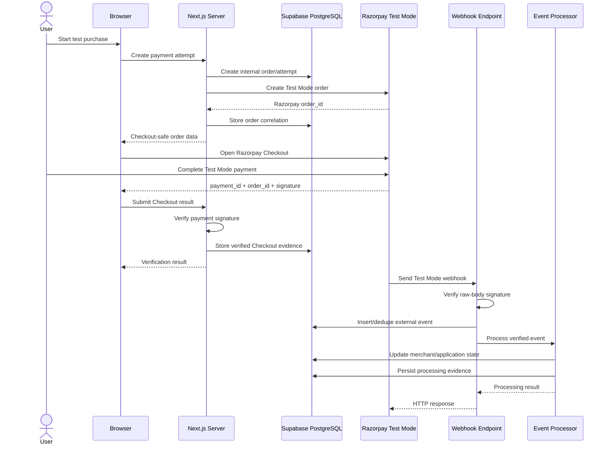
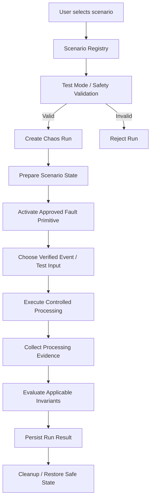
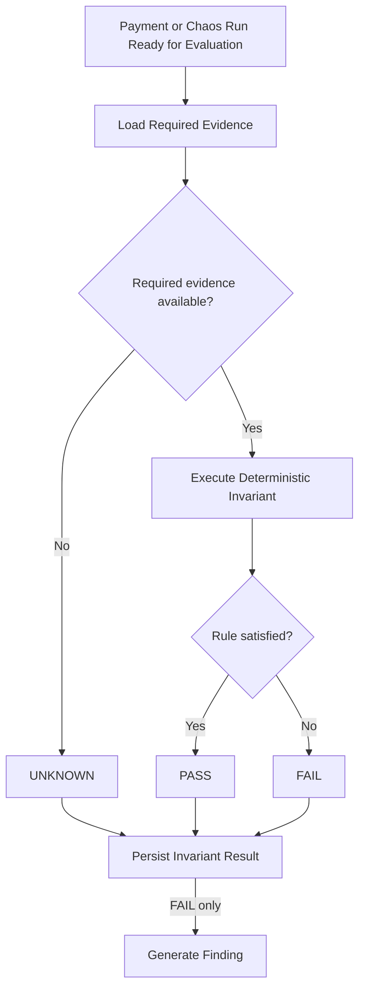
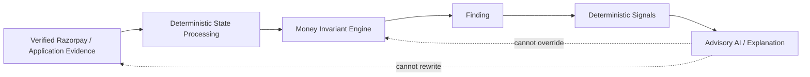
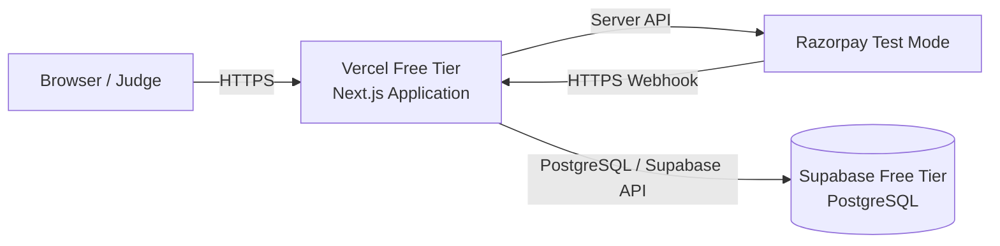
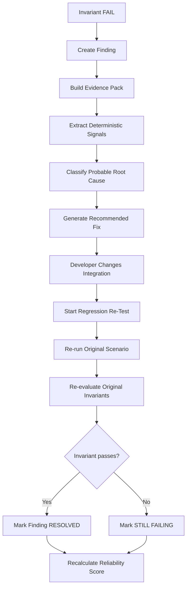

# PayChaos AI — Technical Architecture

**Project:** PayChaos AI — Autonomous Payment Reliability Engineer  
**Purpose:** Razorpay AI Buildathon — Open Track  
**Architecture Status:** Source-of-truth architecture specification  
**Primary Runtime Architecture:** Next.js + TypeScript + Supabase PostgreSQL + Razorpay Test Mode  
**Runtime Cost Target:** ₹0  
**Development Constraint:** Approximately one week

---

# 1. Architecture Goals

The PayChaos AI architecture must make it possible to build a complete, reliable P0 implementation within approximately one week without introducing unnecessary infrastructure.

The architecture has the following goals.

## 1.1 Correct Payment-State Reasoning

PayChaos must clearly distinguish:

- Razorpay payment state;
- PayChaos application state;
- Demo Merchant business state;
- received event state;
- expected state;
- observed state.

No single UI callback, webhook, database row, or AI-generated explanation should automatically be treated as complete payment truth.

---

## 1.2 Deterministic Reliability Evaluation

Payment and money correctness must be determined by deterministic rules.

The Money Invariant Engine is authoritative for invariant evaluation.

AI-generated output is advisory only.

---

## 1.3 Evidence-First Diagnosis

Every finding must be explainable from stored evidence.

The system should be able to answer:

- what happened;
- when it happened;
- which payment was involved;
- which event was involved;
- what state was expected;
- what state was observed;
- which invariant failed;
- why a diagnosis was produced.

---

## 1.4 Safe Controlled Chaos

Chaos testing must operate only on the PayChaos-controlled Demo Merchant and Razorpay Test Mode integration.

PayChaos must not become a general-purpose chaos tool.

It must not accept arbitrary internet targets.

---

## 1.5 Clear Separation of Real and Simulated Behavior

The architecture must preserve the distinction between:

1. real Razorpay Test Mode events;
2. duplicate real Razorpay webhook deliveries;
3. PayChaos replay of previously verified events;
4. PayChaos-controlled simulations;
5. automated-test fixtures.

A replay must never be presented as proof that Razorpay actually delivered the event again.

---

## 1.6 Idempotency by Design

The system must safely handle repeated requests and repeated events.

Duplicate delivery must not automatically cause duplicate merchant-side effects.

---

## 1.7 One-Week Implementability

P0 must avoid:

- microservices;
- message brokers;
- Kubernetes;
- separate orchestration infrastructure;
- distributed worker fleets;
- paid queues;
- runtime agent frameworks;
- large ML systems.

The system should primarily be one Next.js application backed by one PostgreSQL database.

---

## 1.8 ₹0 Runtime Target

P0 should run using:

- Vercel free tier;
- Supabase free tier;
- Razorpay Test Mode;
- GitHub;
- local developer tooling.

No paid AI API is required.

---

# 2. Architecture Principles

The following principles govern every architectural decision.

## Principle 1 — Correctness Over Cleverness

Simple deterministic logic is preferred over impressive but difficult-to-verify automation.

---

## Principle 2 — Evidence Over Assumption

If evidence is insufficient, the system should report:

```text
UNKNOWN
```

rather than infer payment correctness.

---

## Principle 3 — One Application Before Multiple Services

The default architecture is a modular Next.js monolith.

Modules should be separated logically inside the repository but should not be deployed as separate services unless a confirmed requirement later makes that necessary.

---

## Principle 4 — PostgreSQL Is the Durable System Record

Supabase PostgreSQL is responsible for durable PayChaos state.

Important reliability results must not exist only:

- in browser memory;
- in temporary logs;
- inside an AI conversation;
- inside a serverless function's memory.

---

## Principle 5 — External Events Are Immutable Evidence

Once an authentic Razorpay webhook is recorded, its original evidence must not be silently rewritten.

Derived state may change.

The original event evidence should remain traceable.

---

## Principle 6 — Processing Is Separate From Event Identity

A single real event may have:

- multiple HTTP delivery attempts;
- multiple processing attempts;
- one or more controlled PayChaos replay attempts.

These concepts must not be collapsed into one indistinguishable record.

---

## Principle 7 — Business Effects Must Also Be Idempotent

Webhook deduplication alone is insufficient.

Different events may refer to the same payment or business transition.

The Demo Merchant must also prevent duplicate business effects such as duplicate fulfilment.

---

## Principle 8 — Chaos Uses Explicit Fault Primitives

Chaos scenarios must be constructed from predefined safe primitives.

There must be no arbitrary script execution or arbitrary HTTP targeting.

---

## Principle 9 — Deterministic Core, Advisory Intelligence

The processing order is:

```text
Verified Evidence
      ↓
Deterministic State
      ↓
Deterministic Invariants
      ↓
Findings
      ↓
Deterministic Signals
      ↓
Diagnosis / Explanation
```

AI never appears before authoritative correctness evaluation.

---

## Principle 10 — Fail Closed on Security Boundaries

Invalid signatures, live credentials, unsupported chaos targets, malformed critical input, or unavailable authoritative evidence must not silently proceed.

---

# 3. Complete System Overview

PayChaos AI is implemented as a modular web application.

The primary runtime consists of:

```text
Browser
   │
   ▼
Next.js Application
   │
   ├── Demo Merchant UI
   ├── Reliability Dashboard
   ├── Server Route Handlers
   ├── Payment Services
   ├── Webhook Services
   ├── Event Processor
   ├── Chaos Runner
   ├── Invariant Engine
   ├── Finding Engine
   ├── Diagnosis Engine
   ├── Recommendation Engine
   ├── Regression Engine
   └── Reliability Scoring Engine
           │
           ├──────────────► Razorpay Test Mode
           │
           └──────────────► Supabase PostgreSQL
```

Razorpay communicates directly with the public PayChaos webhook endpoint.

Supabase PostgreSQL stores the durable payment, event, chaos, finding, regression and reliability records.

No separate runtime Python service is required for P0.

---

# Diagram A — High-Level System Architecture



The boxes in the Next.js application represent logical modules.

They are **not separate microservices**.

---

# 4. Major Components

The P0 architecture contains the following major components:

1. PayChaos Dashboard
2. Demo Merchant
3. Next.js Server/API Layer
4. Razorpay Integration Adapter
5. Checkout Verification Service
6. Webhook Ingestion Service
7. Event Normalization Layer
8. Event Processing Layer
9. Demo Merchant Domain Processor
10. Event Evidence Store
11. Chaos Scenario Registry
12. Chaos Runner
13. Failure Injection Layer
14. Money Invariant Engine
15. Finding Engine
16. Evidence Builder
17. Root-Cause Diagnosis Engine
18. Recommended-Fix Engine
19. Regression Engine
20. Reliability Score Engine
21. Go-Live Readiness Engine
22. Supabase PostgreSQL
23. Observability/Audit Layer
24. Optional AI/ML Layer

---

# 5. Responsibility of Every Component

## 5.1 PayChaos Dashboard

Responsible for presenting:

- reliability overview;
- chaos scenarios;
- chaos runs;
- payment history;
- findings;
- evidence timelines;
- invariant results;
- diagnoses;
- recommendations;
- regression status;
- reliability score;
- Go-Live Readiness.

The dashboard does not determine authoritative payment state.

---

## 5.2 Demo Merchant

Responsible for providing a small controlled merchant workflow.

It owns:

- merchant order state;
- business-side payment state;
- controlled fulfilment state;
- intentional fault hooks used by chaos scenarios.

It is not a full ecommerce platform.

---

## 5.3 Next.js Server/API Layer

Responsible for:

- trusted server-side operations;
- validating API input;
- calling Razorpay APIs;
- protecting secrets;
- writing authoritative application data;
- starting chaos runs;
- running regressions;
- querying dashboard information.

Browser code must not directly receive server secrets.

---

## 5.4 Razorpay Integration Adapter

Responsible for all direct Razorpay Test Mode API interaction.

It isolates Razorpay-specific SDK/API behavior from the rest of the application.

Responsibilities include:

- creating Test Mode orders;
- fetching payment/order state where reconciliation requires it;
- verifying configuration;
- preventing Live Mode use.

---

## 5.5 Checkout Verification Service

Responsible for verifying successful Razorpay Checkout responses server-side before they are treated as authenticated Checkout evidence.

Checkout success data must not be trusted merely because it came from browser JavaScript.

Razorpay's current Standard Checkout documentation requires successful payment signatures to be verified on the server using the internally known order ID, payment ID and secret.

---

## 5.6 Webhook Ingestion Service

Responsible for:

- receiving incoming Razorpay webhook HTTP requests;
- obtaining the raw request body;
- validating the webhook signature;
- reading the Razorpay event identifier;
- safely persisting the event;
- detecting duplicate deliveries;
- handing verified events to the internal processor.

---

## 5.7 Event Normalization Layer

Responsible for translating supported external Razorpay events into a small internal event model.

The rest of PayChaos should not repeatedly depend on the full raw Razorpay payload structure.

Raw evidence remains preserved separately.

---

## 5.8 Event Processor

Responsible for processing normalized events through controlled merchant logic.

All real, replayed and simulated processing should enter through a common internal processing boundary.

This is the primary point where chaos controls can operate safely.

---

## 5.9 Demo Merchant Domain Processor

Responsible for business-side effects such as:

- updating merchant order state;
- recording successful fulfilment;
- preventing duplicate fulfilment;
- maintaining legal business-state transitions.

The merchant processor must not rely on browser callbacks alone.

---

## 5.10 Chaos Scenario Registry

A static, code-defined catalogue describing allowed scenarios.

Each scenario defines:

- stable ID;
- name;
- permitted fault primitive;
- prerequisites;
- expected behavior;
- applicable invariants.

The user cannot define arbitrary executable scenarios in P0.

---

## 5.11 Chaos Runner

Responsible for executing one allowed scenario against the controlled Demo Merchant.

It creates a traceable chaos run and coordinates:

- setup;
- fault activation;
- event delivery/replay;
- invariant evaluation;
- cleanup/reset;
- result persistence.

---

## 5.12 Failure Injection Layer

Responsible for safe controlled fault behavior.

Examples include:

- duplicate internal delivery;
- delayed processing;
- controlled processing order;
- one-time transient processor failure;
- intentional controlled bypass of a Demo Merchant protection where a scenario specifically demonstrates that failure class.

Fault injection occurs inside PayChaos.

It does not modify Razorpay infrastructure.

---

## 5.13 Money Invariant Engine

Responsible for deterministic evaluation of reliability rules.

Results:

```text
PASS
FAIL
UNKNOWN
```

The invariant engine is authoritative for those results.

---

## 5.14 Finding Engine

Responsible for creating a structured reliability issue when an invariant fails.

It does not independently invent failures.

A P0 finding should originate from a deterministic invariant result.

---

## 5.15 Evidence Builder

Responsible for assembling the minimum relevant evidence explaining the finding.

---

## 5.16 Diagnosis Engine

Responsible for mapping deterministic failure signals to probable root-cause categories.

It is advisory.

---

## 5.17 Recommendation Engine

Responsible for mapping diagnosis categories and failed invariants to actionable engineering recommendations.

---

## 5.18 Regression Engine

Responsible for rerunning a relevant scenario after a fix and connecting the new result with the previous finding.

---

## 5.19 Reliability Score Engine

Responsible for calculating an explainable deterministic score from persisted test outcomes.

---

## 5.20 Go-Live Readiness Engine

Responsible for mapping calculated reliability results into a human-readable readiness classification.

It does not provide official Razorpay certification.

---

## 5.21 Supabase PostgreSQL

Responsible for durable state, evidence and relational integrity.

---

## 5.22 Optional AI/ML Layer

Responsible only for non-authoritative explanation or analysis after deterministic evidence exists.

P0 must function without it.

---

# 6. Complete End-to-End Request/Event Flow

The normal system lifecycle is:

```text
1. User opens Demo Merchant
2. Browser requests new merchant order/payment attempt
3. Next.js server validates request
4. Server creates internal records
5. Server creates Razorpay Test Mode Order
6. Internal records store Razorpay Order ID
7. Browser opens Razorpay Checkout
8. User completes Test Mode payment
9. Checkout returns payment identifiers/signature
10. Browser sends result to server
11. Server verifies Checkout signature
12. Server stores verified Checkout evidence
13. Razorpay independently sends webhook
14. Webhook endpoint verifies webhook signature
15. Event identity is deduplicated
16. Authentic event evidence is stored
17. Supported event is normalized
18. Event processor applies merchant behavior
19. Resulting merchant/application state is persisted
20. Relevant invariants are evaluated
21. Results are persisted
22. Failure creates finding
23. Evidence is assembled
24. Deterministic diagnosis signals are evaluated
25. Diagnosis and recommended fix are stored
26. User may rerun scenario
27. Regression result is linked to finding
28. Reliability score is recalculated
29. Dashboard renders latest evidence-backed state
```

Checkout and webhook paths are independent evidence channels.

The system must tolerate either arriving before the other.

---

# 7. Demo Merchant Architecture

The Demo Merchant exists inside the same Next.js application.

It should contain only the minimum business model needed to demonstrate payment correctness.

A conceptual Demo Merchant entity may include:

```text
Merchant Order
├── internal order ID
├── expected amount
├── currency
├── business status
├── payment status
└── fulfilment status
```

The exact database schema is defined separately.

## Demo Merchant Responsibilities

The merchant must make it possible to demonstrate:

- unpaid versus paid state;
- fulfilment count or fulfilment status;
- amount expectation;
- payment-to-order correlation;
- legal state transitions.

## Business Effect Boundary

A successful payment may result in a merchant business effect such as:

```text
FULFIL_ORDER
```

This action must be represented separately enough that PayChaos can determine whether it occurred:

```text
0 times
1 time
more than 1 time
```

This is critical for duplicate-processing invariants.

## Controlled Fault Hooks

The Demo Merchant may contain explicitly named test-only fault switches used by the Chaos Runner.

These fault hooks must:

- be disabled by default;
- be unavailable outside controlled chaos execution;
- be recorded as part of a chaos run;
- never be confused with actual Razorpay failure behavior.

---

# 8. Razorpay Test Mode Integration Architecture

All Razorpay interaction uses Test Mode.

The Razorpay adapter runs server-side.

## Server-Side Responsibilities

The server owns:

- Razorpay Key Secret;
- Orders API calls;
- Checkout signature verification;
- optional payment/order reconciliation calls;
- Test Mode configuration validation.

## Browser Responsibilities

The browser may receive only information required for Checkout, such as the public Test Mode Key ID and server-created order details.

The browser never receives:

- Razorpay Key Secret;
- webhook secret;
- privileged Supabase credentials.

## Environment Validation

At application startup or first Razorpay operation, the configuration layer must validate that the configured Razorpay Key ID represents Test Mode.

Razorpay currently distinguishes Test Mode keys using the `rzp_test_` prefix and Live Mode keys using `rzp_live_`. PayChaos must reject a Live Mode key rather than silently accepting it.

This prefix check is a safety control, not the only security control.

---

# 9. Razorpay Checkout Flow

# Diagram B — Payment + Webhook Flow



## Important Rule

The Checkout success callback is not the only source of payment lifecycle information.

Webhook processing and optional server-side reconciliation exist independently.

The application must not fulfil solely because the browser says a payment succeeded.

---

# 10. Webhook Ingestion Architecture

The webhook endpoint is a dedicated public server endpoint.

Conceptually:

```text
Razorpay Test Mode
       ↓
Public Webhook Route
       ↓
Raw Body Capture
       ↓
Signature Verification
       ↓
External Event Identity
       ↓
Durable Event Record
       ↓
Normalized Event
       ↓
Event Processor
```

The endpoint should perform only bounded P0 work.

No long-running analytics or AI processing belongs in webhook ingestion.

## P0 Processing Strategy

P0 does not introduce a message broker.

Webhook processing should remain small enough to execute safely during the server request. The deployed normal webhook path must be measured against Razorpay's current response deadline documented in `RAZORPAY_GUIDE.md`; for the frozen P0 contract this means completing the critical durable request path and returning the HTTP response within 5 seconds.

The webhook request path must not run diagnosis, AI/ML, Reliability Score calculation, report generation or other non-critical analytics.

This bounded synchronous design is a **Razorpay Test Mode buildathon simplification for P0**. PayChaos must not present it as a general production-scale webhook architecture recommendation.

If real Phase 2 testing shows the critical durable processing path cannot reliably stay within the documented webhook timing requirement, Phase 2 must stop and record an architecture decision before adding a durable asynchronous mechanism. Do not silently add a queue and do not falsely approve the synchronous path.

---

# 11. Webhook Signature Verification Flow

Razorpay webhook authentication must occur before the payload is trusted.

Razorpay currently signs webhook payloads using HMAC-SHA256 with the webhook secret and the **raw request body**. The raw body must not be parsed and reserialized before signature verification.

The conceptual verification flow is:

```text
Incoming HTTP Request
        ↓
Capture raw request body
        ↓
Read X-Razorpay-Signature
        ↓
Load server-side webhook secret
        ↓
Calculate/verify HMAC
        ↓
┌──────────────────────┐
│ Signature valid?     │
└──────────────────────┘
       │        │
      No       Yes
       │        │
       ▼        ▼
 Reject     Parse JSON
 Request        ↓
           Store Event
```

## Invalid Signatures

Invalid signatures must:

- not update payment state;
- not trigger merchant effects;
- not become verified Razorpay evidence;
- not enter chaos replay as trusted source evidence.

They may be safely logged as rejected security events without storing sensitive payload content unnecessarily.

---

# 12. Webhook Idempotency / Deduplication Architecture

Razorpay can deliver the same webhook more than once, so duplicate handling is mandatory. Razorpay documents `x-razorpay-event-id` as the unique identifier used to identify duplicate webhook events, and webhook consumers must not assume events always arrive in chronological order.

PayChaos uses two distinct idempotency layers.

## Layer 1 — Transport/Event Deduplication

Purpose:

Prevent the same external webhook event from being treated as a new logical event every time Razorpay delivers it.

Conceptual key:

```text
razorpay_event_id
```

Database uniqueness should enforce this where the final schema permits.

The architecture must not rely only on:

```text
SELECT then INSERT
```

because concurrent duplicate deliveries can race.

A database constraint or atomic equivalent must enforce uniqueness.

---

## Layer 2 — Business-Effect Idempotency

Purpose:

Prevent multiple different events or repeated processing attempts from causing the same business action multiple times.

Example:

```text
Payment A
   ├── payment.captured
   └── order.paid

Both must not produce:

FULFIL_ORDER twice
```

The merchant domain layer therefore needs a deterministic idempotency boundary for business effects.

---

## Duplicate Processing State

A previously known webhook may be in states conceptually similar to:

```text
RECEIVED
PROCESSING
PROCESSED
FAILED
```

Exact persisted values are defined by the data model.

A duplicate delivery should not simply disappear without trace.

PayChaos should be able to record that a duplicate delivery occurred while ensuring the corresponding business effect remains idempotent.

---

# 13. Webhook Event Storage

Webhook storage has two responsibilities:

1. preserve external evidence;
2. support deterministic processing.

## Immutable Source Evidence

For a real Razorpay webhook, persist enough information to prove:

- event identifier;
- event type;
- received timestamp;
- signature-verification status;
- relevant Razorpay object identifiers;
- redacted payload/evidence;
- processing status.

The stored representation must not include secrets.

## Raw Evidence

Where the exact payload is retained for buildathon evidence, it must be treated as external event evidence and protected from accidental mutation.

Sensitive or unnecessary fields should be redacted according to the security specification.

## Normalized Representation

A separate normalized model should expose the small set of fields PayChaos actually needs.

Conceptually:

```text
NormalizedPaymentEvent
├── internal event ID
├── source kind
├── external event ID
├── event type
├── Razorpay order ID
├── Razorpay payment ID
├── amount
├── currency
├── payment state
├── event timestamp
└── received timestamp
```

The final field definitions belong in the database/data-model source of truth.

---

# 14. Controlled Event Replay Architecture

Controlled replay is central to PayChaos but must not be confused with genuine Razorpay delivery.

## Rule

PayChaos never forges a webhook and then labels it:

```text
REAL_RAZORPAY_WEBHOOK
```

A replay instead references an already recorded event.

Conceptually:

```text
Verified Razorpay Event
        │
        ├── immutable original evidence
        │
        ▼
Create Replay Delivery
        │
        ├── source = PAYCHAOS_REPLAY
        ├── references original event
        └── same logical payment/event identity
        │
        ▼
Internal Event Processor
```

## Event Source Classification

Every event-processing attempt must be classifiable as one of:

```text
REAL_RAZORPAY_WEBHOOK
PAYCHAOS_REPLAY
PAYCHAOS_SIMULATION
TEST_FIXTURE
```

Checkout evidence may be represented separately as:

```text
VERIFIED_CHECKOUT_RESULT
```

if required by the final data model.

## Replay Trust Rule

A replay of a verified event proves:

> PayChaos reprocessed a copy of previously verified Razorpay Test Mode evidence.

It does **not** prove:

> Razorpay delivered the webhook twice.

If Razorpay actually delivers the webhook twice, that fact is recorded independently as duplicate external delivery evidence.

---

# 15. Chaos Runner Architecture

The Chaos Runner orchestrates controlled tests.

It does not dynamically execute user-provided code.

# Diagram C — Chaos Execution Flow



## Scenario Registry

P0 scenarios must be predefined.

The registry must not accept:

- arbitrary URLs;
- arbitrary JavaScript;
- shell commands;
- arbitrary SQL;
- arbitrary API destinations.

## Chaos Run Identity

Every execution gets a unique internal chaos run ID.

All relevant evidence must be linkable to that run.

---

# 16. Failure Injection Architecture

Failure injection occurs at controlled application boundaries.

The preferred P0 injection point is:

```text
Verified / Approved Event
        ↓
Event Processor Boundary
        ↓
Demo Merchant Processing
```

This gives PayChaos deterministic control without attempting to interfere with Razorpay's infrastructure.

## Approved Fault Primitive Categories

The architecture may support a small subset of:

### Duplicate Delivery

Deliver the same logical event to the internal processor multiple times.

---

### Delayed Processing

Hold an approved internal event-processing action and release it later.

P0 should not require a permanent worker.

A delayed scenario may use an explicit persisted hold/release state or user-driven release rather than a long-running process.

---

### Controlled Alternative Ordering

Process multiple recorded/controlled events in a chosen order.

This tests merchant assumptions about ordering.

---

### One-Time Transient Failure

Cause a known internal processing step to fail once and allow a retry.

---

### Controlled Merchant Fault Profile

Temporarily enable a predefined faulty behavior in the Demo Merchant for educational/demo purposes.

Example:

```text
IDEMPOTENCY_GUARD_DISABLED
```

This must be clearly labeled:

**PayChaos-controlled faulty merchant behavior**

and must never be described as a fault caused by Razorpay.

## Safety

Fault injection must never:

- call arbitrary targets;
- alter live Razorpay configuration;
- use Live Mode credentials;
- run arbitrary user code;
- attack external systems.

---

# 17. Money Invariant Engine Architecture

The Money Invariant Engine is implemented as deterministic TypeScript domain logic.

It should be designed primarily as pure functions operating over explicitly assembled evidence.

Conceptually:

```text
InvariantDefinition
        +
EvidenceSnapshot
        ↓
InvariantEvaluator
        ↓
PASS | FAIL | UNKNOWN
        +
Reason
        +
Evidence References
```

# Diagram D — Money Invariant Evaluation Flow



## Invariant Definition

Each invariant must contain:

- stable invariant ID;
- required evidence;
- deterministic rule;
- PASS condition;
- FAIL condition;
- UNKNOWN condition;
- severity;
- human-readable description.

## Important Rule

The invariant engine must not call an LLM to decide PASS or FAIL.

---

# 18. Finding Generation Architecture

A finding is produced from an invariant failure.

Conceptual flow:

```text
Invariant FAIL
     ↓
Check existing finding identity
     ↓
Create or update finding
     ↓
Attach evidence references
     ↓
Queue/run deterministic diagnosis
```

Findings should be deduplicated where the same run/invariant combination would otherwise create duplicate issues.

A finding should contain references rather than uncontrolled copies of every payload.

Conceptually:

```text
Finding
├── finding ID
├── chaos run/payment reference
├── invariant ID
├── severity
├── expected behavior
├── observed behavior
├── status
├── evidence references
├── diagnosis reference
└── regression status
```

Exact fields are defined later by the data model.

---

# 19. Evidence Collection Architecture

Evidence is collected throughout the system rather than reconstructed after a failure.

## Evidence Sources

Potential authoritative evidence includes:

- internal merchant order state;
- internal payment-attempt state;
- verified Checkout result;
- verified Razorpay webhook;
- verified Razorpay order/payment state where reconciliation is performed;
- business-effect records;
- processing attempts;
- chaos configuration;
- invariant results.

## Evidence Timeline

Every relevant record should include server-side timestamps so the UI can create a timeline.

The system should distinguish at minimum:

```text
External event time
Received time
Processing time
Application-effect time
Evaluation time
```

where available.

## Evidence References

Diagnosis should primarily consume references to structured evidence rather than unstructured server logs.

---

## Per-Chaos-Run Evidence Assembly (Phase 3E-B)

Phase 3E-B adds one **read-only** assembly step between the durable records and the future Money Invariant Engine.

### Read-only by construction

`assembleChaosRunEvidence(chaosRunId)` (`lib/evidence/chaos-evidence-service.ts`) takes exactly one input — an internal `chaos_runs.id` UUID — and performs `SELECT` statements only. It issues no `INSERT`/`UPDATE`/`DELETE`/`UPSERT`/RPC, invokes no chaos execution service, invokes no merchant processing, calls no Razorpay API and makes no network request. Assembling evidence must never be able to change the evidence being assembled.

### No generic evidence table

Phase 3E-B introduces no migration and no `evidence_snapshots`/`chaos_evidence`/`evidence_records` table. Section 31 and `docs/DATABASE.md` stand: evidence lives on the existing records, and is later referenced by `invariant_results.evidence_refs`.

### A versioned in-memory bundle

The result is `ChaosRunEvidenceBundleV1` (`lib/evidence/chaos-run-evidence.ts`) — a versioned, deterministically ordered, **in-memory** projection assembled fresh on every call, never persisted. It carries a safe allowlisted run projection, a safe webhook projection, safe processing-attempt projections split into original provider attempts and chaos-run-linked replay attempts, the canonical source event count, a scenario-specific evidence envelope, deduplicated evidence references and factual evidence gaps. It contains no raw webhook body, no signature, no secret, no customer data, no `normalized_event` blob and no generic `fault_state` blob.

### Persisted processing snapshots remain the historical before/after authority

`event_processing_attempts.state_before` / `state_after` (Phase 3E-A) are the only source of historical merchant state. They are runtime-validated against `MerchantStateSnapshotV1` rather than cast; a `NULL` column stays `NOT_CAPTURED` and a malformed value becomes `INVALID`.

Validation also enforces the snapshot's **order/fulfilments completeness relationship**, because the two fields are not independent: a snapshot that resolved an order must carry a fulfilments **array**, and a snapshot that resolved no order must carry **`null`**. `null` means "the owning order was not resolved, so no claim about fulfilments is made"; `[]` means "the order was resolved and genuinely had zero fulfilment rows". Any other combination is `INVALID`. Neither side is ever transformed to make a shape pass.

### The authoritative original provider attempt

A canonical webhook event may legitimately accumulate several `REAL_RAZORPAY_WEBHOOK` processing attempts over time — attempt 1 `FAILED`, attempt 2 `SUCCEEDED`. That is ordinary retry history, not ambiguity, and the repository's read stays deliberately **broad** so that history is never hidden.

Selecting THE authoritative original is therefore a property of each attempt, never of the array's length or order. An attempt is a candidate only when `source_kind = REAL_RAZORPAY_WEBHOOK`, `chaos_run_id IS NULL`, `status = SUCCEEDED` and `is_duplicate_delivery = false`. Exactly one candidate resolves the authoritative original for C01/C07/C11; zero candidates and two-or-more candidates are each their own factual gap, and the authoritative field is `null` in both cases. Array position, insertion order and "latest timestamp wins" are never used as authority.

Failed and duplicate attempts remain fully visible in the bundle — the assembler only declines to call them authoritative.

### Canonical source completeness

Authoritative provider evidence for C01/C07/C11 also requires the canonical source event itself to have finished processing (`webhook_events.processing_status = 'PROCESSED'`). A source still `RECEIVED`/`PROCESSING`, or one that ended `FAILED`, is a factually incomplete source and is reported as such.

### C03 classification

A valid C03 runtime evidence envelope is explicitly `data_classification = SYNTHETIC_DEMO`; a C03 run claiming otherwise contradicts its own frozen architecture and is reported as a factual gap.

All of the above are **evidence-integrity facts, not money verdicts**.

### Current mutable merchant state is never used to reconstruct history

The assembly repository never reads `orders`, `payment_attempts`, `payments` or `fulfilments` at all. A missing or invalid snapshot can therefore never be silently replaced with today's merchant state — the current state is not reachable from that code path. Historical `NULL` remains authoritative evidence of "not captured".

### C03 has its own processor-independent evidence envelope

C03 creates no canonical webhook row, no processing attempt and no merchant mutation, and all of its merchant/provider FKs are `NULL`. Its envelope is assembled solely from its existing durable `SYNTHETIC_DEMO` verification facts, and reports those absences honestly. No fake webhook, fake processing attempt or fake before/after snapshot is ever manufactured to fit the other scenarios' model.

### Evidence gaps are factual, not verdicts

An evidence gap states that a required factual input could not be established from the durable record. It is never `PASS`, `FAIL`, `UNKNOWN`, `NOT_APPLICABLE` or `ERROR`, and the bundle has no verdict field of any kind.

### Phase 3F remains the only money verdict layer

Phase 3E-B provides deterministic evidence INPUTS. Deciding what those inputs mean — including which gap maps to `UNKNOWN` — remains the Money Invariant Engine's exclusive responsibility (Section 17).

---

# 20. Root-Cause Diagnosis Architecture

P0 diagnosis is deterministic and rule-based.

The architecture is:

```text
Failed Invariant
      +
Evidence Pack
      ↓
Signal Extraction
      ↓
Diagnosis Rules
      ↓
Probable Root-Cause Category
      ↓
Evidence-Based Explanation
```

Examples of deterministic signals:

```text
same logical event processed >1 time
fulfilment count >1
event sequence differs from expected assumption
processing attempt failed then repeated
Razorpay state captured but merchant state unpaid
expected amount != observed amount
```

Examples of root-cause categories:

```text
MISSING_IDEMPOTENCY
DUPLICATE_BUSINESS_EFFECT
ORDERING_ASSUMPTION
MISSING_RECONCILIATION
INVALID_STATE_TRANSITION
RETRY_HANDLING_FAILURE
AMOUNT_MISMATCH
INSUFFICIENT_EVIDENCE
```

The final catalogue is frozen in the diagnosis specification.

## Confidence

P0 should avoid fake machine-learning confidence.

If confidence is displayed, it must be based on explicit deterministic criteria.

Otherwise use labels such as:

```text
STRONG EVIDENCE
PARTIAL EVIDENCE
INSUFFICIENT EVIDENCE
```

---

# 21. Recommended-Fix Architecture

Recommendations are derived from:

```text
Failed invariant
+
Diagnosis category
+
Observed evidence
```

P0 uses a deterministic recommendation catalogue.

Example mapping:

```text
MISSING_IDEMPOTENCY
    ↓
Recommendation:
Add a durable uniqueness/idempotency boundary before applying the
merchant business effect.
```

Recommendations may contain:

- problem explanation;
- engineering principle;
- suggested implementation approach;
- regression test to rerun.

They must not automatically modify application code.

---

# 22. Regression Test / Re-Test Architecture

Regression is a first-class domain operation.

A regression run does not erase the original failure.

Instead:

```text
Original Finding
      │
      ▼
Regression Run
      │
      ├── original scenario ID
      ├── original relevant invariant IDs
      └── new chaos run ID
      │
      ▼
Re-Evaluation
      │
   ┌──┴─────────────┐
   │                │
RESOLVED       STILL FAILING
```

A successful regression demonstrates that the same supported test now passes.

It does not delete previous historical evidence.

---

# 23. Reliability Score Architecture

The Reliability Score Engine consumes persisted deterministic results.

It should not calculate a score from arbitrary natural-language diagnosis text.

Conceptual inputs:

```text
Executed scenarios
+
Invariant results
+
Finding severity
+
Unresolved findings
+
Regression results
+
UNKNOWN results
        ↓
Deterministic Score Formula
        ↓
0–100 Reliability Score
```

The exact scoring formula is frozen in the reliability specification.

## Requirements

The scoring engine must:

- be deterministic;
- be reproducible;
- expose a score breakdown;
- use only actual executed test results;
- distinguish unresolved failures;
- account for UNKNOWN without pretending it passed;
- avoid fabricated historical data.

No LLM participates in arithmetic.

---

# 24. Go-Live Readiness Architecture

Go-Live Readiness is derived from:

```text
Reliability Score
+
Critical Findings
+
Test Coverage / Executed Scenarios
+
Unresolved UNKNOWNs where relevant
```

Conceptual statuses may be:

```text
NOT READY
NEEDS ATTENTION
READY FOR REVIEW
```

The exact labels and thresholds are defined in the reliability specification.

The UI must explain:

- why the status was assigned;
- which tests ran;
- which did not run;
- which failures remain unresolved.

## Important Disclaimer

This is:

**PayChaos Go-Live Readiness**

It is not:

**Razorpay Certification**

and must not be presented as one.

---

# 25. Database Responsibilities

Supabase PostgreSQL is the central durable data store.

It is responsible for:

## Payment Data

- merchant orders;
- payment attempts;
- Razorpay identifiers;
- observed states.

## Event Data

- webhook evidence;
- normalized events;
- duplicate deliveries;
- processing attempts.

## Chaos Data

- scenario definitions or identifiers;
- chaos runs;
- active fault configuration;
- replay records.

## Reliability Data

- invariant results;
- findings;
- evidence references;
- diagnoses;
- recommendations;
- regression runs;
- score snapshots if required.

## Integrity

The database should enforce important correctness properties where possible through:

- primary keys;
- foreign keys;
- unique constraints;
- check constraints;
- transactions.

Application-level `if` statements must not be the only protection against duplicate writes where PostgreSQL can enforce the invariant.

## Authority Boundary

The browser must not directly mutate authoritative payment/evidence tables.

Sensitive mutations go through trusted server-side code.

---

# 26. Frontend / Dashboard Responsibilities

The frontend is responsible for interaction and presentation.

It may:

- start a Test Mode purchase;
- open Razorpay Checkout;
- request a chaos run;
- request a regression run;
- display payment history;
- display events;
- display findings;
- display timeline evidence;
- display diagnosis;
- display recommendations;
- display scores.

It must not:

- calculate authoritative payment state;
- mark payments captured based solely on browser callbacks;
- hold private secrets;
- independently decide invariant results;
- forge event source classifications.

## UI Source Labels

The UI must visibly distinguish evidence using labels such as:

```text
Razorpay Test Mode
Verified Checkout
PayChaos Replay
PayChaos Simulation
Test Fixture
```

especially in judge-facing screens.

---

# 27. Backend / API Responsibilities

Next.js server-side code owns all privileged operations.

Major server capabilities conceptually include:

```text
Payment API
Webhook API
Chaos API
Regression API
Reliability Query API
```

Exact route names may be chosen during implementation while preserving the module boundaries in this document.

## Server Responsibilities

- environment validation;
- Razorpay interaction;
- Checkout signature verification;
- webhook signature verification;
- database mutation;
- event normalization;
- event processing;
- chaos authorization/safety checks;
- invariants;
- diagnosis;
- score calculation.

Business logic should not be duplicated across route handlers.

Route handlers should delegate to domain services.

---

# 28. Optional AI / ML Responsibilities

AI/ML is optional after P0.

The architecture does not require:

- OpenAI API;
- Anthropic API;
- hosted embedding APIs;
- paid inference.

Potential P1 additions include:

- grouping similar findings;
- anomaly clustering;
- summarizing evidence;
- ranking diagnosis candidates;
- local lightweight analysis using scikit-learn.

Python may be used for offline experiments if helpful.

It should not become another runtime service without strong justification.

---

# 29. Boundary Between Deterministic Logic and AI Logic

This boundary is mandatory.



## Deterministic Layer Owns

- webhook signature validity;
- Checkout signature validity;
- event identity;
- payment IDs;
- amount comparisons;
- state transitions;
- fulfilment count;
- invariant PASS;
- invariant FAIL;
- invariant UNKNOWN;
- reliability arithmetic.

## AI/Advisory Layer May Own

- wording;
- explanation;
- grouping;
- prioritization;
- advisory recommendations.

## AI Cannot Override

```text
Verified Evidence
Payment State
Money State
Invariant Result
Security Decision
```

---

# 30. Security Boundaries

The major trust boundaries are:

```text
Browser
   │
   ▼
Next.js Server
   │
   ├────────► Razorpay
   │
   └────────► Supabase
```

## Browser

Untrusted for payment authority.

Treat browser-supplied values as input requiring validation.

---

## Next.js Server

Trusted application boundary.

Holds:

- Razorpay Key Secret;
- webhook secret;
- privileged database credentials where required.

---

## Razorpay Test Mode

External trusted payment provider only after the relevant evidence has been authenticated or retrieved through authenticated server APIs.

---

## Supabase PostgreSQL

Durable trusted application state subject to database access control.

---

## Webhook Endpoint

Publicly reachable but untrusted until signature verification succeeds.

---

## Chaos Boundary

Only predefined internal operations are permitted.

No arbitrary URL parameter may be converted into a chaos target.

---

# 31. Environment Boundaries

PayChaos has two practical application environments.

## Local Development

```text
Developer Machine
+
Local Next.js
+
Supabase project/local tooling as selected
+
Razorpay Test Mode
```

---

## Deployed Demo

```text
Vercel
+
Supabase Free Tier
+
Razorpay Test Mode
```

The Vercel deployment may technically use Vercel's "production" deployment environment, but **payment behavior remains Razorpay Test Mode only**.

The word "production" in hosting must never be interpreted as permission to use Razorpay Live Mode.

---

# 32. Test Mode-Only Protections

Test Mode safety is enforced at multiple layers.

## Protection 1 — Configuration Validation

Razorpay Key ID must represent Test Mode.

A `rzp_live_` key must cause configuration validation to fail. Razorpay's documentation distinguishes the two environments through their respective key prefixes.

---

## Protection 2 — No Live Configuration Path

PayChaos should not expose a UI control to switch from Test Mode to Live Mode.

---

## Protection 3 — Chaos Safety Gate

Every chaos run begins with a server-side safety validation.

Conceptually:

```text
Is Razorpay environment Test Mode?
Is scenario in approved registry?
Is target the internal Demo Merchant?
Is requested fault primitive allowed?

All yes → run

Any no → reject
```

---

## Protection 4 — Visual Indicator

The UI should visibly show:

```text
RAZORPAY TEST MODE
```

during Demo Merchant and chaos workflows.

---

## Protection 5 — Documentation

All setup and demo documentation must state that live credentials are unsupported.

---

# 33. Error-Handling Architecture

Errors are separated into categories.

## Validation Errors

Examples:

- invalid amount;
- unsupported scenario;
- missing identifier;
- malformed API input.

Result:

- reject request;
- do not mutate authoritative state.

---

## Configuration Errors

Examples:

- missing Razorpay secret;
- Live Mode key detected;
- missing webhook secret;
- missing database configuration.

Result:

- fail closed;
- expose safe developer-facing error;
- never leak the secret value.

---

## Authentication / Signature Errors

Examples:

- invalid Checkout signature;
- invalid webhook signature.

Result:

- do not trust the evidence;
- do not update merchant paid state.

---

## Duplicate Event

A duplicate authentic event is not automatically an application error.

It should be:

- recognized;
- recorded where useful;
- handled idempotently.

Razorpay documents webhook delivery as at-least-once behavior, making duplicate-tolerant processing necessary.

---

## Processing Error

If verified event processing fails:

- record the processing failure;
- do not mark the event successfully processed;
- preserve enough state for safe retry.

The webhook HTTP response should reflect whether the event was successfully consumed according to the implementation contract.

---

## Incomplete Evidence

If an invariant cannot safely evaluate:

```text
UNKNOWN
```

not:

```text
PASS
```

---

## Diagnosis Failure

A diagnosis failure must not affect the underlying invariant result.

Example:

```text
Invariant = FAIL
Diagnosis = UNAVAILABLE
```

is valid.

---

## Score Failure

A score calculation problem must not rewrite invariant results.

The dashboard should degrade safely.

---

# 34. Observability / Logging Architecture

PayChaos requires evidence-quality observability without introducing a paid observability platform.

Use:

- structured application logs;
- Supabase evidence records;
- server timestamps;
- correlation identifiers.

## Required Correlation IDs

Where applicable, logs and records should include:

```text
payment_attempt_id
merchant_order_id
razorpay_order_id
razorpay_payment_id
external_event_id
processing_attempt_id
chaos_run_id
finding_id
regression_run_id
```

## Structured Logs

Prefer structured log fields over long free-form strings.

Example conceptual event:

```text
event = webhook_processed
source = REAL_RAZORPAY_WEBHOOK
external_event_id = ...
payment_id = ...
result = success
```

## Redaction

Never log:

- Razorpay Key Secret;
- webhook secret;
- privileged Supabase credentials;
- CVV;
- full card details.

## Database Evidence vs Logs

Critical evidence needed by PayChaos should be stored in PostgreSQL.

Server logs are supporting operational information, not the only evidence source.

---

# 35. Deployment Architecture

P0 deployment:



## Deployment Components

### Vercel

Runs:

- Next.js frontend;
- server route handlers;
- payment services;
- webhook route;
- chaos engine;
- invariant logic;
- diagnosis logic;
- score logic.

### Supabase

Runs:

- PostgreSQL;
- persistence;
- database constraints;
- optional platform features if later required.

### Razorpay

Runs:

- Test Mode Orders;
- Test Mode Checkout;
- Test Mode payments;
- Test Mode webhook delivery.

## No Separate P0 Worker

P0 does not require:

- Redis;
- Kafka;
- RabbitMQ;
- SQS;
- Celery;
- BullMQ;
- separate Python server.

If a durable worker later becomes technically necessary, it must go through architecture review.

---

# 36. Repository / Module Boundaries

The repository remains a single Next.js project.

The exact filenames may evolve during implementation, but the logical boundaries below must remain recognizable.

Conceptual structure:

```text
/
├── app/
│   ├── demo/
│   ├── dashboard/
│   ├── payments/
│   ├── chaos/
│   ├── findings/
│   └── api/
│       ├── payments/
│       ├── webhooks/
│       ├── chaos/
│       └── regressions/
│
├── components/
│   ├── demo-merchant/
│   ├── dashboard/
│   ├── payments/
│   ├── chaos/
│   ├── findings/
│   └── shared/
│
├── lib/
│   ├── config/
│   ├── supabase/
│   ├── razorpay/
│   ├── payments/
│   ├── events/
│   ├── merchant/
│   ├── chaos/
│   ├── invariants/
│   ├── findings/
│   ├── evidence/
│   ├── diagnosis/
│   ├── recommendations/
│   ├── regression/
│   ├── reliability/
│   └── security/
│
├── types/
│
├── tests/
│   ├── unit/
│   ├── integration/
│   └── e2e/
│
├── supabase/
│   └── migrations/
│
└── docs/
```

This is a **module boundary**, not a requirement to create empty directories prematurely.

## Important Module Rule

Route handlers should not contain all business logic.

For example:

```text
Webhook Route
    ↓
Webhook Verification Service
    ↓
Event Repository
    ↓
Event Processor
```

rather than one massive webhook route containing every responsibility.

## Dependency Direction

Preferred domain dependency:

```text
UI
↓
API / Server Actions
↓
Application Services
↓
Domain Logic
↓
Repositories / External Adapters
```

The invariant engine should not depend on UI components.

The diagnosis engine should not modify Razorpay state.

---

# 37. Phase-to-Architecture Mapping

The five project phases map to the architecture as follows.

## Phase 1 — Foundation + Demo Merchant

Implements primarily:

```text
Next.js application shell
UI foundations
configuration layer
Supabase connectivity
approved base data model
Demo Merchant domain
server/client security boundaries
test framework
```

Phase 1 must not implement the full chaos or diagnosis system.

---

## Phase 2 — Razorpay Test Mode + Payments + Webhooks

Implements:

```text
Razorpay adapter
payment attempt flow
Razorpay Orders
Checkout
Checkout verification
webhook endpoint
signature verification
external event storage
event normalization
event idempotency
merchant payment processing
baseline payment correlation
```

Phase 2 establishes trustworthy payment evidence.

---

## Phase 3 — Chaos Engine + Money Invariant Engine

Implements:

```text
Scenario Registry
Chaos Runner
Replay architecture
Failure Injection Layer
Processing attempt evidence
Money Invariant Engine
Invariant Results
Finding Engine
Evidence Builder
```

Phase 3 does not redesign the Phase 2 webhook architecture.

It consumes it.

---

## Phase 4 — Diagnosis + Reliability Score + AI Differentiators

Implements:

```text
Signal Extraction
Diagnosis Rules
Recommendation Catalogue
Regression Engine
Reliability Score Engine
Go-Live Readiness
approved P1 intelligence if time permits
```

Phase 4 does not move payment truth into AI.

---

## Phase 5 — Polish + Testing + Security + Deployment + Demo

Completes:

```text
dashboard UX
evidence timelines
security review
full test suite
end-to-end flows
deployment
environment validation
demo safeguards
documentation
submission preparation
```

Phase 5 may harden architecture but should not redesign it without a confirmed problem.

---

# 38. Key Architectural Decisions

The following decisions are considered frozen unless changed through the architecture-decision process.

## ADR-A01 — Modular Monolith

**Decision:** Use one Next.js application rather than microservices.

**Reason:** One-week delivery constraint and low operational complexity.

---

## ADR-A02 — TypeScript Is the P0 Runtime Language

**Decision:** Core payment, event, chaos, invariant, diagnosis and scoring behavior runs in TypeScript.

**Reason:** Avoid operating multiple runtime services.

---

## ADR-A03 — Supabase PostgreSQL Is the Main Database

**Decision:** Persist durable state in PostgreSQL.

**Reason:** Relational integrity, free tier, simple deployment.

---

## ADR-A04 — Razorpay Test Mode Only

**Decision:** Live Mode is unsupported.

**Reason:** Safety and buildathon scope.

---

## ADR-A05 — Server-Created Razorpay Orders

**Decision:** Razorpay Orders are created through trusted server-side code before Checkout.

**Reason:** Protect credentials and maintain authoritative order correlation. Razorpay's Standard Checkout documentation specifies server-side order creation and passing the resulting `order_id` to Checkout.

---

## ADR-A06 — Checkout Result Requires Server Verification

**Decision:** Browser success is not automatically authoritative.

**Reason:** Checkout signature verification belongs on the server.

---

## ADR-A07 — Raw Webhook Body Verified Before Parsing

**Decision:** Signature verification occurs against the original raw body.

**Reason:** Required by Razorpay's webhook-signature model.

---

## ADR-A08 — Database-Enforced Event Deduplication

**Decision:** External event identity must have a database-backed uniqueness boundary.

**Reason:** Application-only checks can race.

---

## ADR-A09 — Separate External Event and Processing Attempts

**Decision:** Event identity and processing/delivery identity are separate concepts.

**Reason:** Required to distinguish real duplicate deliveries, retries and PayChaos replay.

---

## ADR-A10 — Replay Happens Internally

**Decision:** PayChaos replays verified evidence through its internal processing boundary rather than pretending to send a new Razorpay webhook.

**Reason:** Clear evidence provenance and safe chaos testing.

---

## ADR-A11 — Chaos Scenarios Are Predefined

**Decision:** No user-defined arbitrary fault scripts or network targets.

**Reason:** Safety, reliability and one-week scope.

---

## ADR-A12 — Invariants Are Deterministic

**Decision:** Invariant evaluation uses deterministic TypeScript logic.

**Reason:** Money correctness cannot depend on probabilistic language-model output.

---

## ADR-A13 — P0 Diagnosis Is Rule-Based

**Decision:** Evidence-to-diagnosis mapping works without an external LLM.

**Reason:** ₹0 runtime and deterministic reliability.

---

## ADR-A14 — Reliability Score Is Deterministic

**Decision:** Score calculation is normal application logic.

**Reason:** Explainability and reproducibility.

---

## ADR-A15 — No Separate P0 Job Queue

**Decision:** P0 avoids paid or separately operated queue infrastructure.

**Reason:** One-week constraint.

If actual testing proves this unsafe or unreliable, revisiting it requires an architecture decision.

---

## ADR-A17 — Later-Phase Evidence Compatibility Corrections Are Narrow and Additive

**Context.** Phase 3F (Money Invariant Engine) discovered that the frozen Phase 3D/3E evidence surface could not supply three inputs the approved invariant contracts require:

1. C03 produced no before/after merchant state, so INV-005 — the core safety invariant of the only executable invalid-signature scenario — could only ever evaluate `UNKNOWN`. C03 is verification-only by design and correctly creates no `event_processing_attempts` row, so it has no `state_before`/`state_after` pair.
2. Chaos-run evidence did not project `webhook_events.amount_subunits`/`currency`, so INV-008 §8's trusted-webhook money clause was unevaluable.
3. Evidence carried only the run's SOURCE webhook, so no authoritative captured-payment basis existed for INV-003, INV-004 or INV-010 — a C11 run is sourced from `payment.failed`, and C01/C07 may be sourced from `order.paid`.

**Decision.** A narrow, additive compatibility correction to the frozen phases is permitted when a later phase genuinely requires evidence the frozen implementation does not provide. Such a correction must:

- touch the minimum number of frozen production files;
- add no database migration where the existing schema already suffices;
- change no scenario mechanism, fault primitive, provenance model or lifecycle;
- preserve every existing safety guarantee and static guard;
- never backfill or rewrite historical evidence.

**Consequences.** Three frozen production files were modified and two read-only modules added. No migration was required: `chaos_runs.fault_state` is already unconstrained `jsonb`, and `webhook_events.amount_subunits`/`currency` already existed. Historical runs keep their original dispositions permanently.

**Rejected alternative — accept permanent `UNKNOWN`.** A P0 invariant whose core safety property can never be proven would materially weaken the product.

**Rejected alternative — solve C03 with a fabricated processing attempt, a fabricated order, or later reconstruction from present-day state.** All three would invent evidence, and reconstruction would be a false claim about the past (`docs/MONEY_INVARIANTS.md` §43).

**Rejected alternative — treat a false payment finding as a "safe" failure direction.** It is not. Concluding "no capture exists" from a search that could not have seen one produces false INV-003/INV-004/INV-010 findings. The capture search therefore refuses to report a negative result unless it was capable of finding a positive one (`SEARCH_INCOMPLETE`), and provider-authenticated capture evidence with incomplete internal correlation stays visible rather than being discarded.

---

## ADR-A18 — Invariant Results Are Append-Only by Privilege, and Correlations May Be `NULL`

**Context.** Phase 3F-A implements `public.invariant_results`, the first table that stores authoritative deterministic money verdicts. Two properties of the pre-implementation plan could not survive contact with the real system.

First, the planning schema declared `order_id` and `payment_attempt_id` **NOT NULL**. C03 — the only executable invalid-signature scenario — has no merchant order, no payment attempt and no payment at all: its Mechanism C targets PayChaos's own fixed internal verification path. Every approved C03 chaos run already carries all four correlation FKs as `NULL`. A NOT NULL column would have forced an INV-005 result to fabricate a link to an order the evaluation never examined.

Second, "immutable" was only a documented convention. Every other table in this project grants `service_role` full CRUD, so nothing at the database would have stopped a service-layer bug from rewriting a `FAIL` into a `PASS`.

**Decision.**

1. All four entity correlations on `invariant_results` are **individually nullable**, with `ON DELETE RESTRICT` foreign keys that still apply whenever a value is non-null. A `NULL` link is preferred over a false one. This is **not** permission for all four to be `NULL` at once: `invariant_results_subject_present` requires at least one anchor, so an orphan authoritative verdict about no subject is rejected. A C03 evaluation is anchored to `chaos_run_id` — which is therefore **required** for C03 — plus the factual mutation evidence on that run. `chaos_run_id` is nullable only because baseline evaluation is supported, and a baseline evaluation still carries a real order/payment-attempt/payment subject.
2. `invariant_results` is **append-only by privilege**: the migration grants `SELECT`, `INSERT` and `DELETE` to `service_role` and **no `UPDATE` to any role**. A re-evaluation appends a new row. `DELETE` is retained solely because the documented administrative Demo Reset (`docs/DATABASE.md` §39) deletes from this table.
3. `NOT_APPLICABLE` and `ERROR` get **no schema representation**. They are in-memory dispositions; the CHECK on `result` accepts only `PASS`/`FAIL`/`UNKNOWN`, and `lib/invariants/types.ts` makes a non-persistable evaluation a structurally different type so the compiler rejects it before the database has to.

**Consequences.** Three independent layers now protect the same guarantee — TypeScript discriminated union, database CHECK, database privilege. `lib/supabase/types.ts` types the table's `Update` member as `never`. The frozen `lib/chaos/types.ts` `InvariantId` union stays byte-unchanged at its eight scenario-referenced IDs; the full twelve-invariant catalogue lives in `lib/invariants/`, which owns it.

**Rejected alternative — fabricate an order link for C03 to satisfy NOT NULL.** This would invent a correlation the evaluation never examined, which `docs/MONEY_INVARIANTS.md` §12 and CLAUDE.md §12 both forbid.

**Rejected alternative — leave every correlation freely nullable with no floor.** Dropping NOT NULL solves C03 but permits an all-`NULL` row: an authoritative money verdict traceable to no durable subject. The narrow `invariant_results_subject_present` CHECK keeps C03 legal while making the orphan case impossible, without turning any single column back into NOT NULL.

**Rejected alternative — grant `UPDATE` for consistency with the other tables.** Consistency is not a reason to leave the one table holding money verdicts writable. The narrowing is the point.

**Rejected alternative — add `NOT_APPLICABLE`/`ERROR` to the `result` CHECK.** Neither is payment truth. Storing "the evaluator crashed" beside a real verdict invites it being read as one, and would let an evaluation failure quietly count as evidence of correctness.

---

## ADR-A16 — No Multi-Tenant Merchant Platform in P0

**Decision:** P0 is a controlled single Demo Merchant / buildathon workspace.

**Reason:** Merchant onboarding, tenancy and enterprise authorization are outside the core reliability demonstration.

Server-side trust boundaries and chaos restrictions still apply.

A full account system is not required. However, the minimal single-workspace operator access gate defined in `SECURITY.md` is mandatory **before any publicly reachable payment-enabled PayChaos deployment is used**, including a Phase 2 Vercel preview or equivalent public verification environment.

The Razorpay webhook endpoint remains exempt from operator-session authentication because it must be reachable by Razorpay; its trust boundary is webhook signature verification. Trusted local development may disable the operator gate as defined in `SECURITY.md`.

---

# 39. Architecture Risks

## Risk 1 — Webhook Processing Exceeds Serverless Timing

Long webhook processing could trigger retries or function limits.

### Mitigation

Keep ingestion and deterministic processing small.

Do not run expensive analysis or AI during webhook ingestion.

If real testing proves a durable queue is required, make an explicit architecture decision rather than silently adding infrastructure.

---

## Risk 2 — Duplicate Delivery Race

Two webhook requests may arrive concurrently.

### Mitigation

Use database uniqueness and transactional processing.

---

## Risk 3 — Business Effect Duplicates Despite Event Deduplication

Different event types could trigger the same merchant action.

### Mitigation

Add business-level idempotency.

---

## Risk 4 — Replay Is Misrepresented as Razorpay Behavior

This could undermine credibility.

### Mitigation

Persist explicit source/provenance and display it in the UI.

---

## Risk 5 — Chaos Becomes Too Generic

A generic chaos system introduces security and scope problems.

### Mitigation

Static scenario registry and approved internal fault primitives only.

---

## Risk 6 — Too Many Scenarios

Implementing numerous scenarios could leave P0 unreliable.

### Mitigation

Freeze a small high-value P0 catalogue.

---

## Risk 7 — Invariant Definitions Are Ambiguous

Weak invariants produce meaningless results.

### Mitigation

Every invariant must define exact evidence requirements and PASS/FAIL/UNKNOWN rules before implementation.

---

## Risk 8 — Incomplete Evidence Is Mistaken for Success

### Mitigation

Use `UNKNOWN`.

---

## Risk 9 — Score Appears Arbitrary

### Mitigation

Use a documented deterministic formula with visible breakdown.

---

## Risk 10 — AI Branding Overstates AI Authority

### Mitigation

Clearly describe diagnosis/explanation as advisory and evidence-backed.

---

## Risk 11 — Live Keys Accidentally Configured

### Mitigation

Reject `rzp_live_` configuration and show explicit Test Mode status.

---

## Risk 12 — Database Schema Becomes Excessively Complex

### Mitigation

Only create tables needed for implemented P0 capabilities.

The detailed data-model document should collapse concepts where doing so preserves integrity and traceability.

---

## Risk 13 — Demo Faults Look Artificial

Some chaos behavior necessarily occurs inside the controlled Demo Merchant.

### Mitigation

Clearly state what is:

- genuine Razorpay Test Mode behavior;
- PayChaos replay;
- controlled faulty merchant behavior.

The value demonstrated is the reliability-testing methodology, not a false claim that Razorpay produced every injected failure.

---

## Risk 14 — Authentication Scope Expands

Building full merchant accounts could consume significant project time.

### Mitigation

P0 remains a controlled buildathon workspace.

Full multi-tenancy is out of scope.

---

# 40. Out-of-Scope Architecture

The following architecture is explicitly not required.

## No Microservices

Do not split:

- chaos;
- invariants;
- diagnosis;
- scoring;
- webhooks

into separately deployed services.

---

## No Kubernetes

Not required.

---

## No Dedicated Message Broker for P0

Do not introduce Kafka, RabbitMQ or similar infrastructure unless real testing proves it necessary and the architecture is formally changed.

---

## No Production Chaos Agent

PayChaos does not deploy agents into merchant production systems.

---

## No Arbitrary Proxy

PayChaos is not a network interception proxy for arbitrary external traffic.

---

## No Arbitrary Webhook Generator

Users cannot use PayChaos to send custom traffic to arbitrary webhook endpoints.

---

## No Live Razorpay Integration

Live Mode is outside scope.

---

## No Financial Ledger

PayChaos records reliability evidence.

It is not an accounting ledger.

---

## No Card Vault

Card data is handled through Razorpay's payment interface.

PayChaos does not store card credentials.

---

## No Runtime LLM Requirement

No OpenAI, Anthropic or other paid model API is required.

---

## No Autonomous Code Modification

PayChaos recommends fixes.

It does not autonomously rewrite or deploy merchant production code.

---

## No Enterprise Multi-Tenancy

P0 does not need:

- merchant organizations;
- teams;
- roles;
- billing;
- subscriptions;
- enterprise tenancy.

---

# Canonical Architectural Data Flow

The complete architecture can be summarized as:

```text
REAL PAYMENT PATH

Demo Merchant
    ↓
Next.js Server
    ↓
Razorpay Test Order
    ↓
Razorpay Checkout
    ↓
Verified Checkout Result
    +
Verified Razorpay Webhook
    ↓
Normalized Evidence
    ↓
Demo Merchant State
    ↓
Money Invariants


CHAOS PATH

Approved Scenario
    ↓
Chaos Run
    ↓
Approved Internal Fault Primitive
    ↓
Verified Event Replay / Controlled Simulation
    ↓
Same Merchant Processing Boundary
    ↓
Observed State
    ↓
Money Invariants


DIAGNOSIS PATH

Invariant FAIL
    ↓
Finding
    ↓
Evidence Pack
    ↓
Deterministic Signals
    ↓
Root-Cause Classification
    ↓
Recommended Fix


REGRESSION PATH

Finding
    ↓
Same Scenario
    ↓
New Chaos Run
    ↓
Same Invariants
    ↓
Resolved / Still Failing


READINESS PATH

Executed Tests
+
Invariant Results
+
Finding Severity
+
Regression Results
    ↓
Deterministic Reliability Score
    ↓
PayChaos Go-Live Readiness
```

---

# Diagram E — Finding → Diagnosis → Fix → Re-Test Flow



---

# Architectural Authority Hierarchy

When implementation decisions are made, authority should be interpreted as:

```text
PROJECT_CONTEXT.md
        ↓
ARCHITECTURE.md
        ↓
Specific Domain Source-of-Truth Documents
        ↓
Current Phase Specification
        ↓
Previous Approved Phase Handoff
        ↓
Implementation
```

A more specific document may define details intentionally left open by this architecture.

It must not silently violate this architecture.

---

# Non-Negotiable Architectural Invariants

Regardless of implementation details, the following must remain true.

## ARCH-INV-001

Razorpay chaos execution uses Test Mode only.

## ARCH-INV-002

No arbitrary external chaos target is accepted.

## ARCH-INV-003

Razorpay secrets remain server-side.

## ARCH-INV-004

Webhook authenticity is verified before an event becomes trusted Razorpay evidence.

## ARCH-INV-005

Real Razorpay evidence is distinguishable from PayChaos replay and simulation.

## ARCH-INV-006

Duplicate event processing must have an idempotency strategy.

## ARCH-INV-007

Business effects must have an idempotency strategy independent of HTTP delivery uniqueness.

## ARCH-INV-008

Invariant PASS/FAIL/UNKNOWN is deterministic.

## ARCH-INV-009

AI cannot override authoritative payment or invariant state.

## ARCH-INV-010

Reliability scoring is deterministic and explainable.

## ARCH-INV-011

Critical reliability evidence is durably persisted.

## ARCH-INV-012

P0 does not require paid runtime AI or paid infrastructure.

---

# ARCHITECTURE FREEZE RULES

This section governs architectural changes after this document is approved.

## Rule 1 — This Architecture Becomes Frozen Before Phase 1

Once reviewed and approved, this architecture becomes the default technical contract for PayChaos AI.

Implementation should conform to it rather than redesigning it phase by phase.

---

## Rule 2 — Later Phases May Refine Internal Implementation

Later phases may make normal implementation-level decisions that do not change architectural boundaries.

Examples include:

- TypeScript function names;
- React component names;
- exact UI layout;
- route naming;
- internal helper functions;
- test organization;
- SQL query implementation;
- non-semantic refactoring.

These changes do not require architecture review.

---

## Rule 3 — Detailed Documents May Freeze Previously Open Details

Later source-of-truth documents are expected to define details intentionally left open here.

Examples:

- exact table names and columns;
- exact Razorpay webhook event list;
- exact chaos scenario catalogue;
- exact invariant catalogue;
- exact reliability-score formula;
- exact readiness thresholds.

Defining those details is not an architecture change provided they remain consistent with this document.

---

## Rule 4 — Confirmed Bugs May Be Fixed

Completed architecture may be changed where implementation or testing proves a real correctness problem.

The bug and architectural effect must be documented.

---

## Rule 5 — Security Problems Override Architecture Freeze

A confirmed security vulnerability may require architecture changes.

Security corrections take priority over preserving an earlier architectural decision.

The change must still be documented.

---

## Rule 6 — Verified Platform Constraints May Require Change

Architecture may change if real implementation proves that Razorpay, Supabase, Vercel or another required platform prevents the documented approach.

The constraint must be verified rather than assumed.

---

## Rule 7 — Later Phases Cannot Rewrite Completed Phases for Convenience

A later phase must not replace working Phase 1 or Phase 2 architecture simply because another implementation appears cleaner.

Changes require a concrete reason.

Valid examples include:

```text
Confirmed correctness bug
Confirmed security issue
Verified platform constraint
Incorrect frozen assumption
Necessary approved later-phase dependency
```

"Cleaner code" alone is not sufficient for a major architecture rewrite.

---

## Rule 8 — Major Changes Require an Architecture Decision

An architecture decision must be recorded before changing any of the following:

- modular monolith approach;
- primary database;
- Razorpay Test Mode-only restriction;
- payment authority model;
- webhook trust model;
- event provenance model;
- event replay boundary;
- chaos safety boundary;
- deterministic invariant authority;
- deterministic reliability scoring;
- runtime AI dependency;
- introduction of microservices;
- introduction of background infrastructure;
- introduction of a queue or worker service;
- introduction of another persistent database;
- enabling external merchant chaos targets;
- multi-tenant architecture.

---

## Rule 9 — Architecture Decisions Must Be Documented

A significant architectural change must record:

```text
Decision ID
Date
Status
Problem / Context
Existing Architecture
Proposed Change
Reason
Alternatives Considered
Security Impact
Testing Impact
Affected Phases
Migration Impact
Decision
```

The architecture decision log becomes part of repository documentation.

---

## Rule 10 — Approved Phase Handoffs Preserve Architecture History

Every phase handoff must report:

- architecture implemented;
- deviations from architecture;
- new decisions;
- known architectural risks;
- dependencies created for later phases.

A deviation must not be hidden inside implementation.

---

## Rule 11 — Repository Documentation Wins Over Old AI Conversations

If an old ChatGPT or Claude conversation conflicts with approved repository documentation:

**the repository documentation is authoritative.**

A new AI session should not attempt to reconstruct architecture from conversation history.

---

## Rule 12 — Every Future Phase Must Read the Architecture

Every implementation phase must begin by reading:

```text
PROJECT_CONTEXT.md
ARCHITECTURE.md
Current Phase Specification
Relevant Domain Specifications
Previous Approved Phase Handoff
Architecture Decision Log
```

before changing the application.

---

## Rule 13 — Architecture Freeze Does Not Mean Architecture Cannot Improve

The purpose of freezing architecture is to prevent unnecessary redesign during a one-week project.

It does not prevent correcting proven problems.

The governing principle is:

```text
Preserve working architecture by default.

Change it only when evidence provides a concrete reason.
```

---

# Final Architecture Rule

PayChaos AI must remain understandable as one coherent system:

```text
One Next.js Application
        +
One PostgreSQL Database
        +
Razorpay Test Mode
        +
Controlled Internal Chaos
        +
Deterministic Money Invariants
        +
Evidence-Based Diagnosis
        +
Deterministic Reliability Scoring
```

Any proposed architecture significantly more complicated than this must demonstrate a confirmed P0 requirement before being accepted.