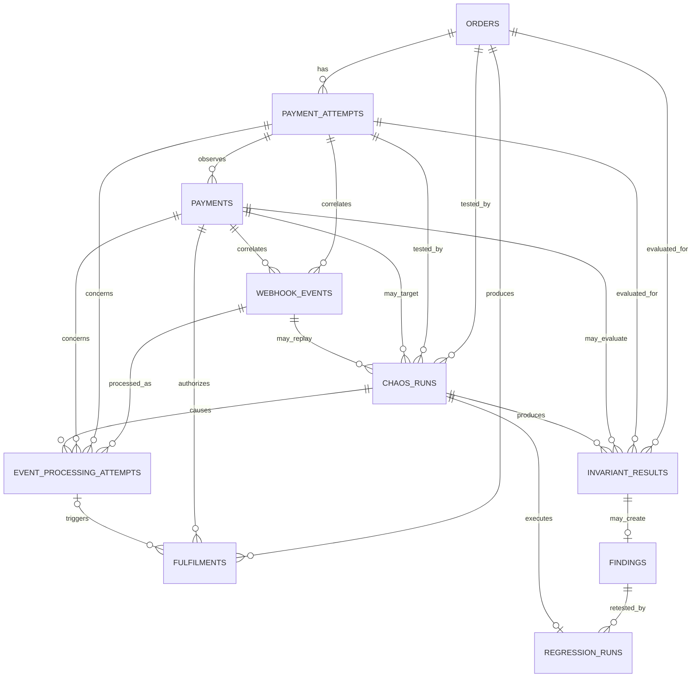

# PayChaos AI — Database Design

**Project:** PayChaos AI — Autonomous Payment Reliability Engineer  
**Database:** Supabase PostgreSQL  
**Design Status:** Source-of-truth database specification  
**Scope:** Complete P0 schema + explicitly approved P1 extension  
**Runtime Cost Target:** ₹0  
**Environment:** Controlled Demo Merchant + Razorpay Test Mode only

---

# 0. Purpose and Authority of This Document

This document defines the complete PayChaos AI database contract.

It tells future implementation sessions:

- which tables exist;
- which tables do not exist;
- exact column responsibilities;
- relationships;
- constraints;
- idempotency boundaries;
- evidence requirements;
- security expectations;
- migration ownership by phase.

Claude must not invent additional P0 tables without a confirmed requirement.

The database exists to support:

```text
Demo Merchant
→ Razorpay Test Mode Payment
→ Verified Webhook Evidence
→ Controlled Chaos Run
→ Processing Evidence
→ Money Invariant Result
→ Finding
→ Diagnosis
→ Regression
→ Reliability Score
```

The database is not a financial ledger and is not a replacement for Razorpay.

---

# 1. Database Purpose

Supabase PostgreSQL is the durable system record for PayChaos-owned state.

The database must preserve enough structured evidence to answer:

- which Demo Merchant order was tested;
- which Razorpay Order was created;
- which Razorpay Payment was observed;
- which webhook was genuinely delivered by Razorpay;
- whether that webhook was authentic;
- whether the event was delivered more than once;
- whether PayChaos replayed or simulated an event;
- which merchant-side business effects occurred;
- which chaos scenario ran;
- what fault was injected;
- which deterministic invariant evaluated the result;
- why an invariant passed, failed, or returned UNKNOWN;
- which finding was produced;
- which diagnosis/recommendation was produced;
- whether the issue later passed regression.

The database must support evidence reconstruction without depending on:

- browser memory;
- temporary server memory;
- AI conversation history;
- free-form logs alone.

---

# 2. Why PostgreSQL / Supabase Is Used

PayChaos uses Supabase PostgreSQL because it provides the required P0 capabilities in one simple system:

- relational integrity;
- transactions;
- foreign keys;
- unique constraints;
- check constraints;
- JSONB where controlled flexible evidence is useful;
- indexes;
- Row Level Security;
- free-tier deployment;
- straightforward migration support.

PostgreSQL is particularly important for PayChaos because correctness protections such as webhook deduplication must not rely only on application code.

For example:

```text
Two duplicate webhook requests arrive concurrently
```

must not become:

```text
Two canonical webhook records
```

simply because two server requests both checked the database before either inserted.

A database unique constraint must protect that boundary.

---

# 3. Database Design Principles

## Principle 1 — Keep P0 Small

Create only tables that protect payment correctness, evidence, chaos execution, diagnosis, or regression.

---

## Principle 2 — Relational Fields for Important Truth

Important identities and states belong in normal columns.

JSONB must not become a replacement for a data model.

---

## Principle 3 — JSONB Only for Flexible Evidence

Approved P0 JSONB uses are:

- redacted webhook payload evidence;
- normalized event snapshot;
- merchant-state before/after snapshots;
- chaos fault configuration/state;
- invariant evidence references.

---

## Principle 4 — Money Uses Integers

All monetary amounts are stored in the smallest currency subunit.

For INR:

```text
₹500.00
=
50000 paise
```

Use:

```text
bigint
```

Never use floating point for payment amounts.

---

## Principle 5 — Server Owns Authoritative Writes

The browser must not directly modify:

- payment state;
- Razorpay identifiers;
- webhook evidence;
- fulfilments;
- chaos results;
- invariant results;
- findings;
- regression state.

---

## Principle 6 — External Evidence Is Preserved

Verified Razorpay webhook evidence must not be silently rewritten.

Derived correlation/status fields may be updated, but the original event identity and evidence hash remain stable.

---

## Principle 7 — Historical Results Are Not Rewritten

A successful regression does not delete an earlier failure.

Historical evidence remains available.

---

## Principle 8 — UNKNOWN Is a Valid Result

Incomplete evidence must not become fake PASS.

---

# 4. Smallest Sensible P0 Schema

The final P0 schema contains these **10 tables**:

```text
1. orders
2. payment_attempts
3. payments
4. fulfilments
5. webhook_events
6. event_processing_attempts
7. chaos_runs
8. invariant_results
9. findings
10. regression_runs
```

This is the complete approved P0 table set.

---

# 5. Candidate Entities Deliberately Removed or Combined

## `merchants` — NOT REQUIRED

P0 contains one controlled Demo Merchant.

There is no multi-tenancy.

A merchant table would add no useful P0 integrity.

The Demo Merchant identity remains application configuration.

---

## Separate `razorpay_orders` — NOT REQUIRED

Razorpay Order information belongs to:

```text
payment_attempts
```

because each PayChaos payment attempt owns its server-created Razorpay Order.

---

## `payments` — REQUIRED

A separate payment table is retained.

Reason:

A Razorpay Order/payment attempt may need to preserve one or more Razorpay payment identities without forcing payment state into the merchant order row.

This keeps:

```text
Merchant Order
Payment Attempt
Razorpay Payment
```

as different concepts.

---

## `chaos_scenario_runs` — NOT REQUIRED

`chaos_runs` already represents one execution of one static scenario.

The scenario catalogue remains defined in TypeScript, not duplicated into a database table.

---

## `audit_events` — NOT REQUIRED FOR P0

A generic audit table would duplicate more useful domain evidence.

The P0 audit trail is provided by:

```text
webhook_events
event_processing_attempts
fulfilments
chaos_runs
invariant_results
findings
regression_runs
```

plus structured server logs.

---

## `fault_injection_settings` — NOT REQUIRED

Fault configuration belongs to the specific:

```text
chaos_runs
```

record.

This prevents global persistent fault settings accidentally affecting later payments.

---

## Separate `evidence` Table — NOT REQUIRED

Evidence is already represented by strongly typed domain records.

Invariant results store references to the relevant records.

Do not copy the same webhook/payment information into another generic evidence table.

---

## Separate `diagnoses` Table — NOT REQUIRED

P0 has one current deterministic diagnosis per finding.

Diagnosis fields therefore belong on:

```text
findings
```

---

## Separate `recommendations` Table — NOT REQUIRED

P0 has one deterministic recommendation associated with the finding's diagnosis.

Recommendation fields also belong on:

```text
findings
```

---

## `reliability_scores` — NOT REQUIRED FOR P0

The current Reliability Score is deterministic and can be calculated from persisted results.

P0 must calculate it from:

```text
invariant_results
+
findings
+
regression_runs
+
eligible chaos_runs
```

Persisted score history is optional P1.

---

# 6. Core Entity Relationships

The primary relationship chain is:

```text
Order
  ↓
Payment Attempt
  ↓
Razorpay Payment
  ↓
Verified Webhook Event
  ↓
Event Processing Attempt
  ↓
Fulfilment / Merchant State
```

The reliability chain is:

```text
Payment Attempt
      ↓
Chaos Run
      ↓
Event Processing Attempts
      ↓
Invariant Results
      ↓
Finding
      ↓
Diagnosis + Recommendation
      ↓
Regression Run
```

---

# 7. Mermaid ER Diagram



---

# 8. Shared Database Conventions

## 8.1 Primary Keys

All internal primary keys use:

```text
uuid
```

with a PostgreSQL-generated UUID default.

Do not use Razorpay IDs as primary keys.

---

## 8.2 Time

Use:

```text
timestamptz
```

for all timestamps.

Do not use timezone-less timestamps for payment evidence.

---

## 8.3 Money

Use:

```text
bigint
```

for amount in smallest currency subunits.

---

## 8.4 Currency

Use:

```text
varchar(3)
```

with uppercase three-letter validation.

Default P0 currency:

```text
INR
```

---

## 8.5 Internal Statuses

Internal state fields use:

```text
text + CHECK constraint
```

instead of native PostgreSQL enums.

Reason:

For a one-week build, `text` with explicit CHECK constraints provides strong validation while making controlled additions easier to migrate.

---

## 8.6 External Razorpay Statuses

Fields such as:

```text
razorpay_order_status
razorpay_payment_status
```

remain plain `text`.

Do not create a PostgreSQL enum based on Razorpay's external status catalogue.

---

## 8.7 Updated Timestamps

Mutable tables contain:

```text
updated_at timestamptz
```

Application services must update this field when authoritative mutable state changes.

A generic database trigger is optional, not required for P0.

---

# 9. TABLE — `orders`

## Purpose

Represents the Demo Merchant's internal business order.

This is the root merchant-side record.

It is **not** a Razorpay Order.

---

## Table Definition

| Column | PostgreSQL Type | Nullable? | Default | Constraints | Purpose |
|---|---|---:|---|---|---|
| `id` | `uuid` | No | generated UUID | PRIMARY KEY | Internal Demo Merchant order ID |
| `amount_subunits` | `bigint` | No | — | `> 0` | Expected merchant order amount |
| `currency` | `varchar(3)` | No | `'INR'` | uppercase 3-letter currency | Merchant order currency |
| `payment_status` | `text` | No | `'UNPAID'` | CHECK approved values | Merchant application's payment state |
| `business_status` | `text` | No | `'OPEN'` | CHECK approved values | Merchant business/fulfilment-facing state |
| `created_at` | `timestamptz` | No | `now()` | — | Creation time |
| `updated_at` | `timestamptz` | No | `now()` | — | Last state update |

---

## `payment_status` Values

```text
UNPAID
PENDING
FAILED_OBSERVED
PAID
```

`FAILED_OBSERVED` is intentionally not permanently terminal.

Later verified captured evidence may move the order to:

```text
PAID
```

---

## `business_status` Values

P0 requires only:

```text
OPEN
FULFILLED
```

Do not add ecommerce states unless required.

---

## Important Rules

### Rule ORD-001

`amount_subunits` and `currency` become immutable after the first payment attempt exists.

### Rule ORD-002

The browser cannot directly set:

```text
payment_status = PAID
```

### Rule ORD-003

`PAID` must derive from verified payment evidence.

### Rule ORD-004

`FULFILLED` must correspond to an actual successful fulfilment effect.

---

## Indexes

Required:

- primary-key index on `id`;
- index on `created_at`;
- index on `payment_status`;
- index on `business_status`.

---

## Phase Ownership

Created:

**Phase 1**

Core fields become stable after Phase 1 approval.

---

# 10. TABLE — `payment_attempts`

## Purpose

Represents one PayChaos attempt to pay a Demo Merchant order.

A payment attempt owns the server-created Razorpay Order.

One merchant order may have multiple payment attempts.

---

## Table Definition

| Column | Type | Nullable? | Default | Constraints | Purpose |
|---|---|---:|---|---|---|
| `id` | `uuid` | No | generated UUID | PRIMARY KEY | Internal payment-attempt ID |
| `order_id` | `uuid` | No | — | FK → `orders.id` | Merchant order |
| `attempt_no` | `smallint` | No | — | `> 0`, UNIQUE with `order_id` | Sequence for the merchant order |
| `amount_subunits` | `bigint` | No | — | `> 0` | Amount sent to Razorpay |
| `currency` | `varchar(3)` | No | `'INR'` | currency check | Attempt currency |
| `status` | `text` | No | `'CREATED'` | CHECK approved values | Internal attempt lifecycle |
| `razorpay_receipt` | `text` | No | — | UNIQUE | Stable Razorpay Order receipt/idempotency correlation |
| `razorpay_order_id` | `text` | Yes | `NULL` | partial UNIQUE when non-null | Razorpay Test Mode Order ID |
| `razorpay_order_status` | `text` | Yes | `NULL` | — | Latest verified/observed Razorpay Order status |
| `created_at` | `timestamptz` | No | `now()` | — | Created time |
| `updated_at` | `timestamptz` | No | `now()` | — | Last update |

---

## `status` Values

```text
CREATED
ORDER_CREATED
CHECKOUT_IN_PROGRESS
FAILED_OBSERVED
CAPTURED
```

A failure observation is not necessarily terminal.

---

## Constraints

Required:

```text
UNIQUE(order_id, attempt_no)
UNIQUE(razorpay_receipt)
UNIQUE(razorpay_order_id) WHERE razorpay_order_id IS NOT NULL
```

---

## Important Rules

### PAYATT-001

`amount_subunits` and `currency` must initially match the associated `orders` values.

### PAYATT-002

The attempt amount/currency must not later be silently changed.

### PAYATT-003

`razorpay_receipt` is generated once and reused when resolving an ambiguous Razorpay Order-creation outcome.

### PAYATT-004

A timeout must not generate a new receipt merely to retry.

### PAYATT-005

`razorpay_order_id` comes only from the trusted server Razorpay integration.

---

## Indexes

Required:

- `order_id`;
- `status`;
- `created_at`;
- unique indexes above.

---

## Phase Ownership

### Phase 1

Creates the foundational table including:

- ID;
- order relation;
- attempt number;
- amount;
- currency;
- basic status;
- stable receipt.

### Phase 2

Uses/adds the Razorpay Order correlation fields if not included in the initial migration.

Adding the already-approved Phase 2 Razorpay fields is not considered an architecture redesign.

---

# 11. TABLE — `payments`

## Purpose

Represents a canonical Razorpay Test Mode Payment observed by PayChaos.

It separates:

```text
merchant order
```

from:

```text
payment attempt / Razorpay Order
```

from:

```text
actual Razorpay Payment
```

---

## Table Definition

| Column | Type | Nullable? | Default | Constraints | Purpose |
|---|---|---:|---|---|---|
| `id` | `uuid` | No | generated UUID | PRIMARY KEY | Internal payment record |
| `payment_attempt_id` | `uuid` | No | — | FK → `payment_attempts.id` | Parent attempt/Razorpay Order |
| `razorpay_payment_id` | `text` | No | — | UNIQUE | Razorpay Test Mode Payment ID |
| `razorpay_payment_status` | `text` | Yes | `NULL` | — | Latest verified/observed provider status |
| `amount_subunits` | `bigint` | No | — | `> 0` | Payment amount |
| `currency` | `varchar(3)` | No | `'INR'` | currency check | Payment currency |
| `checkout_signature_verified` | `boolean` | No | `false` | — | Whether Checkout response was server-verified |
| `checkout_verified_at` | `timestamptz` | Yes | `NULL` | consistency CHECK | Verification timestamp |
| `first_observed_at` | `timestamptz` | No | `now()` | — | First observed payment evidence |
| `last_observed_at` | `timestamptz` | No | `now()` | — | Most recent verified observation |
| `captured_at` | `timestamptz` | Yes | `NULL` | — | First verified capture observation |
| `failed_at` | `timestamptz` | Yes | `NULL` | — | Verified failure observation |
| `error_code` | `text` | Yes | `NULL` | — | Safe Razorpay error code |
| `error_description_redacted` | `text` | Yes | `NULL` | — | Redacted failure description |
| `error_source` | `text` | Yes | `NULL` | — | Razorpay error source |
| `error_step` | `text` | Yes | `NULL` | — | Razorpay error step |
| `error_reason` | `text` | Yes | `NULL` | — | Razorpay error reason |
| `created_at` | `timestamptz` | No | `now()` | — | Record creation |
| `updated_at` | `timestamptz` | No | `now()` | — | Last update |

---

## Checkout Verification Constraint

If:

```text
checkout_signature_verified = true
```

then:

```text
checkout_verified_at
```

must not be null.

Do not persist the Razorpay Key Secret or webhook secret.

The Checkout signature itself does not need to be permanently stored.

---

## Important Rules

### PAY-001

`razorpay_payment_id` is globally unique in PayChaos.

### PAY-002

A verified `payment.failed` observation does not prevent a later verified transition to captured state.

### PAY-003

`CAPTURED`-equivalent provider evidence is stronger than a previous failure observation.

### PAY-004

Amount correctness is evaluated against:

```text
orders.amount_subunits
```

and:

```text
payment_attempts.amount_subunits
```

### PAY-005

Browser state cannot update authoritative payment status directly.

---

## Indexes

Required:

- UNIQUE `razorpay_payment_id`;
- index `payment_attempt_id`;
- index `razorpay_payment_status`;
- index `created_at`.

---

## Phase Ownership

Created:

**Phase 2**

---

# 12. TABLE — `fulfilments`

## Purpose

Records actual Demo Merchant business effects caused by successful payment processing.

This table exists so PayChaos can determine:

```text
0 fulfilments
1 fulfilment
more than 1 fulfilment
```

for the same order.

---

## Table Definition

| Column | Type | Nullable? | Default | Constraints | Purpose |
|---|---|---:|---|---|---|
| `id` | `uuid` | No | generated UUID | PRIMARY KEY | Business-effect ID |
| `order_id` | `uuid` | No | — | FK → `orders.id` | Fulfilled merchant order |
| `payment_id` | `uuid` | No | — | FK → `payments.id` | Payment authorizing effect — **added in Phase 2** (not present in the Phase 1 migration; see Column Phasing Note and Phase Ownership below) |
| `trigger_processing_attempt_id` | `uuid` | Yes | `NULL` | FK → `event_processing_attempts.id` | Processing attempt that caused effect — added in Phase 2 (see Phase Ownership below) |
| `effect_type` | `text` | No | `'FULFIL_ORDER'` | CHECK P0 value | Business effect |
| `idempotency_key` | `text` | No | — | UNIQUE | Business-effect idempotency boundary |
| `applied_at` | `timestamptz` | No | `now()` | — | Actual effect time |
| `created_at` | `timestamptz` | No | `now()` | — | Audit creation time |

---

## Column Phasing Note

This table definition describes the **complete, final** `fulfilments` schema. Not every column is
created by the Phase 1 migration.

- `payment_id` — **deferred to Phase 2.** `payments` does not exist until Phase 2, so a `NOT NULL`
  foreign key to it cannot be created in Phase 1. Phase 1 creates `fulfilments` **without** this
  column. Phase 2 creates `payments` first, then adds `payment_id` to the already-approved Phase 1
  `fulfilments` table through a **new additive migration** — never by editing or rewriting the
  original Phase 1 migration.
- `trigger_processing_attempt_id` — deferred to Phase 2 for the same reason
  (`event_processing_attempts` does not exist until Phase 2), added through an additive migration, as
  already documented in Phase Ownership below.

Phase 2 adds these columns through one or more additive migration files, as technically appropriate.
The exact migration-file grouping is an implementation choice; what is fixed is that both columns are
added on top of the approved Phase 1 table, never by rewriting it.

**Phase 1 must not insert any row into `fulfilments`.** No authoritative payment evidence exists in
Phase 1 — there is no `payments` table and no verified capture — so no Phase 1 code path may
populate this table. The table exists in Phase 1 only to establish the approved business-effect
representation and the future duplicate-fulfilment detection model; it remains empty until Phase 2.

---

## P0 `effect_type`

```text
FULFIL_ORDER
```

No other business-effect types are necessary.

---

## Idempotency Model

Correct processing uses a stable semantic key such as:

```text
FULFIL_ORDER:<order-id>
```

The exact string format is implementation-level.

The critical requirement is:

**the same logical fulfilment must reuse the same idempotency key.**

Database uniqueness protects against concurrent duplicate inserts.

---

## Order / Payment Consistency Rule

A `fulfilments.order_id` and `fulfilments.payment_id` must refer to the same logical payment path.

Before inserting a normal fulfilment, trusted server processing must resolve:

```text
payments.id
→ payments.payment_attempt_id
→ payment_attempts.order_id
```

and require:

```text
payment_attempts.order_id = fulfilments.order_id
```

This validation must occur inside the same trusted transaction that applies the fulfilment/business-state change.

P0 does **not** add a new table or redundant foreign-key column solely to encode this relationship. `INV-010` and the required integration test provide the cross-record correctness check in addition to the normal foreign keys.

A mismatch must be rejected with zero fulfilment/business-state mutation.

---

## Chaos Testing Note

A controlled faulty merchant profile may deliberately demonstrate missing semantic idempotency by generating different keys for what is actually the same logical fulfilment.

That is:

```text
PAYCHAOS_SIMULATION
```

behavior.

It must not be presented as normal architecture.

The Money Invariant Engine then detects:

```text
COUNT(successful fulfilments for order) > 1
```

---

## Indexes

Required:

- UNIQUE `idempotency_key`;
- index `order_id`;
- index `payment_id` — created with the column in Phase 2, not part of the Phase 1 migration;
- index `trigger_processing_attempt_id` — created with the column in Phase 2, not part of the Phase 1 migration;
- index `applied_at`.

---

## Phase Ownership

### Phase 1

Creates the business-effect representation **without `payment_id`**: `id`, `order_id`, `effect_type`,
`idempotency_key`, `applied_at`, `created_at`, plus their constraints and indexes (excluding the
`payment_id` index, which arrives with the column in Phase 2). This establishes the approved
business-effect model and the future duplicate-fulfilment (`COUNT(fulfilments) <= 1`) design ahead of
the payment evidence that will populate it.

Phase 1 must not insert a fulfilment row. No authoritative payment evidence exists yet — there is no
`payments` table and no verified capture — so no Phase 1 code path may write to this table. It stays
empty until Phase 2.

### Phase 2

Connects fulfilment to verified payment/event processing, through one or more additive migrations —
as technically appropriate — to the already-approved Phase 1 `fulfilments` table:

1. **`payment_id`** — added once `payments` exists (`payments` is itself created in Phase 2, before
   this migration). The column must be:

   ```text
   payment_id uuid NOT NULL REFERENCES payments(id)
   ```

   using `ON DELETE RESTRICT`, consistent with the FK/delete-semantics default this document already
   establishes in Section 41 for important evidence relationships.

2. **`trigger_processing_attempt_id`** — added once `event_processing_attempts` exists, nullable,
   `FK → event_processing_attempts.id`.

Whether these two columns are added by one migration file or two is an implementation choice. What
is fixed is that each may only be added once its referenced table exists, and neither may be added by
altering the original Phase 1 migration.

**The original Phase 1 `fulfilments` migration must never be rewritten to insert either column.**
Once Phase 1 is approved, its migrations are immutable; every later requirement is layered on
through new migration files only. This preserves the approved Phase 1 migration history and keeps
each schema change traceable to the phase that required it.

---

# 13. TABLE — `webhook_events`

## Purpose

Stores the canonical representation of a genuine, signature-verified Razorpay Test Mode webhook event.

One logical Razorpay event has one canonical row.

Duplicate HTTP deliveries do **not** create additional canonical rows.

---

## Table Definition

| Column | Type | Nullable? | Default | Constraints | Purpose |
|---|---|---:|---|---|---|
| `id` | `uuid` | No | generated UUID | PRIMARY KEY | Internal event ID |
| `razorpay_event_id` | `text` | No | — | UNIQUE | `x-razorpay-event-id` |
| `event_type` | `text` | No | — | — | Razorpay webhook event type |
| `source_kind` | `text` | No | `'REAL_RAZORPAY_WEBHOOK'` | CHECK fixed value | Evidence provenance |
| `razorpay_order_id` | `text` | Yes | `NULL` | — | Order ID observed in payload |
| `razorpay_payment_id` | `text` | Yes | `NULL` | — | Payment ID observed in payload |
| `payment_attempt_id` | `uuid` | Yes | `NULL` | FK → `payment_attempts.id` | Derived internal correlation |
| `payment_id` | `uuid` | Yes | `NULL` | FK → `payments.id` | Derived payment correlation |
| `signature_verified` | `boolean` | No | — | CHECK must be true | Authentication evidence |
| `received_at` | `timestamptz` | No | `now()` | — | Server receipt time |
| `provider_created_at` | `timestamptz` | Yes | `NULL` | — | Event/provider timestamp if available |
| `amount_subunits` | `bigint` | Yes | `NULL` | `>0` when present | Normalized amount evidence |
| `currency` | `varchar(3)` | Yes | `NULL` | currency check | Normalized currency |
| `razorpay_payment_status` | `text` | Yes | `NULL` | — | Payment state from payload |
| `raw_body_sha256` | `char(64)` | No | — | length/hex validation | Integrity hash of original raw body |
| `raw_payload_redacted` | `jsonb` | No | `{}` | must be object | Safe redacted evidence |
| `processing_status` | `text` | No | `'RECEIVED'` | CHECK approved values | Canonical event processing state |
| `processed_at` | `timestamptz` | Yes | `NULL` | — | Successful processing time |
| `duplicate_delivery_count` | `integer` | No | `0` | `>=0` | Number of extra real deliveries detected |
| `updated_at` | `timestamptz` | No | `now()` | — | Status/counter update time |

---

## `source_kind`

For this canonical table the only permitted P0 value is:

```text
REAL_RAZORPAY_WEBHOOK
```

PayChaos replay is **not** inserted as a new webhook event.

---

## `processing_status`

```text
RECEIVED
PROCESSING
PROCESSED
FAILED
```

---

## Immutable Fields

After initial verified insertion, these should not be rewritten during ordinary operation:

```text
razorpay_event_id
event_type
source_kind
signature_verified
received_at
provider_created_at
raw_body_sha256
raw_payload_redacted
```

Derived correlation/status fields may be updated.

---

## Duplicate Protection

Required database constraint:

```text
UNIQUE(razorpay_event_id)
```

This is the primary transport/event deduplication safeguard.

---

## Important Rule

An invalid webhook signature does **not** create a row in `webhook_events`.

Rejected requests may appear in safe structured operational logs.

They do not become trusted Razorpay evidence.

---

## Indexes

Required:

- UNIQUE `razorpay_event_id`;
- `payment_attempt_id`;
- `payment_id`;
- `razorpay_order_id`;
- `razorpay_payment_id`;
- `(event_type, received_at)`;
- `processing_status`.

---

## Phase Ownership

Created:

**Phase 2**

---

# 14. TABLE — `event_processing_attempts`

## Purpose

Records every meaningful attempt to process an event through the PayChaos internal Event Processor.

This table is essential because:

```text
event identity
```

is not the same as:

```text
processing attempt
```

It captures:

- first real Razorpay delivery;
- duplicate real delivery;
- retry after previous processing failure;
- PayChaos replay;
- PayChaos simulation;
- automated-test fixture processing where persisted in test environments.

---

## Table Definition

| Column | Type | Nullable? | Default | Constraints | Purpose |
|---|---|---:|---|---|---|
| `id` | `uuid` | No | generated UUID | PRIMARY KEY | Processing attempt ID |
| `webhook_event_id` | `uuid` | Yes | `NULL` | FK → `webhook_events.id` | Source real event when applicable |
| `payment_attempt_id` | `uuid` | Yes | `NULL` | FK → `payment_attempts.id` | Payment attempt correlation |
| `payment_id` | `uuid` | Yes | `NULL` | FK → `payments.id` | Payment correlation |
| `chaos_run_id` | `uuid` | Yes | `NULL` | FK → `chaos_runs.id` | Chaos/replay association |
| `source_kind` | `text` | No | — | CHECK approved values | Provenance |
| `is_duplicate_delivery` | `boolean` | No | `false` | — | Real HTTP duplicate indicator |
| `status` | `text` | No | `'PENDING'` | CHECK approved values | Processing lifecycle |
| `fault_action` | `text` | Yes | `NULL` | — | Fault primitive applied |
| `normalized_event` | `jsonb` | No | `{}` | object | Safe normalized processor input |
| `state_before` | `jsonb` | Yes | `NULL` | object | Merchant state before processing |
| `state_after` | `jsonb` | Yes | `NULL` | object | Merchant state after processing |
| `error_code` | `text` | Yes | `NULL` | — | Safe processing error |
| `error_message_redacted` | `text` | Yes | `NULL` | — | Redacted processing detail |
| `started_at` | `timestamptz` | No | `now()` | — | Processing start |
| `finished_at` | `timestamptz` | Yes | `NULL` | — | Completion time |

---

## `source_kind` Values

```text
REAL_RAZORPAY_WEBHOOK
PAYCHAOS_REPLAY
PAYCHAOS_SIMULATION
TEST_FIXTURE
```

---

## `status` Values

```text
PENDING
HELD
PROCESSING
SUCCEEDED
FAILED
SKIPPED_DUPLICATE
```

---

## Provenance Constraints

### `REAL_RAZORPAY_WEBHOOK`

Must have:

```text
webhook_event_id
```

---

### `PAYCHAOS_REPLAY`

Must have:

```text
webhook_event_id
chaos_run_id
```

---

### `PAYCHAOS_SIMULATION`

Must have:

```text
chaos_run_id
```

A real webhook reference is optional.

---

### `TEST_FIXTURE`

Allowed only in test/local contexts.

It must never be presented as real Razorpay evidence.

---

## Duplicate Delivery Rules

When Razorpay genuinely sends the same `razorpay_event_id` again:

1. `webhook_events` retains one canonical row;
2. `duplicate_delivery_count` increments;
3. a new processing-attempt record may be created;
4. `is_duplicate_delivery = true`;
5. business-effect idempotency still applies.

---

## Evidence Snapshot Rule

`state_before` and `state_after` exist because the mutable `orders` record may later change.

Historical chaos evidence must not be reconstructed solely from the current order row.

---

## Indexes

Required:

- `webhook_event_id`;
- `payment_attempt_id`;
- `payment_id`;
- `chaos_run_id`;
- `(source_kind, started_at)`;
- `status`;
- `is_duplicate_delivery` where useful.

---

## Phase Ownership

### Phase 2

Creates processing-attempt tracking for genuine webhook processing.

### Phase 3

Adds/uses:

- `chaos_run_id`;
- replay/simulation source kinds;
- fault information;
- before/after evidence snapshots.

These Phase 3 extensions are pre-approved.

---

# 15. TABLE — `chaos_runs`

## Purpose

Represents one execution of one predefined PayChaos chaos scenario.

There is no separate `chaos_scenarios` database table.

`scenario_id` points to the static scenario registry in application code.

---

## Table Definition

| Column | Type | Nullable? | Default | Constraints | Purpose |
|---|---|---:|---|---|---|
| `id` | `uuid` | No | generated UUID | PRIMARY KEY | Chaos run ID |
| `scenario_id` | `text` | No | — | CHECK approved values | Stable scenario catalogue ID |
| `order_id` | `uuid` | **Yes** | `NULL` | FK → `orders.id` | Merchant order being tested, when one applies |
| `payment_attempt_id` | `uuid` | **Yes** | `NULL` | FK → `payment_attempts.id` | Payment attempt being tested, when one exists |
| `payment_id` | `uuid` | Yes | `NULL` | FK → `payments.id` | Specific payment if applicable |
| `source_webhook_event_id` | `uuid` | Yes | `NULL` | FK → `webhook_events.id` | Verified source evidence for replay |
| `status` | `text` | No | `'PENDING'` | CHECK approved values | Run lifecycle |
| `outcome` | `text` | Yes | `NULL` | CHECK approved values | Aggregate scenario outcome |
| `fault_type` | `text` | **Yes** | `NULL` | CHECK approved values | Fault primitive used, when the scenario has one |
| `failed_precheck_id` | `text` | **Yes** | `NULL` | CHECK approved values | Which PRECHECK-01..10 blocked this run |
| `fault_config` | `jsonb` | No | `{}` | object | Immutable requested fault configuration |
| `fault_state` | `jsonb` | No | `{}` | object | Runtime hold/release/transient state |
| `data_classification` | `text` | No | **none** | CHECK | Real/synthetic classification — must be supplied explicitly |
| `error_message_redacted` | `text` | Yes | `NULL` | — | Run failure detail |
| `started_at` | `timestamptz` | Yes | `NULL` | — | Actual run start — remains `NULL` for a BLOCKED run (execution never began) |
| `completed_at` | `timestamptz` | Yes | `NULL` | — | Actual run end, or BLOCKED finalization time |
| `created_at` | `timestamptz` | No | `now()` | — | Creation |
| `updated_at` | `timestamptz` | No | `now()` | — | Last status update |

**Nullable links (architect-approved correction — Phase 3B):** `order_id`/`payment_attempt_id`/`payment_id`/`source_webhook_event_id` are all nullable because not every P0 scenario has an entity/evidence target at chaos-run creation time. C03 (Mechanism C) targets PayChaos's own fixed internal webhook-verification path and has no merchant order at all. C07 and C11 Mechanism A begin from a fresh order, but the frozen Phase 3A precheck contract never guarantees that order already has a `payment_attempts` row — Checkout, which creates the attempt, happens after a chaos run is requested. These links are never fabricated merely to populate the column; a `NULL` link is preferred over a false one.

`fault_type` is nullable because C11 has no unsafe fault primitive of its own (`allowedFaultTypes: []` in the frozen scenario registry) — it is `NULL` for both of its mechanisms, never a fabricated fourth "no fault" primitive.

---

## `status`

```text
PENDING
RUNNING
COMPLETED
FAILED
```

---

## `outcome`

```text
PASS
FAIL
UNKNOWN
BLOCKED
ERROR
```

`outcome` is null while a run is incomplete.

`NOT RUN` is **not** a stored `chaos_runs.outcome`. It is a derived catalogue/UI state meaning no eligible completed run exists for that scenario in the evaluation context.

A run blocked by a failed safety/prerequisite precheck may be finalized with:

```text
status = COMPLETED
outcome = BLOCKED
failed_precheck_id = <the PRECHECK-xx that blocked it>
error_message_redacted = <safe reason>
started_at = NULL
completed_at = <finalization time>
```

without executing replay/fault injection. `started_at` remains `NULL` for a
BLOCKED run because execution never actually began.

Detailed correctness still comes from individual:

```text
invariant_results
```

---

## `failed_precheck_id`

```text
PRECHECK-01
PRECHECK-02
PRECHECK-03
PRECHECK-04
PRECHECK-05
PRECHECK-06
PRECHECK-07
PRECHECK-08
PRECHECK-09
PRECHECK-10
```

Records which of the ten official Chaos Run Precheck IDs (Section 11)
blocked this run. `NULL` for a `PENDING` row. Not every BLOCKED precheck
category is necessarily persisted here — `PRECHECK-01`/`02`/`03` (global
server/config failure), `PRECHECK-05` (unregistered/disabled/malformed
scenario), and `PRECHECK-06` (audit database itself unreachable) are not
scenario-attributable or cannot be durably recorded, so the phase that owns
this decision may choose not to create a row for them at all. Only
`PRECHECK-07`/`08`/`09`/`10` against an independently-confirmed registered
scenario are eligible.

---

## Consistency Constraints

```text
chaos_runs_blocked_state_consistent
chaos_runs_pending_state_consistent
```

`chaos_runs_blocked_state_consistent` guarantees that whenever
`outcome = 'BLOCKED'`, the row is also `status = 'COMPLETED'`,
`failed_precheck_id` and `error_message_redacted` are both non-null,
`started_at` is `NULL`, and `completed_at` is non-null — and that
`failed_precheck_id` is `NULL` on every row whose outcome is not `BLOCKED`.
`chaos_runs_pending_state_consistent` guarantees that a `PENDING` row always
has `outcome`/`failed_precheck_id`/`started_at`/`completed_at` all `NULL`.
Both are enforced at the database level, not only in application code
(docs/ARCHITECTURE.md Section 25). Neither constrains future
`RUNNING`/`COMPLETED`-with-`PASS`/`FAIL`/`UNKNOWN`/`ERROR`/`FAILED`-status
semantics — those belong to whichever later phase actually executes a
mechanism.

---

## `data_classification`

```text
RECORDED_TEST_EVIDENCE
SYNTHETIC_DEMO
```

`text`, `NOT NULL`, **NO DEFAULT** (architect correction). This column must
be supplied explicitly by trusted server code on every insert — omitting it
fails the insert closed rather than silently defaulting to either value.

This is deliberate fail-closed provenance handling:
`RECORDED_TEST_EVIDENCE` is authoritative genuine-evidence metadata, so a
server-side bug or a future writer must never be able to omit this column
and silently receive the strongest/genuine-evidence classification by
default. Defaulting to `SYNTHETIC_DEMO` instead was considered and rejected
too, since that could just as easily silently misclassify a genuine run in
the other direction. The only safe behavior is to require every writer to
decide and state the classification explicitly, and to reject the insert
entirely if it does not.

This column is never caller/browser controlled — it is always derived by
trusted server code (`lib/chaos/run-service.ts`) from the scenario/mechanism
being persisted, never read from a browser-supplied request field.

A replay of a genuine verified Razorpay Test Mode event remains:

```text
RECORDED_TEST_EVIDENCE
```

because the original evidence is real even though processing is replayed.

A fully synthetic fallback/demo scenario must use:

```text
SYNTHETIC_DEMO
```

and must be excluded from genuine reliability metrics unless the UI explicitly displays a synthetic/demo-only score.

---

## Fault Injection Storage

There is deliberately no global fault-settings table.

Every run contains its own:

```text
fault_type
fault_config
fault_state
```

This prevents a forgotten global fault from contaminating later payments.

---

## Indexes

Required:

- `scenario_id`;
- `order_id`;
- `payment_attempt_id`;
- `payment_id`;
- `source_webhook_event_id`;
- `(status, created_at)`;
- `(data_classification, completed_at)`.

---

## Phase Ownership

Created:

**Phase 3**

---

# 16. TABLE — `invariant_results`

## Purpose

Stores immutable results from the deterministic Money Invariant Engine.

This table is authoritative for:

```text
PASS
FAIL
UNKNOWN
```

AI output does not modify it.

---

## Table Definition

| Column | Type | Nullable? | Default | Constraints | Purpose |
|---|---|---:|---|---|---|
| `id` | `uuid` | No | generated UUID | PRIMARY KEY | Evaluation ID |
| `invariant_id` | `text` | No | — | — | Stable invariant catalogue ID |
| `invariant_version` | `text` | No | `'1'` | — | Version of deterministic rule |
| `order_id` | `uuid` | No | — | FK → `orders.id` | Evaluated order |
| `payment_attempt_id` | `uuid` | No | — | FK → `payment_attempts.id` | Evaluated payment attempt |
| `payment_id` | `uuid` | Yes | `NULL` | FK → `payments.id` | Specific payment where applicable |
| `chaos_run_id` | `uuid` | Yes | `NULL` | FK → `chaos_runs.id` | Chaos execution; null for baseline |
| `result` | `text` | No | — | CHECK | PASS/FAIL/UNKNOWN |
| `severity` | `text` | No | — | CHECK | Risk severity snapshot |
| `expected_summary` | `text` | No | — | — | Expected deterministic condition |
| `observed_summary` | `text` | No | — | — | Actual observed condition |
| `reason` | `text` | No | — | — | Deterministic explanation |
| `evidence_refs` | `jsonb` | No | `[]` | array | Structured references to evidence |
| `evaluated_at` | `timestamptz` | No | `now()` | — | Evaluation time |

---

## `result`

```text
PASS
FAIL
UNKNOWN
```

---

## `severity`

```text
LOW
MEDIUM
HIGH
CRITICAL
```

Severity is stored as a snapshot so historical findings remain explainable even if catalogue configuration changes later.

---

## Evidence References

`evidence_refs` may reference records such as:

```text
WEBHOOK_EVENT
PROCESSING_ATTEMPT
PAYMENT
FULFILMENT
CHAOS_RUN
```

Each reference must contain:

- evidence kind;
- internal UUID.

Do not copy entire webhook payloads into invariant results.

---

## Uniqueness

For a chaos run, one invariant should normally be evaluated once.

Required partial unique index:

```text
UNIQUE(chaos_run_id, invariant_id)
WHERE chaos_run_id IS NOT NULL
```

Baseline evaluation may occur more than once, so baseline rows are not forced into this uniqueness rule.

---

## Immutability

Once persisted, an invariant result must not change from:

```text
FAIL → PASS
```

A re-test creates a **new** result.

---

## Indexes

Required:

- `(chaos_run_id, invariant_id)` partial unique;
- `payment_attempt_id`;
- `payment_id`;
- `result`;
- `severity`;
- `evaluated_at`.

---

## Phase Ownership

Created:

**Phase 3**

---

# 17. TABLE — `findings`

## Purpose

Represents a reliability issue generated from one deterministic invariant failure.

P0 uses one finding per failed invariant result.

Diagnosis and recommendation are deliberately stored on the finding rather than separate tables.

---

## Table Definition

| Column | Type | Nullable? | Default | Constraints | Purpose |
|---|---|---:|---|---|---|
| `id` | `uuid` | No | generated UUID | PRIMARY KEY | Finding ID |
| `invariant_result_id` | `uuid` | No | — | FK + UNIQUE | Failed invariant result |
| `status` | `text` | No | `'OPEN'` | CHECK | Finding lifecycle |
| `title` | `text` | No | — | — | Human-readable finding title |
| `diagnosis_code` | `text` | Yes | `NULL` | — | Deterministic diagnosis category |
| `diagnosis_strength` | `text` | Yes | `NULL` | CHECK when present | Evidence-strength label |
| `diagnosis_summary` | `text` | Yes | `NULL` | — | Evidence-based explanation |
| `recommendation_code` | `text` | Yes | `NULL` | — | Deterministic recommendation ID |
| `recommendation_text` | `text` | Yes | `NULL` | — | Human-readable remediation |
| `diagnosed_at` | `timestamptz` | Yes | `NULL` | — | Diagnosis time |
| `resolved_at` | `timestamptz` | Yes | `NULL` | consistency CHECK | Resolution time |
| `created_at` | `timestamptz` | No | `now()` | — | Finding creation |
| `updated_at` | `timestamptz` | No | `now()` | — | Last lifecycle update |

---

## `status`

```text
OPEN
STILL_FAILING
RESOLVED
```

---

## `diagnosis_strength`

Approved P0 values:

```text
STRONG_EVIDENCE
PARTIAL_EVIDENCE
INSUFFICIENT_EVIDENCE
```

Do not invent probabilistic confidence percentages.

---

## Constraints

Required:

```text
UNIQUE(invariant_result_id)
```

This prevents one failed invariant execution from creating duplicate findings.

Application-level validation must ensure findings are created only for:

```text
invariant_results.result = FAIL
```

---

## Diagnosis / Recommendation Storage

Diagnosis is advisory.

It may never modify:

- payment status;
- order amount;
- invariant result;
- webhook authenticity.

---

## Indexes

Required:

- UNIQUE `invariant_result_id`;
- `status`;
- `diagnosis_code`;
- `created_at`.

---

## Phase Ownership

### Phase 3

Creates:

- finding ID;
- invariant relation;
- OPEN status;
- title;
- timestamps.

### Phase 4

Adds/uses:

- diagnosis;
- recommendation;
- regression lifecycle fields.

---

# 18. TABLE — `regression_runs`

## Purpose

Connects a finding to a new chaos run executed to verify whether the issue has been fixed.

The original finding remains unchanged as historical evidence.

---

## Table Definition

| Column | Type | Nullable? | Default | Constraints | Purpose |
|---|---|---:|---|---|---|
| `id` | `uuid` | No | generated UUID | PRIMARY KEY | Regression record |
| `finding_id` | `uuid` | No | — | FK → `findings.id` | Original issue |
| `chaos_run_id` | `uuid` | No | — | FK → `chaos_runs.id`, UNIQUE | Re-test chaos run |
| `status` | `text` | No | `'PENDING'` | CHECK | Regression lifecycle/result |
| `started_at` | `timestamptz` | Yes | `NULL` | — | Start |
| `completed_at` | `timestamptz` | Yes | `NULL` | — | End |
| `created_at` | `timestamptz` | No | `now()` | — | Creation |

---

## `status`

```text
PENDING
RUNNING
RESOLVED
STILL_FAILING
ERROR
```

---

## Regression Rules

### REG-001

A regression references a new `chaos_runs` record.

### REG-002

The new run must use the relevant original scenario.

### REG-003

The original invariant is reevaluated.

### REG-004

The original failed invariant result is never overwritten.

### REG-005

If the new relevant invariant passes, the finding may become:

```text
RESOLVED
```

### REG-006

If it fails again:

```text
STILL_FAILING
```

---

## Indexes

Required:

- UNIQUE `chaos_run_id`;
- `finding_id`;
- `status`;
- `created_at`.

---

## Phase Ownership

Created:

**Phase 4**

---

# 19. P1-Only Table — `reliability_score_snapshots`

This table is **not part of required P0**.

It may be added only if P1 reliability-history/trend UI is selected.

Current P0 score is derived on demand.

---

## Purpose

Store historical deterministic score snapshots so the UI can display genuine score changes over time.

---

## Table Definition

| Column | Type | Nullable? | Default | Constraints | Purpose |
|---|---|---:|---|---|---|
| `id` | `uuid` | No | generated UUID | PRIMARY KEY | Snapshot |
| `score` | `smallint` | No | — | `0 <= score <= 100` | Reliability Score |
| `readiness_status` | `text` | No | — | approved readiness values | Go-Live status |
| `algorithm_version` | `text` | No | — | — | Deterministic formula version |
| `breakdown` | `jsonb` | No | `{}` | object | Explainable score components |
| `included_run_count` | `integer` | No | `0` | `>=0` | Eligible runs |
| `unknown_count` | `integer` | No | `0` | `>=0` | UNKNOWN evaluations |
| `data_cutoff_at` | `timestamptz` | No | — | — | Latest evidence included |
| `computed_at` | `timestamptz` | No | `now()` | — | Snapshot time |

---

## P1 Rule

Never generate fake history.

Every snapshot must derive from real stored PayChaos results.

Synthetic/demo-only runs must not be silently included.

---

# 20. Reliability Score Storage — P0 Decision

P0 does **not** persist a score row.

The current score is calculated from durable source records.

Conceptually:

```text
Eligible Chaos Runs
+
Invariant Results
+
Finding Status
+
Regression Results
        ↓
Deterministic Score Function
        ↓
Current Score + Breakdown
```

Benefits:

- one less P0 table;
- no stale score state;
- deterministic recalculation;
- easier one-week implementation.

If trend history becomes P1:

add `reliability_score_snapshots`.

---

# 21. Data Ownership

PayChaos P0 is a controlled single-workspace application.

Therefore:

- no tenant ID;
- no merchant account table;
- no organization table;
- no user-owned payment data model.

The server owns authoritative application data.

The browser is a presentation/request layer.

---

# 22. Payment / Order State Consistency

The database does not attempt to replace deterministic domain logic with complicated triggers.

However, the following rules are mandatory.

## Rule STATE-001 — Money Values Agree

At payment-attempt creation:

```text
orders.amount_subunits
=
payment_attempts.amount_subunits
```

and currencies must match.

---

## Rule STATE-002 — Captured Amount Is Verified

For a successful payment:

```text
payments.amount_subunits
=
orders.amount_subunits
```

unless an explicitly supported future use case says otherwise.

The Money Invariant Engine verifies this.

---

## Rule STATE-003 — Browser Does Not Mark Paid

`orders.payment_status = PAID` requires trusted server evidence.

---

## Rule STATE-004 — Failure Is Not Necessarily Terminal

A payment previously observed as failed may later have verified captured evidence.

Database/application logic must permit this.

---

## Rule STATE-005 — Fulfilment Requires Verified Payment

Normal P0 processing creates a fulfilment only for verified captured payment state.

---

## Rule STATE-006 — Fulfilment Exactly Once

Correct processing uses a stable business idempotency key.

---

## Rule STATE-007 — State Cannot Regress Incorrectly

Out-of-order events must not move:

```text
PAID
```

back to:

```text
FAILED_OBSERVED
```

simply because the failure event was processed later.

---

# 23. Razorpay Identifiers Stored

Approved Razorpay identifiers include:

```text
razorpay_order_id
razorpay_payment_id
razorpay_event_id
razorpay_receipt
```

They are not secrets.

They may be stored because they are required for:

- correlation;
- webhook processing;
- evidence;
- troubleshooting;
- deterministic invariants.

---

# 24. Razorpay Credentials Never Stored

The database must never contain:

```text
RAZORPAY_KEY_SECRET
RAZORPAY_WEBHOOK_SECRET
```

These belong only in server environment-secret storage.

The Test Key ID also does not need database persistence.

---

# 25. Webhook Event Storage Strategy

For genuine Razorpay Test Mode webhooks, preserve:

```text
event identity
event type
provider IDs
signature verification result
receive time
redacted payload
raw-body SHA-256
normalized useful fields
processing state
duplicate-delivery count
```

Do not persist full raw sensitive bodies solely for convenience.

The raw-body hash provides evidence integrity without requiring indefinite raw-body storage.

---

# 26. Webhook Duplicate Detection

There are two levels.

## Level 1 — Canonical Event

Protected by:

```text
UNIQUE(webhook_events.razorpay_event_id)
```

---

## Level 2 — Business Effect

Protected by:

```text
UNIQUE(fulfilments.idempotency_key)
```

These solve different problems.

Webhook deduplication alone is insufficient.

---

# 27. Chaos Run Storage

`chaos_runs` contains:

- scenario ID;
- target order/payment;
- original webhook evidence when applicable;
- fault primitive;
- fault configuration;
- runtime fault state;
- run status;
- aggregate outcome;
- real/synthetic classification;
- timestamps.

A separate scenario table is unnecessary because the catalogue is static TypeScript configuration.

---

# 28. Chaos Scenario Result Storage

The high-level result is:

```text
chaos_runs.outcome
```

Detailed correctness results are:

```text
invariant_results
```

Do not duplicate the complete invariant result inside `chaos_runs`.

---

# 29. Money Invariant Result Storage

Invariant results are append-only historical records.

Each row records:

- which invariant ran;
- version;
- target payment/order;
- chaos run;
- PASS/FAIL/UNKNOWN;
- severity;
- expected result;
- observed result;
- deterministic reason;
- evidence references;
- evaluation time.

---

# 30. Finding Storage

A finding is created only from a deterministic FAIL.

The finding itself stores:

- lifecycle status;
- human-readable title;
- later diagnosis;
- later recommendation.

The failed invariant remains the underlying authoritative correctness record.

---

# 31. Evidence Storage

There is no generic evidence table.

Evidence comes from:

```text
orders
payment_attempts
payments
webhook_events
event_processing_attempts
fulfilments
chaos_runs
```

and is referenced from:

```text
invariant_results.evidence_refs
```

This keeps evidence structured and queryable.

---

# 32. Diagnosis and Recommendation Storage

P0 diagnosis and recommendation are one-to-one with a finding.

They are stored directly in `findings`.

This is simpler than creating:

```text
diagnoses
recommendations
```

tables.

If future P1 requires multiple competing diagnoses per finding, an architecture/database decision would be required before normalization.

---

# 33. Demo Merchant Data

P0 does not require:

```text
products
catalogs
inventory
customers
merchant_accounts
```

tables.

The single demo product/configuration can remain application configuration.

The database stores the actual order that was created from that Demo Merchant.

This prevents ecommerce scope creep.

---

# 34. Fault Injection Configuration

There is no persistent global fault-injection configuration.

Every fault exists inside one:

```text
chaos_runs
```

record.

Use:

```text
fault_type
fault_config
fault_state
```

This is safer because completing/failing one run does not leave the entire application in a fault-enabled state.

---

# 35. Regression / Re-Test Storage

A regression consists of:

```text
Finding
   ↓
regression_runs
   ↓
new chaos_runs row
   ↓
new invariant_results
```

The new results do not replace previous results.

---

# 36. Audit Requirements

The audit trail must make every important demo result explainable.

For a finding, it must be possible to reconstruct:

```text
Order
↓
Payment Attempt
↓
Razorpay Payment
↓
Original Webhook Event
↓
Processing Attempt(s)
↓
Chaos Run
↓
Merchant State Before/After
↓
Fulfilment Effect(s)
↓
Invariant Result
↓
Finding
↓
Diagnosis
↓
Regression
```

A generic `audit_events` table is unnecessary because these are stronger domain-specific records.

Structured server logs supplement this history.

They do not replace it.

---

# 37. Data Lifecycle

## Mutable Operational Records

May change as verified state evolves:

```text
orders
payment_attempts
payments
webhook_events.processing_status
chaos_runs.status/fault_state
findings.status/diagnosis
regression_runs.status
```

---

## Effectively Immutable Evidence

Normal application operation must not rewrite:

```text
webhook external identity
webhook raw-body hash
webhook redacted original evidence
event processing attempt history
fulfilment history
invariant results
completed chaos fault configuration
completed regression history
```

---

## Deletion

P0 has no normal end-user delete workflow.

Evidence remains until an explicit Demo Reset.

---

## Retention

No automated retention policy is required for the one-week buildathon.

Because PayChaos stores only Test Mode data and redacted evidence, records may remain for the demo period.

---

# 38. Sensitive Data That Must NEVER Be Stored

Never persist:

- card number/PAN;
- CVV;
- card PIN;
- authentication OTP;
- raw card credentials;
- real customer banking credentials;
- unnecessary bank account details;
- unnecessary VPA/UPI identity;
- unnecessary email address;
- unnecessary phone number;
- Razorpay Key Secret;
- Razorpay webhook secret;
- Supabase service-role/secret key;
- API passwords;
- full unredacted sensitive webhook payloads;
- secrets in JSONB;
- secrets in diagnostic text;
- secrets in error messages.

---

# 39. Security Considerations

## DB-SEC-001

Browser code must not hold privileged database credentials.

## DB-SEC-002

Authoritative writes occur through trusted Next.js server code.

## DB-SEC-003

Webhook event insertion occurs only after signature verification.

## DB-SEC-004

Database uniqueness protects external event identity.

## DB-SEC-005

Database uniqueness protects business-effect idempotency keys.

## DB-SEC-006

Redacted JSONB must contain whitelisted safe evidence only.

## DB-SEC-007

Test fixtures must never be relabeled as real Razorpay events.

## DB-SEC-008

Synthetic chaos runs must be marked:

```text
SYNTHETIC_DEMO
```

## DB-SEC-009

No normal browser action can reset the entire database.

---

# 40. Row Level Security

P0 should use the simplest safe model.

## Decision

Enable RLS on all application tables exposed through the Supabase API surface.

P0 does not require direct browser database access.

Therefore:

- browser `anon` access: **DENY**;
- browser authenticated direct writes: **DENY**;
- privileged server access: allowed through server-only Supabase credentials.

No permissive client policies are required for P0.

The frontend gets data through trusted Next.js server routes/services.

---

## Tables Requiring RLS

Enable RLS for:

```text
orders
payment_attempts
payments
fulfilments
webhook_events
event_processing_attempts
chaos_runs
invariant_results
findings
regression_runs
```

and P1 score snapshots if created.

---

# 41. Foreign-Key Deletion Policy

Normal application behavior should not delete reliability evidence.

Therefore P0 should prefer:

```text
ON DELETE RESTRICT
```

for important evidence relationships.

This prevents accidental deletion of an order from silently removing the entire finding history.

Derived correlation fields where loss of the relationship is acceptable may use:

```text
SET NULL
```

only if explicitly justified.

Demo reset is handled separately as an intentional administrative operation.

---

# 42. Index Summary

## `orders`

- PK `id`
- `created_at`
- `payment_status`
- `business_status`

## `payment_attempts`

- PK `id`
- UNIQUE `(order_id, attempt_no)`
- UNIQUE `razorpay_receipt`
- partial UNIQUE `razorpay_order_id`
- `order_id`
- `status`
- `created_at`

## `payments`

- PK `id`
- UNIQUE `razorpay_payment_id`
- `payment_attempt_id`
- `razorpay_payment_status`
- `created_at`

## `fulfilments`

- PK `id`
- UNIQUE `idempotency_key`
- `order_id`
- `payment_id`
- `trigger_processing_attempt_id`
- `applied_at`

## `webhook_events`

- PK `id`
- UNIQUE `razorpay_event_id`
- `payment_attempt_id`
- `payment_id`
- `razorpay_order_id`
- `razorpay_payment_id`
- `(event_type, received_at)`
- `processing_status`

## `event_processing_attempts`

- PK `id`
- `webhook_event_id`
- `payment_attempt_id`
- `payment_id`
- `chaos_run_id`
- `(source_kind, started_at)`
- `status`

## `chaos_runs`

- PK `id`
- `scenario_id`
- `order_id`
- `payment_attempt_id`
- `payment_id`
- `source_webhook_event_id`
- `(status, created_at)`
- `(data_classification, completed_at)`

## `invariant_results`

- PK `id`
- partial UNIQUE `(chaos_run_id, invariant_id)`
- `payment_attempt_id`
- `payment_id`
- `result`
- `severity`
- `evaluated_at`

## `findings`

- PK `id`
- UNIQUE `invariant_result_id`
- `status`
- `diagnosis_code`
- `created_at`

## `regression_runs`

- PK `id`
- UNIQUE `chaos_run_id`
- `finding_id`
- `status`
- `created_at`

---

# 43. Migration Strategy

All schema changes must use repository-managed migrations.

Expected location:

```text
supabase/migrations/
```

Do not manually modify the deployed database and leave the change undocumented.

---

## Migration Rules

### MIG-001

Every schema change receives a migration.

### MIG-002

Migrations are committed to Git.

### MIG-003

Migrations never contain secrets.

### MIG-004

Each phase owns only its approved migrations.

### MIG-005

A phase handoff lists every migration added.

### MIG-006

Fresh database setup must work by applying migrations in order.

### MIG-007

Do not squash approved phase migrations during the buildathon unless there is a confirmed reason.

Migration history is useful evidence of phase evolution.

---

# 44. Migration Ownership by Phase

## Phase 1

Creates foundational schema:

```text
orders
payment_attempts
fulfilments
```

plus:

- basic constraints;
- RLS;
- foundational indexes.

`fulfilments` is created **without** `payment_id` — see the `fulfilments` table's Column Phasing
Note and Phase Ownership sections. Phase 1 must not insert any fulfilment row.

No webhook, chaos, invariant, diagnosis, or regression tables yet.

---

## Phase 2

Creates:

```text
payments
webhook_events
event_processing_attempts
```

and finalizes approved Razorpay-related payment-attempt fields.

Also extends the approved Phase 1 `fulfilments` table through one or more additive migrations, as
technically appropriate, none of which may rewrite the original Phase 1 migration:

- **`fulfilments.payment_id`** — added once `payments` exists (created earlier in this same phase),
  as `uuid NOT NULL REFERENCES payments(id)` with `ON DELETE RESTRICT`.
- **`fulfilments.trigger_processing_attempt_id`** — added once `event_processing_attempts` exists,
  as a nullable `FK → event_processing_attempts.id`.

---

## Phase 3

Creates:

```text
chaos_runs
invariant_results
findings
```

and extends:

```text
event_processing_attempts
```

for:

- chaos-run linkage;
- replay/simulation provenance;
- fault evidence;
- before/after state snapshots.

---

## Phase 4

Creates:

```text
regression_runs
```

and finalizes diagnosis/recommendation fields on:

```text
findings
```

No P0 score table is required.

---

## Phase 5

Should normally introduce **no new domain tables**.

Allowed migrations are limited to:

- confirmed constraint bug;
- security fix;
- required index;
- verified deployment correction.

---

# 45. Seed / Demo Data Strategy

## Default P0 Strategy

Do not seed fake completed payment histories into the canonical deployed database.

The main demo should create real Test Mode evidence through the application.

---

## Allowed Seed Data

Safe seed data may include:

- minimal internal development order examples;
- deterministic automated-test fixtures in a test database.

Do not seed:

- fake real Razorpay events;
- fake production payments;
- fake reliability history presented as real.

---

## Captured Razorpay Fixtures

Sanitized captured Razorpay Test Mode fixtures belong primarily in test fixture files.

If stored in a test database:

provenance must be:

```text
TEST_FIXTURE
```

---

## Synthetic Demo Data

If a fallback synthetic demo is later required:

every synthetic chaos run must use:

```text
data_classification = SYNTHETIC_DEMO
```

and the UI must label it.

Synthetic runs must not silently influence the genuine current reliability score.

---

# 46. Reset-Demo Strategy

The Demo Merchant must be resettable without recreating the Supabase project.

Reset is an intentional administrative/development operation.

It is not a normal customer-facing action.

---

## Reset Scope

Reset removes runtime/demo records from:

```text
regression_runs
findings
invariant_results
event_processing_attempts
chaos_runs
webhook_events
fulfilments
payments
payment_attempts
orders
```

---

## Reset Order

Because normal FKs should protect historical evidence, reset should delete records in dependency order inside one controlled transaction:

```text
1. regression_runs
2. findings
3. invariant_results
4. event_processing_attempts
5. chaos_runs
6. webhook_events
7. fulfilments
8. payments
9. payment_attempts
10. orders
```

The exact implementation may use a safe equivalent database operation.

---

## Reset Must NOT Delete

Never reset:

- database schema;
- migration history;
- RLS configuration;
- environment secrets;
- Razorpay configuration;
- source-controlled test fixtures.

---

## Security Rule

A reset operation must be:

- server-side;
- unavailable to arbitrary public requests;
- explicitly disabled or protected in the judge-facing deployment unless needed.

---

# 47. Database Failure Scenarios PayChaos Must Test

Database reliability is part of payment reliability.

At minimum test the following.

---

## DB-FAIL-001 — Concurrent Duplicate Webhook Insert

### Scenario

Two requests try to insert the same:

```text
razorpay_event_id
```

concurrently.

### Expected

Exactly one canonical `webhook_events` row exists.

No duplicate business effect occurs.

---

## DB-FAIL-002 — Duplicate Fulfilment Idempotency Key

### Scenario

Two processing attempts try to create the same business effect using the same idempotency key.

### Expected

At most one successful fulfilment row exists for that key.

---

## DB-FAIL-003 — Database Failure During Webhook Processing

### Scenario

The database operation fails before critical webhook processing is durable.

### Expected

- event is not incorrectly marked PROCESSED;
- merchant paid state is not falsely updated;
- webhook endpoint can return failure so Razorpay may retry;
- safe operational error is recorded.

---

## DB-FAIL-004 — Transaction Rolls Back

### Scenario

A merchant state update succeeds logically in application code but fulfilment persistence fails inside the same required transaction boundary.

### Expected

No partially committed authoritative business state.

---

## DB-FAIL-005 — Invalid Foreign Key

Attempt to create:

- payment for nonexistent payment attempt;
- fulfilment for nonexistent payment;
- invariant for nonexistent chaos run.

### Expected

Database rejects invalid relationship.

---

## DB-FAIL-006 — Out-of-Order State Update

Process older failure evidence after captured state.

### Expected

Merchant/payment state does not regress incorrectly.

---

## DB-FAIL-007 — Missing Evidence

Delete/omit required evidence in an isolated test fixture.

### Expected

Invariant result:

```text
UNKNOWN
```

rather than PASS.

---

## DB-FAIL-008 — Interrupted Chaos Run

A run starts but an internal operation fails before completion.

### Expected

Run remains explainably:

```text
FAILED
```

and does not appear as PASS.

---

## DB-FAIL-009 — Synthetic Data Scoring Protection

Introduce a:

```text
SYNTHETIC_DEMO
```

run.

### Expected

Normal genuine reliability calculation excludes it.

---

## DB-FAIL-010 — Unauthorized Browser Write

Attempt direct anon/client mutation of authoritative table.

### Expected

RLS denies it.

---

# 48. Database Tests

## 48.1 Migration Tests

Verify:

- fresh Supabase database can apply every migration;
- migrations execute in order;
- expected tables exist;
- expected constraints exist;
- expected indexes exist;
- RLS is enabled.

---

## 48.2 Constraint Tests

Test:

- negative amount rejected;
- zero amount rejected;
- invalid internal status rejected;
- duplicate receipt rejected;
- duplicate Razorpay Order ID rejected;
- duplicate Razorpay Payment ID rejected;
- duplicate Razorpay Event ID rejected;
- duplicate fulfilment idempotency key rejected;
- duplicate finding for one invariant result rejected;
- duplicate regression chaos-run link rejected.

---

## 48.3 Foreign-Key Tests

Verify orphaned:

- payment attempt;
- payment;
- fulfilment;
- webhook correlation;
- chaos run;
- invariant result;
- finding;
- regression

cannot be created when required parent data is missing.

---

## 48.4 Concurrency Tests

At minimum test database-level race behavior for:

```text
razorpay_event_id
```

and:

```text
fulfilments.idempotency_key
```

---

## 48.5 RLS Tests

Using unprivileged/anon access:

- SELECT denied unless explicitly approved;
- INSERT denied;
- UPDATE denied;
- DELETE denied.

Using trusted server credentials:

required operations succeed.

---

## 48.6 Evidence-Chain Test

Create one complete controlled test dataset and verify a query path can reconstruct:

```text
order
→ payment attempt
→ payment
→ webhook
→ processing attempt
→ chaos run
→ invariant
→ finding
```

---

## 48.7 Regression-History Test

Verify successful regression:

- creates new chaos run;
- creates new invariant result;
- updates finding status;
- does not delete original FAIL.

---

## 48.8 Reset Test

Verify reset:

- clears runtime demo data;
- leaves tables/migrations intact;
- leaves security policies intact.

---

# 49. Database Acceptance Criteria

## DB-AC-001

Every P0 table has one clear purpose.

## DB-AC-002

No unused P0 table exists.

## DB-AC-003

Orders, payment attempts and Razorpay payments remain separate concepts.

## DB-AC-004

Amounts use integer smallest-subunit storage.

## DB-AC-005

Razorpay Order IDs are uniquely protected.

## DB-AC-006

Razorpay Payment IDs are uniquely protected.

## DB-AC-007

Razorpay Event IDs are uniquely protected.

## DB-AC-008

Business-effect idempotency has a database uniqueness boundary.

## DB-AC-009

Real webhook identity is distinct from processing/replay attempts.

## DB-AC-010

Replay/simulation provenance is persisted.

## DB-AC-011

Raw webhook evidence is redacted and integrity-hashed.

## DB-AC-012

Invalid webhook payloads cannot become trusted event rows.

## DB-AC-013

Money invariant results support PASS/FAIL/UNKNOWN.

## DB-AC-014

Invariant history is immutable.

## DB-AC-015

Findings are traceable to exact failed invariant results.

## DB-AC-016

Diagnosis cannot overwrite authoritative invariant state.

## DB-AC-017

Regression does not delete original failures.

## DB-AC-018

Synthetic demo results can be identified and excluded from genuine scoring.

## DB-AC-019

Browser direct authoritative writes are blocked.

## DB-AC-020

No prohibited card/payment secrets are stored.

## DB-AC-021

Fresh migrations apply successfully in Supabase PostgreSQL.

## DB-AC-022

The schema can support the complete final PayChaos demo without adding an unplanned P0 table.

---

# 50. Phase-to-Table Matrix

| Table | Phase 1 | Phase 2 | Phase 3 | Phase 4 | Phase 5 |
|---|---|---|---|---|---|
| `orders` | **CREATE** | Use | Use | Use | Stabilize |
| `payment_attempts` | **CREATE** | Add/use Razorpay fields | Use | Use | Stabilize |
| `payments` | — | **CREATE** | Use | Use | Stabilize |
| `fulfilments` | **CREATE** | Link to verified processing | Use | Use | Stabilize |
| `webhook_events` | — | **CREATE** | Use as replay source | Use | Stabilize |
| `event_processing_attempts` | — | **CREATE** | Extend/use chaos evidence | Use | Stabilize |
| `chaos_runs` | — | — | **CREATE** | Use for regression | Stabilize |
| `invariant_results` | — | — | **CREATE** | Use | Stabilize |
| `findings` | — | — | **CREATE** | Add diagnosis/recommendation | Stabilize |
| `regression_runs` | — | — | — | **CREATE** | Stabilize |
| `reliability_score_snapshots` | — | — | — | P1 only | P1 only |

---

# 51. What Each Phase May Assume About the Database

## After Phase 1 Approval

Phase 2 may depend on:

- stable order IDs;
- stable payment-attempt IDs;
- immutable money semantics;
- stable fulfilment business-effect model;
- stable idempotency-key concept;
- RLS/server-only authority.

---

## After Phase 2 Approval

Phase 3 may depend on:

- Razorpay Order correlation;
- Razorpay Payment records;
- canonical real webhook records;
- event-ID deduplication;
- processing-attempt history;
- event provenance;
- fulfilment idempotency.

---

## After Phase 3 Approval

Phase 4 may depend on:

- stable chaos-run IDs;
- stable invariant result history;
- findings;
- evidence references;
- replay/simulation provenance.

---

## After Phase 4 Approval

Phase 5 may depend on:

- regression history;
- finding diagnosis/recommendation state;
- deterministic score inputs.

---

# 52. DATABASE P0 SCHEMA FREEZE

This section defines which database decisions become stable and when.

---

## 52.1 Frozen Before Phase 1

The following database concepts are frozen before implementation begins:

```text
Supabase PostgreSQL
UUID internal identifiers
integer smallest-subunit money
single Demo Merchant workspace
orders as merchant root
payment_attempts separate from payments
fulfilment/business-effect records
verified webhooks as canonical external evidence
processing attempts separate from event identity
database-level webhook deduplication
database-level business idempotency key
real/replay/simulation provenance
append-only invariant results
findings from invariant FAIL only
regression preserving original failures
no secret/card storage
server-only authoritative writes
```

---

## 52.2 Stable After Phase 1 Approval

The following must not be casually changed after Phase 1:

### `orders`

- primary-key semantics;
- amount representation;
- currency representation;
- payment/business state separation.

### `payment_attempts`

- relation to `orders`;
- attempt numbering;
- amount/currency snapshot;
- stable Razorpay receipt concept.

### `fulfilments`

- fulfilment as explicit business-effect evidence;
- stable idempotency-key model.

### Security

- Supabase as the primary database;
- RLS/server-only authoritative mutation model.

Later phases may add the already-approved fields/tables described in this document.

That is not considered redesign.

---

## 52.3 Stable After Phase 2 Approval

The following then become frozen:

```text
payments identity model
razorpay_order_id uniqueness
razorpay_payment_id uniqueness
razorpay_event_id uniqueness
webhook canonical event model
event-processing-attempt model
real-event provenance
business idempotency implementation
```

Phase 3 must consume these rather than redesign them.

---

## 52.4 Stable After Phase 3 Approval

Freeze:

```text
chaos run identity
scenario_id semantics
event replay provenance
invariant result semantics
PASS / FAIL / UNKNOWN
finding relationship
evidence reference model
```

---

## 52.5 Stable After Phase 4 Approval

Freeze:

```text
diagnosis storage
recommendation storage
regression relationship
finding resolution lifecycle
score input semantics
```

---

## 52.6 Changes That Justify Modifying Frozen Schema

A frozen schema may change only for:

1. confirmed correctness bug;
2. confirmed security problem;
3. failed database acceptance criterion;
4. verified Razorpay constraint;
5. verified Supabase/PostgreSQL limitation;
6. incorrect frozen assumption;
7. necessary approved later-phase P0 dependency.

---

## 52.7 Changes That Do NOT Justify Redesign

The following alone are insufficient:

- "another schema looks cleaner";
- preference for more tables;
- preference for fewer tables after implementation is already stable;
- speculative future multi-tenancy;
- hypothetical scale;
- unused P2 features;
- ORM preference.

---

## 52.8 Required Documentation for Frozen Schema Change

Any significant change must record:

```text
Reason
Affected tables
Old design
New design
Data migration impact
Security impact
Idempotency impact
Evidence impact
Affected phases
Tests rerun
Architecture decision reference
```

---

# 53. Explicit P0 Non-Goals

Do not add P0 tables for:

- merchants;
- organizations;
- users;
- teams;
- roles;
- products;
- inventory;
- shopping carts;
- refunds unless separately approved;
- subscriptions;
- payouts;
- settlements;
- invoices;
- AI prompts;
- embeddings;
- vector databases;
- agents;
- model outputs;
- generic audit logs;
- generic event bus;
- queues;
- job scheduler;
- feature flags;
- arbitrary chaos targets.

---

# 54. Final P0 Database Shape

The entire PayChaos database should remain understandable as:

```text
MERCHANT STATE
orders
payment_attempts
payments
fulfilments

EXTERNAL + PROCESSING EVIDENCE
webhook_events
event_processing_attempts

RELIABILITY TESTING
chaos_runs
invariant_results
findings
regression_runs

CURRENT RELIABILITY SCORE
derived from persisted P0 results
```

That is enough for the complete buildathon P0.

---

# DATABASE DEFINITION OF DONE

The database design is ready for implementation only when every item below is true.

## Entity Design

- [ ] every P0 entity has a clear purpose;
- [ ] every P0 table is necessary;
- [ ] unnecessary candidate tables have been removed;
- [ ] relationships are defined.

## Money / Payment

- [ ] money uses integer smallest-subunit values;
- [ ] merchant order state is separate from Razorpay state;
- [ ] payment attempts are separated from Razorpay payments;
- [ ] Razorpay identifiers are defined;
- [ ] payment-state storage supports later captured evidence after failure.

## Idempotency

- [ ] Razorpay Event IDs have a database unique constraint;
- [ ] Razorpay receipts have a unique constraint;
- [ ] Razorpay Order IDs have a unique constraint;
- [ ] Razorpay Payment IDs have a unique constraint;
- [ ] fulfilment idempotency keys have a unique constraint;
- [ ] event identity is separated from processing-attempt identity.

## Webhooks / Evidence

- [ ] real webhook event storage is defined;
- [ ] raw-body integrity hashing is defined;
- [ ] redacted payload storage is defined;
- [ ] duplicate-delivery evidence is defined;
- [ ] replay/simulation provenance is defined;
- [ ] processing before/after state evidence is defined.

## Chaos

- [ ] chaos run storage is defined;
- [ ] fault configuration storage is defined;
- [ ] there is no unsafe global fault table;
- [ ] synthetic demo classification is defined.

## Invariants / Findings

- [ ] PASS/FAIL/UNKNOWN storage is defined;
- [ ] invariant history is immutable;
- [ ] finding creation relationship is defined;
- [ ] evidence references are defined.

## Diagnosis / Regression

- [ ] diagnosis storage is defined;
- [ ] recommendation storage is defined;
- [ ] regression history is defined;
- [ ] original failures remain preserved.

## Reliability

- [ ] P0 current score can be deterministically derived;
- [ ] no unnecessary score table is required;
- [ ] optional P1 score history is separately defined;
- [ ] synthetic runs cannot silently become genuine score inputs.

## Security

- [ ] sensitive-data exclusions are documented;
- [ ] card number is forbidden;
- [ ] CVV is forbidden;
- [ ] Razorpay Key Secret is forbidden;
- [ ] webhook secret is forbidden;
- [ ] Supabase privileged secrets are forbidden;
- [ ] RLS/server authority is defined.

## Supabase Practicality

- [ ] all chosen PostgreSQL types are supported;
- [ ] schema relies on ordinary relational features;
- [ ] no paid database component is required;
- [ ] no unnecessary extensions/infrastructure are required;
- [ ] migrations can be implemented incrementally across the five phases.

## One-Week Practicality

- [ ] P0 contains only 10 domain tables;
- [ ] Phase 1 creates only foundational merchant tables;
- [ ] Phase 2 adds payment/webhook evidence;
- [ ] Phase 3 adds chaos/invariants/findings;
- [ ] Phase 4 adds regression/diagnosis;
- [ ] Phase 5 should not redesign the schema.

When every mandatory item above is satisfied, `DATABASE.md` is considered:

```text
DESIGNED
→ REVIEWED
→ READY FOR PHASE 1 MIGRATION IMPLEMENTATION
```

It does **not** mean the database itself is implemented or Phase 1 has started.