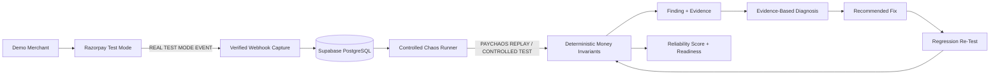

# PayChaos AI — Final Demo & Presentation Plan

**Project:** PayChaos AI — Autonomous Payment Reliability Engineer  
**Purpose:** Razorpay AI Buildathon — Open Track  
**Document Status:** Source-of-truth final demo specification  
**Primary Phase:** Phase 5 — UI Polish + Testing + Security + Deployment + Demo  
**Environment:** Razorpay Test Mode only  
**Target:** PayChaos-controlled Demo Merchant only  
**Target Demo Duration:** 5 minutes maximum  
**Runtime Cost Target:** ₹0  
**Primary Demo Scenario:** C01 — Duplicate Webhook Delivery  
**Authoritative Correctness Layer:** Deterministic Money Invariants  
**P0 AI Dependency:** None

---

# 0. Purpose and Authority of This Document

This document defines exactly how PayChaos AI should be demonstrated to Razorpay Buildathon reviewers.

It governs:

- the final five-minute story;
- screen order;
- demo setup;
- primary chaos scenario;
- Razorpay Test Mode proof;
- evidence presentation;
- diagnosis presentation;
- regression presentation;
- Reliability Score presentation;
- Go-Live Readiness presentation;
- demo truthfulness;
- backup demo mode;
- reset procedure;
- screenshots;
- architecture visual;
- submission assets;
- rehearsal;
- fallbacks.

This document must remain consistent with:

```text
PROJECT_CONTEXT.md
ARCHITECTURE.md
PHASE_PLAN.md
RAZORPAY_GUIDE.md
DATABASE.md
CHAOS_SCENARIOS.md
MONEY_INVARIANTS.md
AI_DESIGN.md
SECURITY.md
TESTING.md
```

No application code is defined by this document.

Phase 5 implementation should make the existing architecture easy to demonstrate rather than redesigning it.

---

# 1. Demo Objective

The demo must prove one complete PayChaos reliability-engineering story:

```text
Real Razorpay Test Mode payment evidence
        ↓
Controlled payment chaos
        ↓
Deterministic Money Invariant violation
        ↓
Structured Finding
        ↓
Factual evidence
        ↓
Evidence-based root-cause diagnosis
        ↓
Recommended engineering fix
        ↓
Regression re-test
        ↓
Deterministic PASS
        ↓
Updated Reliability Score
        ↓
Go-Live Readiness
```

The reviewer should understand within five minutes that PayChaos is not merely:

```text
a payment demo
```

and is not merely:

```text
a chaos simulator
```

and is not merely:

```text
an AI explanation tool
```

Its value is the complete loop:

> **Break the Test Mode integration safely, prove what went wrong, explain why, verify the fix, and quantify readiness.**

---

# 2. Audience

The primary audience is:

- Razorpay Buildathon reviewers;
- payment engineers;
- backend/distributed-systems engineers;
- engineering leads.

The reviewer may not know the internal PayChaos architecture before watching.

Therefore the demo must not require deep prior explanation.

The reviewer should understand these five concepts quickly:

```text
1. Real Razorpay Test Mode integration exists.
2. PayChaos deliberately stresses the merchant integration.
3. Money correctness is checked deterministically.
4. Diagnosis is evidence-based and advisory.
5. The same failure is re-tested after a fix.
```

---

# 3. One-Line Pitch

Use this wording consistently:

> **PayChaos AI is a Razorpay Test Mode-only payment reliability engineer that deliberately injects controlled payment failures, detects money/state invariant violations, explains the evidence-backed root cause, recommends a fix, reruns the failure, and calculates an explainable Go-Live Reliability Score.**

Shorter spoken version:

> **PayChaos deliberately breaks your Razorpay Test Mode integration before production, proves whether money and merchant state remain correct, explains the failure, and verifies the fix.**

---

# 4. Main Story

The canonical final demo story is:

```text
Healthy-looking Demo Merchant
        ↓
Real Razorpay Test Mode evidence exists
        ↓
User clicks:
"Attack My Test Integration"
        ↓
C01 — Duplicate Webhook Delivery
        ↓
PayChaos replays one verified Razorpay event
        ↓
Controlled vulnerable Demo Merchant mishandles replay
        ↓
Expected fulfilments: 1
Actual fulfilments: 2
        ↓
Money Invariant FAIL
Critical Finding
        ↓
Evidence timeline
        ↓
Missing idempotency diagnosed
        ↓
Recommended fix shown
        ↓
Developer-equivalent safe profile enabled
        ↓
Regression re-runs C01
        ↓
PASS
        ↓
Finding RESOLVED
        ↓
Reliability Score improves
        ↓
Go-Live Readiness improves
```

---

# 5. Primary Demo Scenario Decision

The primary scenario is:

```text
C01 — Duplicate Webhook Delivery
```

Priority:

```text
P0
```

This is the preferred demo because it is:

- easy to understand;
- highly relevant to webhook-based payment integrations;
- deterministic;
- visually explainable;
- strongly connected to idempotency;
- safe to reproduce;
- supported by authentic Razorpay Test Mode source evidence;
- capable of demonstrating a Critical business-state violation.

---

# 6. Important C01 Truthfulness Decision

The C01 chaos mechanism is:

```text
Mechanism B — PayChaos replay of authentic verified Razorpay Test Mode evidence
```

Therefore the normal demonstration is:

```text
1 real Razorpay Test Mode webhook event
+
multiple PayChaos replay processing attempts
```

It is **not**:

```text
2 new Razorpay webhook deliveries
```

unless Razorpay genuinely delivered the event twice and PayChaos recorded that external duplicate.

The demo must therefore show:

```text
Original Source:
REAL RAZORPAY TEST MODE EVENT

Processing:
PAYCHAOS REPLAY
```

Never say:

> Razorpay sent this twice.

unless the database proves Razorpay actually did.

Preferred narration:

> “Razorpay originally sent this verified Test Mode payment event. PayChaos now deliberately replays that same authentic event to test whether the merchant is safe under duplicate delivery conditions.”

---

# 7. Authoritative C01 Invariants

The authoritative C01 invariant mapping is:

```text
INV-001
INV-002
INV-006
INV-007
```

---

## INV-001

**Unique Webhook Protected Logic Once**

One logical webhook event must not execute protected merchant business logic more than once.

---

## INV-002

**One Captured Payment, At Most One Fulfilment**

For one captured payment:

```text
fulfilment count <= 1
```

---

## INV-006

**Processed Event Replay Preserves Final Business State**

Replaying already processed evidence must not change protected final merchant state.

---

## INV-007

**Duplicate Delivery Creates No Duplicate Business Record**

Duplicate processing must not create duplicate merchant-side business effects.

---

# 8. Primary Failure Shown

The main visible failure is:

```text
Expected:
1 fulfilment

Actual:
2 fulfilments
```

Severity:

```text
Critical
```

The important business interpretation is:

> One successful Razorpay Test Mode payment caused the Demo Merchant to execute the same protected business effect twice.

This is easy for reviewers to understand.

In a real merchant application, an equivalent failure could mean:

- sending goods twice;
- activating service twice;
- decrementing inventory twice;
- creating duplicate downstream business processing.

PayChaos does not claim that Razorpay itself duplicated money.

The demonstrated problem is:

```text
merchant-side reliability failure
```

---

# 9. Deliberately Vulnerable Demo Merchant

The final demo requires a controlled vulnerable merchant behavior.

This is deliberate test behavior.

It must be clearly labelled:

```text
DEMO / TEST BEHAVIOR
CONTROLLED VULNERABILITY
```

The application must never hide the fact that the vulnerable path exists specifically for reliability testing.

---

## Healthy Appearance

Before chaos, the merchant may correctly show:

```text
payment_status = PAID
business_status = FULFILLED
fulfilment count = 1
```

Therefore the system appears correct under the normal happy path.

That is exactly the point of the demo:

> The happy path looks healthy, but the integration fails under an adverse distributed-system condition.

---

## Vulnerable Profile Rule

If an approved vulnerable Demo Merchant profile is used:

- it must be Test Mode only;
- it must be operator-controlled;
- it must not be publicly exploitable;
- it must not target Razorpay;
- it must not disable PayChaos security controls;
- it must be clearly labelled;
- it must be reset or switched off after the run.

## Phase 5 — as implemented

The profile required above now exists. How each rule above is satisfied:

| Rule | How it is met |
|---|---|
| Test Mode only | The app refuses to boot without `RAZORPAY_MODE=test` and an `rzp_test_` key, and `setC01IdempotencyProfile` re-checks Test Mode before writing |
| Operator-controlled | Settings → **Demo / test behavior**, gated by the existing Demo Access Code session |
| Not publicly exploitable | `POST /api/demo/profile` requires the signed HttpOnly session; RLS with no policy keeps the table unreachable from a browser |
| Does not target Razorpay | The defect is entirely inside the PayChaos Demo Merchant's own fulfilment logic |
| Disables no security control | No constraint, trigger or index is disabled; webhook signature verification is untouched |
| Clearly labelled | The panel states the current mode, and shows a scoped notice while vulnerable |
| Reset/switched off | Demo Reset restores `SAFE` in the same transaction as the deletes |

**Where it lives**

- Storage: `demo_merchant_profile.c01_idempotency_profile`, default `SAFE`
- Behaviour: `process_webhook_payment_event`, guarded by four ANDed conditions
- Control: `components/demo/c01-profile-panel.tsx` on `/settings`
- Migration: `20260907000000_phase5_c01_controlled_vulnerable_profile.sql`

**The defect itself** is the one Section 43 of `docs/CHAOS_SCENARIOS.md`
prescribes: the fulfilment idempotency key incorrectly includes the processing
attempt id. Every replay allocates a new attempt, so the key changes, the
`UNIQUE(idempotency_key)` constraint never matches, and a second fulfilment is
inserted — a real merchant bug reached without weakening the database.

**Reachable only** when the attempt is `PAYCHAOS_REPLAY`, belongs to a chaos
run, that run is `C01`, and an operator has persisted
`VULNERABLE_IDEMPOTENCY`. A real `REAL_RAZORPAY_WEBHOOK` delivery, and C03,
C07 and C11, cannot enter that branch.

---

# 10. Fix Demonstration Rule

PayChaos must not pretend to automatically rewrite payment code.

The demo therefore uses an approved corrected Demo Merchant profile or corresponding fixed implementation state.

Preferred UI wording:

```text
Use Safe Idempotency Profile
```

or:

```text
Enable Corrected Demo Merchant Behavior
```

Do **not** use wording such as:

```text
AI Fixed Production Code
Auto-Deploy Fix
Patch Razorpay
```

Preferred narration:

> “PayChaos recommends the engineering change. For the demo, I’m switching the controlled Demo Merchant to the corrected implementation that represents the developer applying that fix. PayChaos itself does not modify payment code automatically.”

---

# 11. Recommended Root-Cause Presentation

The reviewer-friendly heading may say:

```text
Likely Root Cause:
Missing Idempotency
```

The technical diagnosis should retain the approved taxonomy.

Depending on the exact evidence, likely candidates are:

```text
RC-001 — MISSING_EVENT_IDEMPOTENCY
RC-002 — MISSING_BUSINESS_IDEMPOTENCY
```

For the deliberate duplicate-fulfilment path, `RC-002` may become the stronger diagnosis when the evidence directly proves that the semantic merchant action itself was not protected.

The UI should not hard-code C01 to one diagnosis regardless of evidence.

---

# 12. Recommended Fix Shown

Preferred human-readable recommendation:

> **Deduplicate the logical webhook event before protected business logic executes, and retain a stable database-backed semantic idempotency key for fulfilment so the same order cannot be fulfilled twice even if processing is retried.**

This preserves both required idempotency layers:

```text
Webhook/Event Idempotency
        +
Business-Effect Idempotency
```

Possible technical recommendation categories:

```text
FIX-IDEMPOTENCY
FIX-BUSINESS-IDEMPOTENCY
```

---

# 13. Regression Test Shown

Human-readable regression name:

```text
duplicate-webhook-idempotency
```

The actual regression behavior is:

```text
Original Finding
        ↓
Regression Run
        ↓
Same C01 Scenario
        ↓
Same logical source event / equivalent controlled setup
        ↓
Corrected merchant implementation
        ↓
Re-evaluate C01 invariants
```

Expected result:

```text
fulfilment count remains 1
```

and:

```text
INV-001 PASS
INV-002 PASS
INV-006 PASS
INV-007 PASS
```

where all required evidence exists.

---

# 14. Regression History Rule

The original failure must remain visible.

Never display:

```text
FAIL → overwritten as PASS
```

The correct history is:

```text
Original invariant result:
FAIL

Original Finding:
preserved

Regression:
new chaos run

Regression invariant result:
PASS

Finding:
RESOLVED
```

This gives the reviewer confidence that PayChaos preserves evidence rather than rewriting history.

---

# 15. Five-Minute Demo Structure

The target timing is:

| Time | Segment |
|---|---|
| 0:00–0:20 | Problem + one-line pitch |
| 0:20–0:40 | What PayChaos does + safety boundary |
| 0:40–1:15 | Demo Merchant + proof of real Razorpay Test Mode |
| 1:15–1:55 | “Attack My Test Integration” + C01 run |
| 1:55–2:40 | Critical invariant failure + evidence |
| 2:40–3:15 | Root cause + recommended fix |
| 3:15–3:50 | Regression re-test |
| 3:50–4:20 | Reliability Score + Go-Live Readiness |
| 4:20–4:40 | Architecture + security + testing |
| 4:40–5:00 | Business value + closing |

Total:

```text
5:00
```

The demo should aim for approximately:

```text
4:40–4:50
```

during rehearsal so small pauses do not exceed five minutes.

---

# 16. 0:00–0:20 — Problem and Pitch

## Screen

PayChaos Dashboard / landing page.

Visible:

```text
PayChaos AI
Autonomous Payment Reliability Engineer
RAZORPAY TEST MODE
```

---

## Narration

Recommended:

> “A payment can succeed at Razorpay while the merchant integration still fails—duplicate webhooks, retries, stale state or partial processing can cause duplicate fulfilment or incorrect order state.”

Then:

> “PayChaos deliberately breaks a Razorpay Test Mode integration, checks deterministic money invariants, explains the evidence-backed failure, and verifies the fix before go-live.”

Do not spend more than 20 seconds here.

---

# 17. 0:20–0:40 — What PayChaos Does

## Screen

Compact dashboard flow or visual:

```text
Payment
→ Webhook
→ Chaos
→ Invariant
→ Finding
→ Diagnosis
→ Regression
→ Reliability
```

---

## Narration

> “The important boundary is that AI never decides whether money is correct. Verified Test Mode evidence and deterministic invariants are authoritative. Diagnosis comes after the failure is proven.”

Mention:

```text
Test Mode only
our Demo Merchant only
no production chaos
```

Do not explain every architecture component yet.

---

# 18. 0:40–1:15 — Demo Merchant + Razorpay Test Mode Context

## Screen Order

1. Demo Merchant order.
2. Payment detail/evidence.
3. Real Razorpay event badge.

---

## Starting Order State

Preferred known state:

```text
Order:
PAID

Business:
FULFILLED

Fulfilments:
1

Currency:
INR

Payment evidence:
Verified
```

---

## Required Visible Razorpay Evidence

Show safe values such as:

```text
Razorpay Order ID
Razorpay Payment ID
Razorpay Event ID
Event Type
payment.captured
Signature Verified: Yes
Source: Razorpay Test Mode — Real Event
```

Never show:

- Key Secret;
- webhook secret;
- service-role key;
- Checkout signature;
- full unredacted payload.

---

## Narration

> “This payment is real Razorpay Test Mode evidence—not synthetic data. The order was created server-side, Checkout was verified server-side, and this `payment.captured` webhook was actually delivered by Razorpay Test Mode and signature-verified.”

Then:

> “Under the normal happy path, the merchant looks healthy: one payment and one fulfilment.”

---

# 19. Razorpay Test Mode Steps the Demo Must Prove

The final submission must demonstrate that PayChaos has successfully performed:

```text
Demo Merchant order
→ server-created Razorpay Test Mode Order
→ Razorpay Standard Checkout
→ Test Mode payment
→ Checkout response
→ server-side Checkout verification
→ real Razorpay Test Mode webhook
→ webhook signature verification
→ stored evidence
```

---

## Preferred Video Strategy

For maximum reliability, create the authentic Test Mode payment immediately before recording and start the timed five-minute story from the verified payment/evidence page.

A short Checkout clip may be included if the submission format allows it.

The five-minute core should not depend on waiting unpredictably for a fresh webhook.

---

## Live Presentation Strategy

For a live reviewer session:

use the already verified authentic Test Mode payment as the main source.

A fresh Test Mode payment may be performed afterward if requested.

---

# 20. 1:15–1:55 — “Attack My Test Integration”

## Screen

Chaos page.

Primary CTA:

```text
Attack My Test Integration
```

Clicking it should lead to or reveal the approved P0 scenario catalogue.

Highlight:

```text
C01
Duplicate Webhook Delivery
P0
```

---

## P0 Suite Presentation

The mandatory P0 suite contains four scenarios:

```text
C01 Duplicate Webhook Delivery
C03 Invalid Webhook Signature
C07 Client Confirmation Lost
C11 Failed Payment Safety
```

The UI may also show implemented P1 scenarios in a clearly separate optional section, but they must not be presented as required P0 coverage.

The live five-minute story should focus on C01.

Preferred:

```text
Show four-scenario P0 suite
→ Execute C01
→ Drill into C01
```

The reviewer can see a credible mandatory suite without sacrificing demo clarity or overstating implementation breadth.

---

# 21. Chaos Precheck Shown

Before C01 executes, show a concise successful preflight.

Preferred visible indicators:

```text
Environment: TEST              PASS
Razorpay Key: Test Mode        PASS
Demo Merchant Target           PASS
Database Reachable             PASS
Source Evidence Verified       PASS
Scenario Registered            PASS
No Arbitrary External Target   PASS
Operator Authorized            PASS
```

Then:

```text
RUN C01
```

This proves the safety model without spending time explaining every check.

---

# 22. C01 Execution Presentation

The run should show:

```text
Source Evidence:
REAL RAZORPAY TEST MODE EVENT

Event:
payment.captured

Source Event ID:
<safe Razorpay event ID>

Chaos Mechanism:
PAYCHAOS REPLAY

Replay Attempt #1
Replay Attempt #2
```

---

## Critical Truthfulness Rule

Do not label the two replay attempts:

```text
Razorpay Delivery #1
Razorpay Delivery #2
```

unless Razorpay genuinely produced those deliveries.

Preferred:

```text
Original Razorpay Event
Replay Processing #1
Replay Processing #2
```

---

# 23. 1:55–2:40 — Critical Finding

After execution, the result should become visually obvious.

Preferred summary:

```text
CRITICAL RELIABILITY FAILURE

Expected Fulfilments:
1

Actual Fulfilments:
2

Invariant:
INV-002

Result:
FAIL

Severity:
Critical
```

The C01 run may show all mapped invariants, but the reviewer should immediately see the clearest one.

---

# 24. Money Invariant Presentation

Primary invariant:

```text
INV-002
One Captured Payment, At Most One Fulfilment
```

Exact deterministic rule:

```text
count(
  fulfilments
  where payment_id = this payment
  and effect_type = FULFIL_ORDER
) <= 1
```

Visible result:

```text
Expected:
<= 1

Actual:
2

Result:
FAIL
```

---

## Narration

> “This result is not an AI opinion. The database contains two fulfilment records for one captured payment, so the deterministic Money Invariant Engine marks it Critical FAIL.”

---

# 25. Other C01 Invariants

The detail view should also expose:

```text
INV-001
INV-002
INV-006
INV-007
```

The main video should not read all four aloud unless time permits.

---

# 26. Evidence Shown

The Finding page must make the failure explainable without reading raw JSON.

Preferred evidence cards:

```text
Razorpay Event
Event ID: <safe ID>
Type: payment.captured
Signature Verified: Yes
Source: REAL RAZORPAY TEST MODE EVENT

Processing
Original processing
Replay processing #1
Replay processing #2

Payment
Razorpay Payment ID: <safe ID>
Status: captured

Merchant Order
Payment State: PAID

Fulfilments
Fulfilment #1
Fulfilment #2

Invariant
INV-002
Expected <= 1
Actual = 2
```

---

# 27. Evidence Timeline

Preferred visual order:

```text
T0  Razorpay Test Mode payment captured
        ↓
T1  Real webhook verified
        ↓
T2  Original event processed
        ↓
T3  Fulfilment #1
        ↓
T4  PayChaos Replay #1
        ↓
T5  Protected logic executes again
        ↓
T6  Fulfilment #2
        ↓
T7  INV-002 = FAIL
        ↓
T8  Finding created
```

The timeline must visually distinguish:

```text
REAL
```

from:

```text
REPLAY
```

---

# 28. 2:40–3:15 — Root-Cause Diagnosis

## Screen

Finding → Diagnosis.

Recommended headings:

```text
Observed Evidence

Deterministic Violation

Likely Root Cause

Evidence Strength

Recommended Fix

Regression Test
```

---

## Root Cause

Reviewer-friendly:

```text
Missing Idempotency
```

Technical diagnosis example:

```text
RC-002
MISSING_BUSINESS_IDEMPOTENCY
```

or:

```text
RC-001
MISSING_EVENT_IDEMPOTENCY
```

depending on the deterministic evidence.

---

## Evidence Strength

P0 uses:

```text
STRONG_EVIDENCE
PARTIAL_EVIDENCE
INSUFFICIENT_EVIDENCE
```

Do not display fake probability percentages such as:

```text
97% confidence
```

unless a later approved ML design explicitly produces calibrated probabilities.

---

# 29. Diagnosis Narration

Recommended:

> “PayChaos first proved the duplicate business effect using deterministic invariants. Only after that does the diagnosis layer reason about why.”

Then:

> “The evidence shows the same logical payment path was processed repeatedly and produced two fulfilments, so the strongest root-cause candidate is missing idempotency.”

Then:

> “The root cause is advisory. The two fulfilment records and failed invariant remain the factual evidence.”

---

# 30. Recommendation Presentation

Show:

```text
Recommended Fix

1. Deduplicate the logical Razorpay event before protected business logic.
2. Use database-backed uniqueness for the event identity.
3. Protect fulfilment independently with a stable semantic idempotency key.
4. Make retry/replay processing a safe no-op after the business effect succeeds.
```

---

## Important Fix Boundary

The recommendation does not execute code.

The UI should never claim:

```text
Fix applied automatically
```

until the operator explicitly switches to the approved corrected Demo Merchant state.

---

# 31. 3:15–3:50 — Regression Test + Re-Test

## Screen

Finding detail → Regression.

Show:

```text
Regression Test:
duplicate-webhook-idempotency

Scenario:
C01 — Duplicate Webhook Delivery

Original Result:
FAIL — Critical
```

---

## Apply Corrected Demo Behavior

Use operator-controlled action:

```text
Use Safe Idempotency Profile
```

Display:

```text
DEMO / TEST BEHAVIOR
Corrected merchant implementation selected
```

---

## Narration

> “This switch represents the merchant developer implementing the recommended idempotency protection. PayChaos does not automatically edit or deploy payment code.”

Then click:

```text
Re-Test
```

---

# 32. Regression Execution

The regression must:

```text
reference original Finding
        ↓
create new regression_runs record
        ↓
create new chaos_runs record
        ↓
execute C01 again
        ↓
create new processing attempts
        ↓
create new invariant results
```

The original failed records remain unchanged.

---

# 33. Re-Test Result

Expected visible result:

```text
REGRESSION PASSED

Expected Fulfilments:
1

Actual Fulfilments:
1

C01:
PASS

Finding:
RESOLVED
```

Mapped C01 invariants should now pass when all required evidence exists.

---

## Narration

> “PayChaos reruns the exact failure condition rather than just checking that the code changed. The duplicate event is replayed again, but the protected merchant effect occurs only once.”

---

# 34. 3:50–4:20 — Reliability Score Before and After

The Reliability Score must be deterministic.

It must use the actual Phase 4 frozen scoring formula.

This document intentionally does **not** invent numeric values.

---

# 35. Required Score States

During final rehearsal, capture the actual score generated at two points.

## Failure State

After unresolved Critical C01 Finding:

```text
Score:
S_FAIL = actual deterministic value

Go-Live:
NOT READY
```

or the exact equivalent label defined by the final frozen readiness specification.

An unresolved Critical Finding must prevent the highest ready state.

---

## Regression State

After successful C01 regression:

```text
Score:
S_FIXED = actual deterministic value
```

with expected relationship:

```text
S_FIXED > S_FAIL
```

only if that is what the approved scoring formula legitimately calculates.

Never hard-code an artificial improvement.

---

# 36. READY Transition Rule

The demo may show:

```text
NOT READY
→
READY
```

only if:

- C01 is resolved;
- no other blocking Critical Finding remains;
- required UNKNOWN/untested conditions satisfy the frozen readiness rules;
- all required score inputs are genuine;
- the score/readiness formula actually produces READY.

If other legitimate blockers remain:

display the truthful result.

For example:

```text
NEEDS ATTENTION
```

Do **not** manipulate data to force the word READY.

---

# 37. Recommended Pre-Demo Reliability Preparation

To make the intended:

```text
NOT READY → READY
```

story possible without faking results, the demo workspace should already contain genuine passing evidence for the other required P0 scenarios where the final score formula expects them.

Those results must come from actual PayChaos runs.

Do not seed fake PASS history.

Recommended before recording:

```text
Run and verify P0 suite
        ↓
confirm no unresolved Finding
        ↓
confirm current readiness legitimately reaches READY
        ↓
activate controlled vulnerable demo state
        ↓
start five-minute demo
        ↓
C01 creates Critical Finding
        ↓
NOT READY
        ↓
regression resolves C01
        ↓
READY returns
```

If this preparation proves too fragile:

do not force the READY transition.

A truthful:

```text
NOT READY → NEEDS ATTENTION
```

is better than fake metrics.

---

# 38. Score Explanation Shown

The dashboard should make clear why the score changed.

Preferred summary:

```text
Before Fix

Unresolved Critical Findings: 1
C01: FAIL
Regression: Not passed
Readiness: NOT READY


After Fix

Unresolved Critical Findings: 0
C01 Regression: PASS
Finding: RESOLVED
Readiness: READY
```

Actual fields must follow the final Phase 4 score design.

---

# 39. Reliability Score Disclaimer

Display:

> **PayChaos Go-Live Readiness is an engineering assessment based on the implemented PayChaos test suite. It is not Razorpay certification.**

This should be visible on the Reliability page.

---

# 40. 4:20–4:40 — Architecture / Security / Testing Highlights

Do not open many source files.

Use one compact architecture visual.

Narration:

> “This stays deliberately simple: one Next.js application, Supabase PostgreSQL, and Razorpay Test Mode. Webhook signatures, event deduplication, money invariants and scoring are deterministic. Chaos is restricted to predefined scenarios against our own Demo Merchant.”

Then:

> “P0 requires no paid AI API.”

This section should be approximately 20 seconds.

---

# 41. Required Architecture Visual

Use the following conceptual architecture:



---

# 42. Architecture Visual Message

The visual must make one boundary unmistakable:

```text
Razorpay produces authentic Test Mode payment evidence.
PayChaos controls the chaos after evidence enters its own environment.
```

The visual must not imply PayChaos attacks Razorpay infrastructure.

---

# 43. 4:40–5:00 — Final Business Value

Recommended closing:

> “Happy-path tests tell you that a payment works once. PayChaos asks the harder question: will the merchant still be correct when the same payment event is duplicated, delayed, retried or partially processed?”

Then:

> “PayChaos gives the engineer the failed invariant, the evidence, the likely root cause, the fix, the regression result and an explainable readiness assessment—before real customers and real money are involved.”

Final sentence:

> **“PayChaos helps merchants break their Razorpay integration safely in Test Mode, so production does not break it for them.”**

---

# 44. Exact Screen Order

The canonical screen order is:

```text
SCREEN 1
PayChaos Dashboard

SCREEN 2
Demo Merchant / healthy payment

SCREEN 3
Real Razorpay Test Mode evidence

SCREEN 4
Chaos Catalogue / Attack My Test Integration

SCREEN 5
C01 Precheck + Run

SCREEN 6
C01 Result / Critical Invariant FAIL

SCREEN 7
Evidence Timeline

SCREEN 8
Finding + Diagnosis + Recommendation

SCREEN 9
Regression / Safe Idempotency Profile

SCREEN 10
Regression PASS / Finding RESOLVED

SCREEN 11
Reliability Score + Go-Live Readiness

SCREEN 12
Architecture / security summary
```

Avoid unnecessary navigation.

The reviewer should always understand where they are in the story.

---

# 45. Demo Navigation Rule

The UI should prioritize one linear path.

Preferred next-action buttons:

```text
View Evidence
View Finding
View Diagnosis
Run Regression
View Reliability
```

Do not make the reviewer watch the operator hunt through menus.

---

# 46. DEMO TRUTHFULNESS RULES

Truthfulness is mandatory.

PayChaos must never make synthetic behavior look more impressive by misrepresenting it as Razorpay behavior.

Every source-bearing visible result must have one primary source classification.

Allowed primary labels are:

```text
REAL RAZORPAY TEST MODE EVENT

RECORDED RAZORPAY TEST MODE FIXTURE

PAYCHAOS CONTROLLED SIMULATION

DEMO/SYNTHETIC METRIC
```

Derived PayChaos results such as:

```text
Invariant
Finding
Diagnosis
Regression
Reliability Score
```

must additionally state which evidence class they derive from where useful.

---

# 47. REAL RAZORPAY TEST MODE EVENT

Use only when:

1. Razorpay Test Mode actually produced the payment/event;
2. PayChaos actually received it;
3. webhook authenticity was verified where applicable.

Example UI:

```text
REAL RAZORPAY TEST MODE EVENT
payment.captured
Signature Verified
```

---

# 48. RECORDED RAZORPAY TEST MODE FIXTURE

Use when:

- evidence originated from a real Test Mode interaction;
- it was captured previously;
- it was sanitized;
- the current demonstration is loading/replaying the saved fixture rather than receiving a fresh provider delivery.

Example:

```text
RECORDED RAZORPAY TEST MODE FIXTURE
Captured previously from Test Mode
Sanitized
```

Never call this:

```text
Live Razorpay Webhook
Fresh Razorpay Event
```

---

# 49. PAYCHAOS CONTROLLED SIMULATION

Use for controlled internal behaviors that PayChaos itself causes.

Examples:

- deliberately slow processor;
- database-failure checkpoint;
- lost frontend confirmation;
- controlled vulnerable Demo Merchant behavior.

Example:

```text
PAYCHAOS CONTROLLED SIMULATION
Demo Merchant test behavior
```

Never say:

```text
Razorpay database failed
Razorpay handler timed out
```

when PayChaos created the fault.

---

# 50. DEMO/SYNTHETIC METRIC

Use only for backup/demo synthetic values.

Example:

```text
DEMO/SYNTHETIC METRIC
Not included in genuine Reliability Score
```

Synthetic metrics must never silently affect real readiness.

---

# 51. PAYCHAOS REPLAY Label

Replay is an execution mechanism rather than a new provider event.

Therefore a replayed result should show two labels:

```text
Source:
REAL RAZORPAY TEST MODE EVENT

Processing:
PAYCHAOS REPLAY
```

or in backup mode:

```text
Source:
RECORDED RAZORPAY TEST MODE FIXTURE

Processing:
PAYCHAOS REPLAY
```

This preserves the four required truthfulness categories without pretending replay is a new Razorpay delivery.

---

# 52. Demo Merchant Starting State

Immediately before the primary run:

```text
Environment:
Razorpay Test Mode

Target:
Registered PayChaos Demo Merchant

Order:
PAID

Business State:
FULFILLED

Captured Payment:
Verified

Fulfilment Count:
1

Source Event:
Verified payment.captured

Open Critical Findings:
0
```

If the controlled vulnerable test profile is enabled:

show:

```text
DEMO / TEST BEHAVIOR
Controlled vulnerability profile enabled
```

Do not hide it.

---

# 53. What Must Be Preloaded Before Recording

Prepare the following before starting the timed recording:

1. deployed PayChaos URL loaded;
2. operator authenticated;
3. browser notifications disabled;
4. correct browser zoom selected;
5. DevTools closed unless required;
6. Razorpay Dashboard confirmed in Test Mode;
7. Supabase deployment healthy;
8. webhook configuration verified;
9. at least one authentic `payment.captured` Test Mode event available;
10. authentic payment/order/event correlation verified;
11. source event safe for display;
12. controlled vulnerable Demo Merchant profile ready;
13. corrected safe profile ready;
14. C01 automated test passing in both vulnerable-detection and fixed-path modes;
15. regression flow manually verified;
16. Reliability Score formula frozen and tested;
17. readiness thresholds frozen and tested;
18. current score/readiness state known;
19. other blocking findings resolved if READY transition is intended;
20. backup recorded fixture verified;
21. Demo Reset verified;
22. architecture visual ready;
23. final screenshots prepared;
24. README current;
25. final build/test status current.

---

# 54. What Must Be Hidden From Recording

Never show:

```text
RAZORPAY_KEY_SECRET
RAZORPAY_WEBHOOK_SECRET
SUPABASE_SERVICE_ROLE_KEY
PAYCHAOS_ACCESS_TOKEN
PAYCHAOS_SESSION_SECRET
.env.local
Vercel secret values
Supabase service-role credentials
webhook secret
Checkout signature
full session cookies
CVV
PAN/card number
OTP
real customer banking credentials
full unredacted webhook payload
```

---

# 55. Other Recording Hygiene

Hide or close:

- email;
- Slack/Discord notifications;
- browser password manager popups;
- personal bookmarks if sensitive;
- unrelated tabs;
- terminal windows containing environment variables;
- personal account data.

Use a dedicated browser profile if practical.

---

# 56. Security Precautions During Demo

Before recording or presenting:

```text
RAZORPAY_MODE=test
```

must be confirmed.

Key ID must be Test Mode.

Chaos preflight must pass.

The target must be the registered Demo Merchant.

No arbitrary URL field may exist.

The operator access gate must be active on the public deployment.

The webhook endpoint remains externally reachable only through webhook signature authentication.

---

# 57. Security Narration Rule

Do not spend 60 seconds reading security controls.

Use one compact statement:

> “Chaos is restricted to predefined server-side scenarios against our own Demo Merchant, Razorpay Live Mode is rejected, secrets stay server-side, and invalid webhook signatures can never mutate merchant state.”

---

# 58. Which Parts Are Real Razorpay Test Mode

The following may be shown as real:

```text
Razorpay Test Mode Order
Razorpay Standard Checkout
Razorpay Test Payment
Razorpay Order ID
Razorpay Payment ID
real Test Mode webhook
Razorpay Event ID
verified payment.captured
verified payment.failed when genuinely observed
verified order.paid when genuinely observed
```

Only when they actually occurred.

---

# 59. Which Parts Are Replayed

Primary C01 chaos action:

```text
previously verified event
→ PAYCHAOS REPLAY
→ Event Processor
```

The replay processing attempts are PayChaos activity.

The original event remains immutable.

---

# 60. Which Parts Are Controlled Simulations

Examples across the project include:

```text
controlled vulnerable merchant behavior
delayed processing
handler failure
database failure checkpoint
lost frontend confirmation
```

These must show:

```text
PAYCHAOS CONTROLLED SIMULATION
```

where applicable.

---

# 61. Which Parts Are Deterministic Derived Results

The following are PayChaos-derived outputs:

```text
Money Invariant result
Finding
severity
diagnostic signals
root-cause candidate
recommendation
regression result
Reliability Score
Go-Live Readiness
```

Money Invariants and scoring are deterministic.

Diagnosis/recommendation are advisory.

---

# 62. Required Metrics

The main demo must show actual recorded values for:

| Metric | Main Demo Expectation |
|---|---|
| Payment count for selected path | Actual |
| Canonical Razorpay event count | `1` for normal C01 replay demo |
| Replay processing attempts | Actual count shown |
| Expected fulfilment count | `1` |
| Vulnerable actual fulfilment count | `2` |
| Fixed fulfilment count | `1` |
| Invariant result before fix | `FAIL` |
| Finding severity | `Critical` |
| Diagnosis strength | Actual deterministic label |
| Regression result | `PASS` after corrected behavior |
| Finding status after regression | `RESOLVED` |
| Reliability Score before regression | Actual formula output |
| Reliability Score after regression | Actual formula output |
| Go-Live status before | Actual deterministic status |
| Go-Live status after | Actual deterministic status |

Never insert invented metric values merely because they look impressive.

---

# 63. Optional Suite Metrics

If genuine and current, the dashboard may show:

```text
P0 scenarios executed
PASS count
FAIL count
BLOCKED count
ERROR count
NOT RUN count
unresolved Critical findings
resolved findings
```

Only actual persisted run results may be used.

---

# 64. Required Screenshots

Prepare the following clean screenshots before submission.

## SS-01 — Landing / Dashboard

Must show:

```text
PayChaos AI
Razorpay Test Mode
```

---

## SS-02 — Demo Merchant

Show:

```text
PAID
FULFILLED
1 fulfilment
```

using real Test Mode evidence.

---

## SS-03 — Real Razorpay Evidence

Show safe:

```text
Order ID
Payment ID
Event ID
payment.captured
Signature Verified
REAL RAZORPAY TEST MODE EVENT
```

---

## SS-04 — Chaos Catalogue

Show C01 and the P0 suite.

---

## SS-05 — C01 Failure

Show:

```text
Expected 1
Actual 2
FAIL
Critical
```

---

## SS-06 — Evidence Timeline

Show original event, replay attempts and duplicate fulfilments.

---

## SS-07 — Diagnosis

Show:

```text
Observed Evidence
Likely Root Cause
Evidence Strength
Recommended Fix
```

---

## SS-08 — Regression PASS

Show:

```text
Original FAIL
Regression PASS
Finding RESOLVED
```

---

## SS-09 — Reliability

Show actual:

```text
score
breakdown
Go-Live Readiness
disclaimer
```

---

## SS-10 — Architecture

Use the final architecture visual.

---

## SS-11 — Test Evidence

Optional submission screenshot showing current:

```text
build
tests
typecheck
lint
Playwright
```

without secrets.

---

# 65. Screenshot Rules

Screenshots must:

- be readable;
- use consistent browser zoom;
- hide secrets;
- avoid personal data;
- show source labels;
- avoid dead/error states unless demonstrating one intentionally;
- use real current results where claimed.

---

# 66. BACKUP DEMO MODE

A backup demonstration is mandatory.

It exists for situations such as:

- Razorpay Test Mode temporarily unavailable;
- webhook connectivity problem;
- network failure;
- external provider delay.

---

# 67. Backup Demo Source

Use a previously captured, sanitized Razorpay Test Mode fixture.

Visible label:

```text
RECORDED RAZORPAY TEST MODE FIXTURE
```

Processing label:

```text
PAYCHAOS REPLAY
```

---

# 68. Backup Demo Flow

The backup preserves the exact core story:

```text
Recorded Test Mode fixture
        ↓
PayChaos Replay
        ↓
Controlled C01 duplicate condition
        ↓
Expected 1 fulfilment
        ↓
Actual 2 fulfilments
        ↓
Invariant FAIL
        ↓
Finding
        ↓
Evidence
        ↓
Diagnosis
        ↓
Recommendation
        ↓
Corrected profile
        ↓
Regression
        ↓
PASS
        ↓
Reliability / Readiness
```

---

# 69. Backup Demo Narration

Say:

> “Razorpay Test Mode connectivity is unavailable right now, so I’m using a sanitized webhook fixture that was previously captured from a genuine Razorpay Test Mode payment. The UI labels it as a recorded fixture. Everything after that—the replay, invariants, finding, diagnosis and regression—is running deterministically inside PayChaos.”

This maintains credibility.

---

# 70. Backup Mode Must Never Claim

Never say:

```text
Razorpay just sent this webhook
This is a live payment
This happened right now in Razorpay
```

when using a recorded fixture.

---

# 71. Backup Fixture Requirements

The backup fixture must:

- come from Test Mode;
- be sanitized;
- contain no webhook signature;
- contain no personal data unless safely redacted;
- contain no card details;
- contain no secrets;
- be version-controlled safely;
- be reproducible;
- be labelled as recorded fixture.

---

# 72. Backup Fixture Loading

The final application may provide an operator-protected action such as:

```text
Load Backup Demo Fixture
```

if needed.

Requirements:

- only predefined bundled fixture;
- no arbitrary file upload required;
- no arbitrary webhook target;
- explicit recorded-fixture label;
- unavailable to unauthenticated public users.

Manual database editing must not be needed.

---

# 73. DEMO RESET PROCEDURE

The demo must be reproducible from a known state.

Reset is an operator-only administrative action.

---

## Step 1 — Finish Current Run

Ensure no active chaos run remains.

---

## Step 2 — Disable Controlled Fault State

Verify:

```text
fault_state = inactive
```

or equivalent approved state.

---

## Step 3 — Click Demo Reset

Use the protected application reset action.

Do not manually delete rows in Supabase during the presentation.

---

## Step 4 — Confirm Reset

Runtime/demo records are removed in dependency-safe order from:

```text
fulfilments
regression_runs
event_processing_attempts
findings
invariant_results
chaos_runs
webhook_events
payments
payment_attempts
orders
```

Every delete is explicitly qualified so it satisfies Supabase `safeupdate`,
which stays enabled.

The reset is atomic: all ten deletes run in one transaction, so it either
fully applies or does not apply at all. If it fails, the database is unchanged
and the UI says so — it never reports that some tables were cleared.

---

## Step 5 — Verify Preserved State

Reset must preserve:

```text
database schema
migration history
RLS
environment secrets
Razorpay configuration
source-controlled fixtures
```

---

## Step 6 — Establish Baseline

For main mode:

create/confirm a new genuine Razorpay Test Mode baseline.

For backup mode:

load the approved recorded fixture.

---

## Step 7 — Verify Known State

Before starting C01:

```text
fulfilment count = 1
source evidence available
no active chaos run
no unresolved unexpected finding
```

---

# 74. Reset Failure Rule

If Demo Reset does not produce a deterministic known state:

the demo is not ready.

Do not repair database rows manually during the recorded presentation.

Fix the reset workflow before submission.

---

# 75. Pre-Recording Checklist

Immediately before recording:

```text
[ ] Demo Reset verified
[ ] Main Test Mode source evidence ready
[ ] Backup fixture ready
[ ] Vulnerable demo profile ready
[ ] Safe profile ready
[ ] C01 tested
[ ] Regression tested
[ ] Score tested
[ ] Readiness tested
[ ] Architecture visual ready
[ ] Secrets hidden
[ ] Browser notifications off
[ ] No unrelated tabs
[ ] App warmed
[ ] Operator session valid
[ ] Razorpay Test Mode confirmed
[ ] Webhook endpoint confirmed
[ ] Recording audio tested
```

---

# 76. Required Architecture Asset

Final submission should include an exported version of the architecture diagram.

Preferred formats:

```text
PNG
or
SVG
```

The repository source may remain Mermaid.

The visual should remain simple enough to understand without zooming heavily.

---

# 77. Final Submission Assets

Prepare at minimum:

```text
1. Deployed PayChaos application URL
2. GitHub repository
3. Current README
4. Source-of-truth documentation
5. Final 5-minute demo video
6. Architecture diagram
7. Main dashboard screenshot
8. Critical Finding screenshot
9. Evidence timeline screenshot
10. Regression PASS screenshot
11. Reliability / Go-Live screenshot
12. Current test-result evidence
13. Phase 5 handoff
14. Submission description / one-line pitch
```

---

# 78. README Demo Section

README should contain:

```text
What PayChaos is
Why it matters
Safety / Test Mode warning
Core architecture
Main demo flow
How to run locally
How Razorpay Test Mode is configured
How Demo Reset works
How to run tests
Known limitations
```

Do not include secrets.

---

# 79. Project Name Consistency

The following name should remain consistent everywhere:

```text
PayChaos AI — Autonomous Payment Reliability Engineer
```

Use the same one-line pitch across:

- README;
- submission form;
- video opening;
- app landing page;
- architecture visual where practical.

---

# 80. Demo Rehearsal Checklist

Run the complete demo repeatedly.

At minimum verify:

```text
[ ] timed flow <= 5:00
[ ] target rehearsal <= 4:50
[ ] main demo works from known state
[ ] backup demo works
[ ] source labels readable
[ ] Test Mode label readable
[ ] C01 runs
[ ] vulnerable path produces expected FAIL
[ ] expected 1 / actual 2 visible
[ ] Finding created
[ ] evidence understandable
[ ] diagnosis appears
[ ] recommendation appears
[ ] safe profile switch works
[ ] regression runs C01
[ ] new PASS produced
[ ] original FAIL preserved
[ ] Finding RESOLVED
[ ] score updates deterministically
[ ] readiness updates correctly
[ ] disclaimer visible
[ ] architecture explanation <= 20 sec
[ ] no secret visible
[ ] no console error
[ ] no broken button
```

---

# 81. Rehearsal Count

Before final approval:

the complete judge-facing sequence must succeed at least:

```text
2 consecutive times
```

without manual database repair.

Recommended:

```text
3 successful runs
```

if time permits.

---

# 82. Common Demo Failure Risks

| Risk | Prevention | Fallback |
|---|---|---|
| Razorpay Test Mode unavailable | Pre-verify before recording | Recorded Test Mode fixture |
| Webhook delayed | Use pre-created authentic source event | Recorded fixture |
| Checkout takes too long | Prepare genuine baseline before timed story | Show verified real evidence |
| Vercel cold start | Warm app before recording | Retry before timer begins |
| Operator session expired | Login before recording | Re-authenticate before restart |
| Wrong Razorpay mode | Preflight and visible TEST badge | Do not proceed |
| Vulnerable profile not active | Verify demo state before timer | Restart from reset |
| Safe profile not active for regression | Pretest profile switch | Restart regression |
| C01 leaves dirty state | Cleanup/reset test | Demo Reset |
| Score does not become READY | Verify genuine blockers beforehand | Show truthful status |
| Backup fixture mislabeled | Review badges before recording | Stop and fix |
| Secret accidentally visible | Dedicated recording profile | Re-record |
| Browser popup/notification | Disable beforehand | Restart take |
| Console errors | Run final QA | Fix before recording |
| Full suite takes too long | Demonstrate C01 only | Show suite catalogue/results |
| Mobile layout breaks screenshot | Verify responsive layout | Use desktop recording |
| Architecture slide unreadable | Simplify visual | Use larger export |
| External API rate limit | Avoid repeated payment creation during takes | Use existing authentic event |

---

# 83. Reliability Score Risk

A specific demo risk is:

```text
Expected:
READY after fix

Actual:
NEEDS ATTENTION
```

This is not necessarily a software bug.

It may mean:

- another finding remains unresolved;
- an invariant is UNKNOWN;
- a required scenario is untested;
- the frozen scoring formula does not yet permit READY.

The demo must not hide these facts.

Fix the underlying test state before recording if READY is required.

Never fake the score.

---

# 84. Main Scenario Failure Risk

If C01 unexpectedly passes while the controlled vulnerable profile should fail:

the demo should stop.

That means the vulnerable demonstration is not reproducible.

Do not alter database records to manufacture the two fulfilments.

Fix the controlled test path and rerun automated tests.

---

# 85. Regression Failure Risk

If the corrected profile still fails C01:

do not manually mark the Finding RESOLVED.

The correct state is:

```text
STILL FAILING
```

Fix the implementation and rerun.

---

# 86. Architecture Failure Risk

If the backup path needs a new service, queue or architecture change on Day 7:

do not introduce it casually.

Prefer a fixed sanitized fixture through the existing Next.js application.

Day 7 is for stability.

---

# 87. Required Security Verification Before Final Video

Verify:

```text
[ ] no rzp_live_ credential configured
[ ] no secret in Git
[ ] no .env committed
[ ] no service-role key in client
[ ] no Key Secret in client
[ ] no webhook secret in client
[ ] access gate enabled
[ ] reset protected
[ ] chaos protected
[ ] arbitrary URLs rejected
[ ] invalid signature zero mutation
[ ] real/replay/simulation labels correct
```

---

# 88. Required Test Verification Before Final Video

Run repository equivalents of:

```text
npm run build
npm run lint
npm run typecheck
npm test
```

and:

```text
Playwright / E2E
```

where implemented.

Record:

- command;
- exit code;
- tests passed;
- tests failed;
- tests skipped.

Do not claim a successful final QA pass from old test results.

---

# 89. Five-Minute Recording Rules

Keep the video:

- direct;
- evidence-heavy;
- low on setup narration;
- visually readable;
- free of long typing;
- free of terminal debugging;
- free of environment setup.

Do not spend demo time:

- installing packages;
- editing code;
- opening Supabase SQL Editor;
- configuring Razorpay secrets;
- explaining every optional scenario individually;
- reading entire JSON payloads.

---

# 90. What the Reviewer Should Remember

After five minutes, the reviewer should remember:

```text
One real Razorpay Test Mode payment.
One controlled duplicate-event test.
One Critical deterministic invariant failure.
Clear factual evidence.
Clear root cause.
Clear engineering fix.
Same test rerun.
Failure resolved.
Readiness improves.
```

If those points are clear, the demo succeeded.

---

# 91. Business Value Message

PayChaos is useful because merchant payment reliability is not the same as payment-gateway availability.

A payment provider can process correctly while the merchant application mishandles:

- duplicate events;
- retries;
- ordering;
- client loss;
- database failure.

PayChaos provides a pre-production engineering loop to uncover these mistakes deliberately.

---

# 92. What PayChaos Is Not

The final presentation should never imply that PayChaos is:

- a payment gateway;
- a Razorpay replacement;
- a Razorpay certification system;
- a production chaos platform;
- an attack tool;
- a financial ledger;
- an autonomous production remediation agent.

---

# 93. Optional Reviewer Questions — Fast Answers

## “Is this using real Razorpay?”

Answer:

> “The payment source is genuine Razorpay Test Mode. The chaos happens inside PayChaos after verified evidence is captured.”

---

## “Did Razorpay really send the duplicate?”

Answer for normal C01 replay:

> “No. Razorpay sent the original verified event. PayChaos deliberately replayed it to test duplicate-delivery safety.”

---

## “Is AI deciding that the merchant is wrong?”

Answer:

> “No. Money invariants are deterministic. AI-style diagnosis only explains a failure after the invariant has already proved it.”

---

## “Does PayChaos fix production automatically?”

Answer:

> “No. It recommends a fix and reruns the scenario after the developer applies it.”

---

## “Can this attack arbitrary websites?”

Answer:

> “No. Chaos uses a static server-side scenario registry and only targets the controlled Demo Merchant.”

---

## “Can this run with real money?”

Answer:

> “No. PayChaos is Razorpay Test Mode only and rejects Live Mode configuration.”

---

## “Does the Reliability Score mean Razorpay certified this merchant?”

Answer:

> “No. It is a deterministic PayChaos engineering assessment based on the implemented test suite.”

---

# 94. FINAL SUBMISSION CHECKLIST

## Deployment

- [ ] deployed application URL works;
- [ ] Vercel deployment healthy;
- [ ] Supabase connected;
- [ ] deployed migrations correct;
- [ ] operator access works.

---

## GitHub

- [ ] repository accessible as required;
- [ ] correct branch merged;
- [ ] README current;
- [ ] no secret committed;
- [ ] no `.env.local` committed;
- [ ] source-of-truth docs present.

---

## Razorpay

- [ ] Test Mode confirmed;
- [ ] real Test Mode payment verified;
- [ ] real webhook verified;
- [ ] correct webhook URL configured;
- [ ] webhook signature verification working.

---

## Demo

- [ ] Demo Reset works;
- [ ] main scenario reproducible;
- [ ] C01 vulnerable path reproducible;
- [ ] corrected C01 path reproducible;
- [ ] regression preserves history;
- [ ] backup demo works;
- [ ] backup fixture correctly labelled.

---

## Truthfulness

- [ ] real events labelled real;
- [ ] recorded fixtures labelled recorded fixture;
- [ ] replays labelled replay;
- [ ] controlled simulations labelled;
- [ ] synthetic/demo metrics labelled;
- [ ] no synthetic result presented as merchant performance;
- [ ] no replay described as Razorpay redelivery unless genuine.

---

## Metrics

- [ ] no fake metric;
- [ ] Reliability Score uses actual frozen formula;
- [ ] score before/after recorded;
- [ ] readiness derived deterministically;
- [ ] unresolved Critical Finding blocks READY as required;
- [ ] synthetic results excluded where required.

---

## UI

- [ ] no broken button;
- [ ] no critical console error;
- [ ] Test Mode visible;
- [ ] evidence readable;
- [ ] provenance readable;
- [ ] desktop layout good;
- [ ] basic mobile/narrow responsiveness works;
- [ ] no sensitive data visible.

---

## Testing

- [ ] build current;
- [ ] lint current;
- [ ] typecheck current;
- [ ] automated tests current;
- [ ] Playwright current;
- [ ] manual Test Mode verification current;
- [ ] final QA documented.

---

## Submission Assets

- [ ] final video within required time;
- [ ] architecture diagram current;
- [ ] screenshots current;
- [ ] project description current;
- [ ] project name consistent;
- [ ] one-line pitch consistent;
- [ ] Phase 5 handoff complete.

---

# 95. Final Demo Definition of Done

The final PayChaos demo is ready only when all mandatory conditions below are satisfied.

---

## Reproducibility

- [ ] main demo can be reproduced from reset;
- [ ] backup demo can be reproduced;
- [ ] no manual database editing is required;
- [ ] no hidden one-off database manipulation is required.

---

## Razorpay Proof

- [ ] genuine Razorpay Test Mode integration exists;
- [ ] real Test Mode Order/payment has been verified;
- [ ] real webhook has been captured and authenticated;
- [ ] Razorpay evidence shown in the demo is genuine or explicitly labelled recorded fixture.

---

## Chaos

- [ ] C01 executes through the approved Chaos Runner;
- [ ] safety precheck runs;
- [ ] original external evidence remains immutable;
- [ ] replay is labelled correctly.

---

## Failure Detection

- [ ] expected state is visible;
- [ ] actual state is visible;
- [ ] duplicate fulfilment is understandable;
- [ ] Money Invariant FAIL is deterministic;
- [ ] severity is correct.

---

## Evidence

- [ ] Razorpay event ID visible safely;
- [ ] processing attempts visible;
- [ ] fulfilment records visible;
- [ ] state before/after understandable;
- [ ] no secret included;
- [ ] no AI-generated text presented as factual evidence.

---

## Diagnosis

- [ ] diagnosis follows deterministic failure;
- [ ] supporting evidence is shown;
- [ ] evidence strength is shown;
- [ ] root cause is advisory;
- [ ] recommendation is technically relevant.

---

## Regression

- [ ] same scenario is rerun;
- [ ] corrected merchant behavior is used;
- [ ] new invariant result is created;
- [ ] original failure remains;
- [ ] Finding status updates correctly;
- [ ] regression passes.

---

## Reliability

- [ ] score uses actual deterministic inputs;
- [ ] score before/after is explainable;
- [ ] readiness before/after is explainable;
- [ ] READY is shown only when genuinely allowed;
- [ ] readiness disclaimer is visible.

---

## Security

- [ ] no real money;
- [ ] no Live Mode;
- [ ] no production endpoint;
- [ ] no arbitrary target;
- [ ] no secret visible;
- [ ] no card number;
- [ ] no CVV;
- [ ] no service-role key;
- [ ] operator-only controls protected.

---

## Truthfulness

- [ ] every source-bearing result has the correct classification;
- [ ] real event is never confused with replay;
- [ ] replay is never confused with a Razorpay retry;
- [ ] simulation is never blamed on Razorpay;
- [ ] synthetic/demo data is never presented as real merchant performance.

---

## Presentation

- [ ] exact screen order works;
- [ ] no unnecessary navigation;
- [ ] reviewer can understand evidence without reading raw JSON;
- [ ] complete story fits within five minutes;
- [ ] main flow succeeds twice consecutively;
- [ ] backup flow succeeds;
- [ ] final closing statement is clear.

---

# 96. Final Canonical Demo Flow

The final frozen demo story is:

```text
PayChaos AI
        ↓
Healthy Demo Merchant
        ↓
Genuine Razorpay Test Mode payment evidence
        ↓
Attack My Test Integration
        ↓
C01 — Duplicate Webhook Delivery
        ↓
Original verified Razorpay event
        ↓
PAYCHAOS REPLAY
        ↓
Controlled vulnerable merchant behavior exposed
        ↓
Expected fulfilment = 1
Actual fulfilment = 2
        ↓
INV-002 FAIL
Critical
        ↓
Finding
        ↓
Observed Evidence
        ↓
Likely Root Cause:
Missing Idempotency
        ↓
Recommended Fix:
Event + business-effect idempotency
        ↓
Corrected Demo Merchant profile
        ↓
Regression re-runs C01
        ↓
Fulfilment = 1
        ↓
PASS
        ↓
Finding RESOLVED
        ↓
Reliability Score improves according to frozen rules
        ↓
Go-Live Readiness improves according to frozen rules
```

---

# 97. Final Demo Principle

The governing demo rule is:

> **Show one real payment, one controlled failure, one deterministic proof, one evidence-backed explanation, one verified fix, and one truthful readiness result.**

The final presentation should leave the reviewer with one clear message:

> **PayChaos helps developers discover payment-integration failures before those failures reach real customers and real money.**