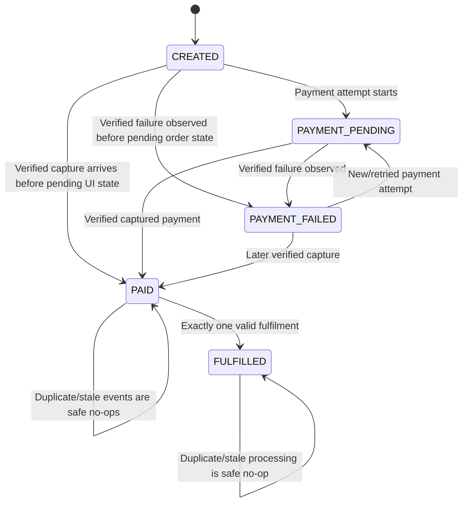
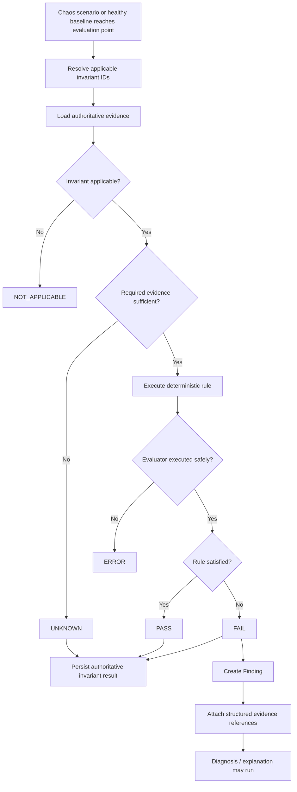

# PayChaos AI — Money Invariants

**Project:** PayChaos AI — Autonomous Payment Reliability Engineer  
**Document Status:** Authoritative money and business-state correctness specification  
**Primary Implementation Phase:** Phase 3 — Chaos Engine + Money Invariant Engine  
**Environment:** Razorpay Test Mode only  
**Implementation Style:** Deterministic TypeScript domain logic  
**Runtime AI Required:** No  
**Runtime Cost Target:** ₹0

---

# 0. Purpose and Authority of This Document

This document defines the authoritative payment and Demo Merchant correctness rules used by PayChaos AI.

The Money Invariant Engine answers:

> Given the verified evidence available to PayChaos, is this payment/business state correct?

The answer must be determined using:

```text
Verified Razorpay Test Mode evidence
+
verified PayChaos server state
+
Supabase PostgreSQL state
+
deterministic rules
```

The answer must **never** be determined using:

- an LLM;
- natural-language inference;
- frontend-only state;
- assumptions;
- generated explanations;
- probabilistic confidence;
- synthetic evidence presented as real.

The Money Invariant Engine is one of the primary authorities in PayChaos AI.

---

# 1. Source-of-Truth Relationship

This document must remain consistent with:

```text
PROJECT_CONTEXT.md
ARCHITECTURE.md
PHASE_PLAN.md
RAZORPAY_GUIDE.md
DATABASE.md
CHAOS_SCENARIOS.md
```

For invariant definitions specifically:

**MONEY_INVARIANTS.md is authoritative.**

For database structure:

**DATABASE.md is authoritative.**

For Razorpay platform behavior:

**RAZORPAY_GUIDE.md + current official Razorpay documentation are authoritative.**

For chaos mechanics:

**CHAOS_SCENARIOS.md is authoritative except for the provisional invariant identifiers explicitly normalized by this document.**

---

# 2. Important Invariant-ID Normalization Decision

`CHAOS_SCENARIOS.md` was created before the dedicated invariant source of truth and therefore contained a provisional scenario-facing invariant catalogue.

This document now freezes the final authoritative invariant IDs requested for PayChaos.

The earlier provisional invariant meanings must be interpreted through the migration table in Section 41.

This is a documentation normalization.

It does **not** change:

- Razorpay architecture;
- database architecture;
- chaos safety boundaries;
- scenario meanings;
- evidence provenance.

Before Phase 3 implementation begins, the scenario registry must use the authoritative mappings in this document.

---

# 3. Core Invariant Principles

## Principle 1 — Deterministic

Given the same evidence snapshot and invariant version, the result must always be the same.

---

## Principle 2 — Evidence-Driven

No invariant may make a decision from natural-language explanation.

---

## Principle 3 — Fail Safely

Missing evidence produces:

```text
UNKNOWN
```

rather than invented PASS.

---

## Principle 4 — Append-Only Results

A historical invariant result is never changed from:

```text
FAIL → PASS
```

A regression creates a new invariant result.

---

## Principle 5 — Narrow Rules

Each invariant should protect one understandable property.

Avoid large "everything must be correct" rules.

---

## Principle 6 — Server-Side Truth

Authoritative evaluation reads trusted server/database evidence.

Frontend display state is not authoritative.

---

## Principle 7 — No Floating-Point Money

Amounts use integer smallest-currency units.

---

## Principle 8 — AI Comes After the Result

The order is:

```text
Evidence
→ Invariant
→ PASS / FAIL / UNKNOWN
→ Finding
→ Diagnosis
→ Explanation
```

Never:

```text
AI explanation
→ payment truth
```

---

# 4. Authoritative Evidence Hierarchy

When evaluating payment correctness, evidence strength is conceptually:

```text
1. Verified Razorpay Test Mode provider evidence
2. Server-verified Checkout evidence
3. Durable PayChaos PostgreSQL state
4. Recorded internal processing evidence
5. Browser/client observations
```

Browser observations may be useful evidence of user experience.

They do not override provider/server truth.

---

# 5. Authoritative Successful Payment Evidence

For P0, a payment is considered authoritatively captured when PayChaos has sufficient verified server-side evidence such as:

```text
verified REAL_RAZORPAY_WEBHOOK
event_type = payment.captured
```

correlated to the Razorpay Payment and internal payment attempt.

If authenticated server-side Razorpay payment reconciliation is implemented later, a provider response showing the payment as captured may also serve as authoritative evidence.

A verified Checkout success signature proves the Checkout response is authentic.

It does **not by itself** authorize permanent fulfilment.

## 5.1 `payments.captured_at` Is Supporting Evidence, Not Provider Authority

`payments.captured_at` is a trusted, durable merchant fact and may be used as SUPPORTING evidence. It is **not** an authoritative captured-payment basis for INV-003, INV-004 or INV-010.

The reason is circularity, not doubt about the column: `captured_at` is written by `process_webhook_payment_event`'s own `payment.captured` branch (`captured_at = coalesce(captured_at, v_now)`) — the merchant-processing transaction those invariants exist to audit. Accepting it as proof would let the code under test certify itself. Section 4's hierarchy also ranks verified provider evidence strictly above durable PayChaos state.

## 5.2 The Authoritative Capture Search (Phase 3F evidence-compatibility correction)

A chaos run's `sourceWebhook` is only that run's SOURCE event: a C11 run is sourced from `payment.failed` by definition, and C01/C07 may legitimately be sourced from `order.paid`. The captured-payment basis is therefore established by a separate, shared search over canonical `webhook_events`:

```text
event_type         = payment.captured
source_kind        = REAL_RAZORPAY_WEBHOOK
signature_verified = true
correlated to the exact trusted payment identity
```

**Exact identity only.** The subject is derived solely from trusted persisted rows — never browser input and never a caller-supplied Razorpay id. Matching is exact equality on the trusted `razorpay_payment_id`, unioned with exact equality on the internal `payment_id`. Never a substring, prefix, `like`/`ilike`, fuzzy match, timestamp preference or "latest wins".

**`processing_status` is deliberately not filtered.** A signature-verified provider capture delivery is authentic capture evidence whether or not PayChaos finished processing it. The actual status is reported truthfully for the evaluator to weigh.

**One shared mechanism** serves INV-003 (the "capture-event search result"), INV-004 §8 condition 3, and INV-010's "authoritative successful payment evidence". There are deliberately not two overlapping mechanisms.

### Outcomes, and the rule against a false negative

```text
NO_SUBJECT                        no trustworthy payment identity (normal for C03)
AMBIGUOUS_SUBJECT                 trusted rows disagree about which payment
SEARCH_INCOMPLETE                 subject exists, but no trusted provider identity was available to search by
NONE_OBSERVED                     COMPLETE negative: exact provider identity established, query succeeded, zero rows
EXACTLY_ONE                       one verified capture, internally correlated to the subject
INCOMPLETE_INTERNAL_CORRELATION   one verified capture matched by provider identity, internal correlation absent/mismatched
AMBIGUOUS                         more than one candidate, or a conflicting provider identity
```

Binding rules:

- `NO_SUBJECT`, `AMBIGUOUS_SUBJECT` and `SEARCH_INCOMPLETE` are **never** interpreted as proof that no capture exists. They must produce `UNKNOWN`, never a `FAIL`.
- `NONE_OBSERVED` is a valid, required factual result — it *is* INV-003 §12's "capture-event search result" — and is therefore **not** an evidence gap.
- `INCOMPLETE_INTERNAL_CORRELATION` is real provider capture evidence and **must remain visible**. It is never collapsed into `NONE_OBSERVED`. It may be insufficient for a relational INV-004/INV-010 `PASS`, but it must prevent an evaluator from claiming "failure-only evidence" for a payment that demonstrably was captured (see INV-003 §16 "Failure followed later by capture").
- A false payment finding is not a safe outcome. Concluding "no capture exists" from a search that could not have seen one is forbidden.
- `PAYCHAOS_REPLAY` can never become provider capture evidence: `webhook_events.source_kind` is CHECK-constrained to `REAL_RAZORPAY_WEBHOOK`, and the search filters on it regardless.

`order.paid` is useful corroborating provider evidence but P0 fulfilment authority should rely on verified payment-capture evidence.

---

# 6. Authoritative Failed Payment Evidence

A verified:

```text
payment.failed
```

event is authoritative evidence that a failure was observed.

It is not necessarily permanent terminal truth.

A later verified:

```text
payment.captured
```

for the same payment may supersede the earlier failure observation.

Therefore:

```text
FAILED_OBSERVED
```

is intentionally non-terminal.

---

# 7. MONEY STATE MODEL

PayChaos does not use one overloaded order-state column.

The Demo Merchant uses two authoritative state axes.

---

## 7.1 Payment State

Stored in:

```text
orders.payment_status
```

Allowed P0 values:

```text
UNPAID
PENDING
FAILED_OBSERVED
PAID
```

---

## 7.2 Business State

Stored in:

```text
orders.business_status
```

Allowed P0 values:

```text
OPEN
FULFILLED
```

---

# 8. Human-Readable Composite States

For UI and diagrams, these database fields can be projected into the following conceptual states.

| Conceptual State | `payment_status` | `business_status` | Meaning |
|---|---|---|---|
| `CREATED` | `UNPAID` | `OPEN` | Merchant order exists; no active successful payment |
| `PAYMENT_PENDING` | `PENDING` | `OPEN` | Payment attempt is in progress |
| `PAYMENT_FAILED` | `FAILED_OBSERVED` | `OPEN` | Failure observed; later capture is still possible |
| `PAID` | `PAID` | `OPEN` | Authoritative captured payment verified; fulfilment not yet recorded |
| `FULFILLED` | `PAID` | `FULFILLED` | Paid order has exactly one valid fulfilment |

---

# 9. CANCELLED State Decision

`CANCELLED` is **not part of P0**.

`DATABASE.md` currently freezes:

```text
payment_status:
UNPAID
PENDING
FAILED_OBSERVED
PAID

business_status:
OPEN
FULFILLED
```

There is no P0 cancellation workflow.

Adding `CANCELLED` later would require:

- defined business semantics;
- legal transition rules;
- database migration;
- affected invariant review;
- an approved architecture/database decision.

Do not introduce it casually.

---

# 10. Money State Diagram



---

# 11. Legal Payment-State Transitions

Allowed (INV-011/v2 — eight transitions):

```text
UNPAID → PENDING
UNPAID → FAILED_OBSERVED
UNPAID → PAID

PENDING → FAILED_OBSERVED
PENDING → PAID

FAILED_OBSERVED → PENDING
FAILED_OBSERVED → PAID

PAID → PAID
```

The self-transition:

```text
PAID → PAID
```

represents idempotent handling of duplicate or stale events.

Every other self-pair — `UNPAID → UNPAID`, `PENDING → PENDING`,
`FAILED_OBSERVED → FAILED_OBSERVED` — is **not** a member of this set. The
status did not move, so no transition was observed; idempotent re-processing
is judged as no observation rather than as a legality claim.

## 11.1 `UNPAID → FAILED_OBSERVED` (added in INV-011/v2)

`UNPAID → FAILED_OBSERVED` was **not** in the original seven-transition set.
It was added after the Phase 4E-R3-B C11-A regression observed it in genuine
Razorpay Test Mode evidence:

- a genuine `payment.failed` webhook (`REAL_RAZORPAY_WEBHOOK`, signature
  verified, processed successfully) arrived for an order still recorded as
  `UNPAID`;
- the frozen Phase 2F processing path sets
  `orders.payment_status = FAILED_OBSERVED` (unless the order is already
  `PAID`) and leaves `business_status = OPEN` with no fulfilment;
- nothing in the real flow moves the **order** to `PENDING` merely because
  Checkout opened — only the payment **attempt** advances to
  `CHECKOUT_IN_PROGRESS`.

The v1 set therefore modelled a `PENDING` waypoint the implementation
deliberately does not create, and reported a violation for a run in which no
money-safety guarantee was broken. The contract was corrected; the merchant
processing path was not changed.

This addition:

- does **not** weaken `PAID` monotonicity — the only legal successor of
  `PAID` is still `PAID`, and `PAID → UNPAID`, `PAID → PENDING` and
  `PAID → FAILED_OBSERVED` remain illegal;
- does **not** permit any fulfilment on failure — INV-004's fulfilment
  authority rules are untouched;
- does **not** make browser or client-reported failure authoritative — only
  verified provider processing may write `FAILED_OBSERVED` at all.

---

# 12. Illegal Payment-State Transitions

The following are P0-invalid:

```text
PAID → UNPAID
PAID → PENDING
PAID → FAILED_OBSERVED

FULFILLED → OPEN
```

Also invalid:

```text
OPEN → FULFILLED
```

unless the order has authoritative successful payment evidence and a valid fulfilment row is being committed.

---

# 13. Payment-Attempt State Model

`payment_attempts.status` uses:

```text
CREATED
ORDER_CREATED
CHECKOUT_IN_PROGRESS
FAILED_OBSERVED
CAPTURED
```

Conceptually legal transitions include:

```text
CREATED
→ ORDER_CREATED
→ CHECKOUT_IN_PROGRESS
→ FAILED_OBSERVED

CHECKOUT_IN_PROGRESS
→ CAPTURED

FAILED_OBSERVED
→ CAPTURED
```

The final transition is required because failure evidence may later be followed by verified capture evidence.

Once an attempt is:

```text
CAPTURED
```

it must not regress to a weaker payment state.

---

# 14. MONEY INVARIANT P0 SET

The final P0 set contains **12 invariants**.

| ID | Name | Priority | Primary Protection |
|---|---|---|---|
| INV-001 | Unique Webhook Protected Logic Once | P0 | Webhook idempotency |
| INV-002 | One Captured Payment, At Most One Fulfilment | P0 | Duplicate fulfilment |
| INV-003 | Failed Payment Never Marks Order Paid | P0 | False-positive payment state |
| INV-004 | Fulfilment Requires Verified Successful Payment | P0 | Unpaid fulfilment |
| INV-005 | Invalid Webhook Signature Causes Zero Mutation | P0 | Webhook authenticity |
| INV-006 | Processed Event Replay Preserves Final Business State | P0 | Replay/stale-event safety |
| INV-007 | Duplicate Delivery Creates No Duplicate Business Record | P0 | Business idempotency |
| INV-008 | Order / Attempt / Payment Amount and Currency Consistency | P0 | Money mismatch |
| INV-009 | Failed Processing Is Atomic or Safely Retryable | P0 | Partial commit |
| INV-010 | Fulfilment Has Exactly One Valid Payment Path | P0 | Referential payment correctness |
| INV-011 | Payment State Is Legal, Monotonic and Convergent | P0 | Ordering/stale/client-loss correctness |
| INV-012 | Unsupported Event Causes No Business Effect | P0 | Safe event handling |

This is small enough for the one-week project because several invariants are straightforward relational or state checks.

---

# 15. Evaluation of Additional Candidate Invariants

## Payment / Order Currency Consistency

**Decision:** P0.

Combined with INV-008.

Amount and currency should be evaluated together because a matching integer amount in different currencies is not equivalent money.

---

## State Transition Legality

**Decision:** P0.

Included in INV-011.

---

## Stale-Event Protection

**Decision:** P0.

Included in INV-006 and INV-011.

---

## Terminal-State Protection

**Decision:** P0.

Included in INV-011.

`PAID` cannot regress.

---

## Duplicate Payment Processing Protection

**Decision:** P1 as a separate invariant.

P0 already prevents duplicate webhook processing and duplicate fulfilment.

A separate rule detecting multiple distinct captured Razorpay Payments against one Demo Merchant order requires additional business semantics around multiple payment attempts.

It is useful, but not required to complete the primary P0 story.

Defined later as INV-013.

---

# 16. INV-001 — Unique Webhook Event Must Not Execute Protected Business Logic More Than Once

## 1. Invariant ID

```text
INV-001
```

## 2. Name

**Unique Webhook Protected Logic Once**

## 3. Priority

**P0**

## 4. Business Meaning

One logical Razorpay webhook event must not cause the same protected merchant-side business action more than once.

Repeated delivery or replay may create additional processing-attempt evidence.

It must not create repeated protected effects.

## 5. Why It Matters

Razorpay webhook delivery must be treated as at-least-once behavior.

Without idempotency:

```text
one payment event
→ multiple merchant actions
```

may occur.

## 6. Entities / Data Required

```text
webhook_events
event_processing_attempts
fulfilments
orders
```

Required fields include:

- `razorpay_event_id`;
- `webhook_event_id`;
- processing attempt status;
- `trigger_processing_attempt_id`;
- fulfilment records.

## 7. Preconditions

- event identity is known;
- for real Razorpay evidence, signature is verified;
- event is correlated sufficiently to the merchant path being evaluated.

## 8. Exact Deterministic Rule

For one logical:

```text
webhook_events.id
```

all processing attempts referencing that event may exist, but:

```text
count(
  protected successful business effects
  caused by those processing attempts
  for the same logical merchant action
)
<= 1
```

For the P0 Demo Merchant, the protected action is:

```text
FULFIL_ORDER
```

The canonical:

```text
razorpay_event_id
```

must also map to one canonical webhook record.

## 9. Pass Condition

- one canonical webhook event;
- zero or one protected successful business effect;
- duplicate/replay attempts are side-effect-free after the first successful effect.

## 10. Fail Condition

The same logical event causes the protected business effect two or more times.

## 11. Severity

**Critical**

## 12. Evidence to Capture

- Razorpay event ID;
- canonical webhook ID;
- processing-attempt IDs;
- processing source kinds;
- fulfilment rows;
- fulfilment idempotency keys;
- before/after state snapshots;
- timestamps.

## 13. Chaos Scenarios

```text
C01
C04
C05
C09
C15 P1
```

## 14. Recommended Remediation

```text
FIX-IDEMPOTENCY
FIX-BUSINESS-IDEMPOTENCY
```

## 15. Regression Requirement

Reprocess the same logical event multiple times.

The protected effect count must remain one or less.

## 16. Edge Cases

### Duplicate real delivery

Two HTTP deliveries with the same `x-razorpay-event-id` remain one logical event.

### PayChaos replay

Replay creates a new processing attempt but does not create a new real webhook.

### Event that does not authorize fulfilment

The fulfilment portion is not applicable, but canonical event uniqueness still applies.

## 17. Manual Verification

1. select a verified successful webhook;
2. record fulfilment count;
3. run C01;
4. inspect all processing attempts;
5. confirm the original external event remains one row;
6. confirm protected business effect count does not increase beyond one.

## 18. Automation Requirement

Unit + database/integration test.

Concurrent duplicate-delivery behavior should be tested where practical.

## 19. Phase

**Phase 3**

---

# 17. INV-002 — One Successful / Captured Payment Must Produce At Most One Fulfilment

## 1. Invariant ID

```text
INV-002
```

## 2. Name

**One Captured Payment, At Most One Fulfilment**

## 3. Priority

**P0**

## 4. Business Meaning

A successful payment must never produce duplicate merchant fulfilment.

## 5. Why It Matters

Duplicate fulfilment can represent:

- duplicated goods;
- duplicated service activation;
- duplicate inventory decrement;
- duplicate business processing.

## 6. Entities / Data Required

```text
payments
payment_attempts
orders
fulfilments
```

## 7. Preconditions

A specific Razorpay Payment is correlated to an internal payment attempt/order.

## 8. Exact Deterministic Rule

For each payment:

```text
count(
  fulfilments
  where fulfilments.payment_id = payment.id
  and effect_type = 'FULFIL_ORDER'
)
<= 1
```

## 9. Pass Condition

Fulfilment count is:

```text
0 or 1
```

for the payment.

A separate invariant determines whether fulfilment was authorized.

## 10. Fail Condition

Fulfilment count is:

```text
2 or more
```

for one payment.

## 11. Severity

**Critical**

## 12. Evidence

- payment ID;
- Razorpay payment ID;
- order ID;
- fulfilment row IDs;
- fulfilment timestamps;
- triggering processing attempts;
- idempotency keys.

## 13. Chaos Scenarios

```text
C01
C02
C04
C05
C06
C07
C08
C09
```

## 14. Recommended Remediation

```text
FIX-BUSINESS-IDEMPOTENCY
```

## 15. Regression Requirement

Rerun the original duplicate-processing scenario.

Exactly zero or one fulfilment may exist for the payment.

For the healthy completed success path, expected final count is one.

## 16. Edge Cases

A captured payment where fulfilment has not yet occurred does not violate this specific invariant.

Missing eventual fulfilment is a separate convergence/business completeness issue.

## 17. Manual Verification

Inspect:

```text
fulfilments
```

for the payment before and after the chaos run.

## 18. Automation Requirement

Required database/integration test.

## 19. Phase

**Phase 3**

---

# 18. INV-003 — Failed Payment Must Never Mark an Order Paid

## 1. Invariant ID

```text
INV-003
```

## 2. Name

**Failed Payment Never Marks Order Paid**

## 3. Priority

**P0**

## 4. Business Meaning

Failure evidence cannot be interpreted as successful payment.

## 5. Why It Matters

A false PAID state may cause the merchant to provide value without successful payment.

## 6. Entities / Data Required

```text
payments
payment_attempts
orders
webhook_events
```

## 7. Preconditions

The evaluated payment has verified failure evidence.

## 8. Exact Deterministic Rule

At the evaluation cutoff:

if:

```text
verified failure evidence exists
AND
no authoritative captured evidence exists for that payment
```

then:

```text
orders.payment_status != PAID
```

and the payment/attempt must not be treated as captured.

## 9. Pass Condition

Failure-only evidence leaves the merchant in:

```text
UNPAID
PENDING
or
FAILED_OBSERVED
```

as appropriate.

## 10. Fail Condition

Failure-only evidence causes:

```text
orders.payment_status = PAID
```

## 11. Severity

**Critical**

## 12. Evidence

- verified failure webhook;
- Razorpay payment ID;
- capture-event search result (see §5.2 — a `payment.failed` source is never assumed to be permanent terminal truth, and a `NO_SUBJECT`/`SEARCH_INCOMPLETE`/`INCOMPLETE_INTERNAL_CORRELATION` result must never be read as "no capture exists");
- order payment status;
- payment-attempt status;
- relevant timestamps.

## 13. Chaos Scenarios

```text
C11
```

## 14. Recommended Remediation

```text
FIX-PAYMENT-FAILURE-GUARD
FIX-STATE-MACHINE
```

## 15. Regression Requirement

Repeat failed-payment processing.

Order must not become PAID.

## 16. Edge Cases

### Failure followed later by capture

If verified capture evidence exists later:

this invariant must not interpret the historical failure as permanent terminal truth.

State correctness is then evaluated by INV-011.

### Browser failure only

A frontend failure message without authoritative provider failure evidence is insufficient to apply this invariant as provider truth.

## 17. Manual Verification

1. create fresh order;
2. trigger/observe supported Test Mode failure;
3. inspect verified evidence;
4. confirm no captured evidence exists at the evaluation cutoff;
5. confirm order is not PAID.

## 18. Automation Requirement

Required fixture + state-transition test.

## 19. Phase

**Phase 3**

---

# 19. INV-004 — Order Must Not Be Fulfilled Without Authoritative Successful Payment

## 1. Invariant ID

```text
INV-004
```

## 2. Name

**Fulfilment Requires Verified Successful Payment**

## 3. Priority

**P0**

## 4. Business Meaning

The Demo Merchant cannot fulfil an order merely because the browser claims success or because an unverified event says payment succeeded.

## 5. Why It Matters

This protects the boundary between:

```text
payment observation
```

and:

```text
real merchant value delivery
```

## 6. Entities / Data Required

```text
fulfilments
payments
payment_attempts
orders
webhook_events
```

## 7. Preconditions

One or more fulfilment records exist for the order.

## 8. Exact Deterministic Rule

For every P0 fulfilment row:

1. the linked payment exists;
2. the payment belongs to the order through its payment attempt;
3. authoritative captured-payment evidence exists;
4. that evidence is verified server-side;
5. payment/order amount and currency satisfy INV-008.

A verified Checkout signature **alone** does not satisfy condition 3.

## 9. Pass Condition

Every fulfilment has a verified captured-payment basis.

## 10. Fail Condition

Any fulfilment exists without sufficient authoritative successful payment evidence.

## 11. Severity

**Critical**

## 12. Evidence

- fulfilment ID;
- payment ID;
- Razorpay payment ID;
- payment-attempt/order relationship;
- verified `payment.captured` webhook or approved provider reconciliation evidence;
- signature-verification status;
- amount/currency records.

## 13. Chaos Scenarios

```text
C03
C02
C06
C07
C10
C11
C12 P1
```

## 14. Recommended Remediation

```text
FIX-PAYMENT-FAILURE-GUARD
FIX-WEBHOOK-AUTH
FIX-STATE-MACHINE
```

## 15. Regression Requirement

Repeat the relevant invalid/unverified/failure scenario and prove zero unauthorized fulfilment.

## 16. Edge Cases

### Verified Checkout success but webhook delayed

Do not fulfil solely from the browser/Checkout callback.

Wait for sufficient capture evidence or approved server-side reconciliation.

### `order.paid` observed

It is corroborating evidence.

P0 should still link fulfilment to verified successful payment evidence.

## 17. Manual Verification

Open the fulfilment record and trace:

```text
fulfilment
→ payment
→ payment attempt
→ merchant order
→ verified provider evidence
```

## 18. Automation Requirement

Mandatory relational/integration test.

## 19. Phase

**Phase 3**

---

# 20. INV-005 — Invalid Webhook Signatures Must Produce Zero Business-State Mutation

## 1. Invariant ID

```text
INV-005
```

## 2. Name

**Invalid Webhook Signature Causes Zero Mutation**

## 3. Priority

**P0**

## 4. Business Meaning

Unauthenticated webhook data cannot become payment truth.

## 5. Why It Matters

Otherwise an untrusted request could attempt to create false paid state or fulfilment.

## 6. Entities / Data Required

Before/after snapshots of:

```text
orders
payment_attempts
payments
fulfilments
webhook_events
```

plus the controlled verification outcome.

## 7. Preconditions

A webhook-signature test request is intentionally invalid.

## 8. Exact Deterministic Rule

Given an invalid webhook signature:

```text
trusted canonical webhook rows created = 0
payment/business state delta = 0
fulfilment delta = 0
```

No authoritative processing attempt may execute merchant business logic from the payload.

## 9. Pass Condition

Zero trusted payment/business mutation.

## 10. Fail Condition

Any invalid-signature request causes:

- trusted webhook insertion;
- paid-state transition;
- payment-state mutation;
- fulfilment;
- protected merchant-side effect;
- **or the intentionally invalid signature is ACCEPTED by the verification boundary** (`classification = UNEXPECTED_ACCEPTANCE`), regardless of whether any state actually changed.

### UNEXPECTED_ACCEPTANCE is a FAIL (ARCH-3F-013)

An intentionally invalid signature being accepted is itself a breach of the trusted authentication boundary this invariant protects. A zero merchant-state delta must **NOT** convert a fail-open verifier into `PASS`.

This matters specifically because C03's mechanism is verification-only: it invokes nothing downstream, so an acceptance *cannot* produce a mutation. Reading the three deltas alone would therefore report "unchanged" for a merchant whose webhook authentication is broken.

The chaos and evidence layers record `UNEXPECTED_ACCEPTANCE` as a **fact only** and assign no verdict. The Phase 3F Money Invariant Engine applies this rule.

### Where INV-005's before/after evidence comes from

C03 creates no `event_processing_attempts` row, so it has no `state_before`/`state_after` pair. Its before/after snapshots are captured at execution time and persisted on `chaos_runs.fault_state.mutationEvidence` — see `docs/DATABASE.md` → `chaos_runs` → "C03 `fault_state` shape".

Evaluation semantics (Phase 3F):

```text
complete before + complete after + unchanged state + both cases REJECTED  -> eligible to PASS
complete evidence + factual mutation                                       -> FAIL
UNEXPECTED_ACCEPTANCE (either case)                                        -> FAIL, regardless of zero delta
missing / invalid / truncated / incomplete required mutation evidence      -> UNKNOWN
```

`UNKNOWN` is never converted to `PASS`. The historical C03 run carries no mutation evidence and therefore stays `UNKNOWN` permanently; it is never backfilled.

## 11. Severity

**Critical**

## 12. Evidence

- signature validation result;
- HTTP result;
- before/after order state;
- before/after payment row count;
- before/after fulfilment count;
- trusted webhook row count.

Do not store the webhook secret as evidence.

## 13. Chaos Scenarios

```text
C03
```

## 14. Recommended Remediation

```text
FIX-WEBHOOK-AUTH
```

## 15. Regression Requirement

Repeat:

- incorrect signature;
- missing signature;
- modified body.

All must produce zero mutation.

## 16. Edge Cases

Operational security logs may be created.

They are not business-state mutation.

## 17. Manual Verification

Run C03 and inspect Supabase before/after.

## 18. Automation Requirement

Mandatory integration/security test.

## 19. Phase

**Phase 3 wrapper**, using Phase 2 verification logic.

---

# 21. INV-006 — Replaying an Already Processed Event Must Not Change Final Business State

## 1. Invariant ID

```text
INV-006
```

## 2. Name

**Processed Event Replay Preserves Final Business State**

## 3. Priority

**P0**

## 4. Business Meaning

Historical payment evidence may be processed again without undoing or duplicating final merchant state.

## 5. Why It Matters

Operations tooling, retries or replay systems can reintroduce old events.

## 6. Entities / Data Required

```text
webhook_events
event_processing_attempts
orders
payments
fulfilments
chaos_runs
```

## 7. Preconditions

- source webhook was previously verified;
- event was already successfully processed;
- merchant has a known final state.

## 8. Exact Deterministic Rule

Define the protected business-state tuple before replay:

```text
order.payment_status
order.business_status
payment captured/failure state
fulfilment count
```

After replay, that tuple must equal the original tuple.

Allowed new audit evidence includes:

- processing-attempt record;
- chaos-run record;
- timestamps related to the replay.

Those audit additions do not count as business-state change.

## 9. Pass Condition

Protected business state is unchanged.

## 10. Fail Condition

Replay causes:

- payment-state regression;
- duplicate fulfilment;
- changed amount/currency;
- false failure;
- another protected business record.

## 11. Severity

**Critical**

## 12. Evidence

- original webhook;
- original processing timestamp;
- replay processing attempt;
- source classification;
- state-before snapshot;
- state-after snapshot;
- fulfilment count.

## 13. Chaos Scenarios

```text
C01
C09
```

## 14. Recommended Remediation

```text
FIX-IDEMPOTENCY
FIX-STATE-MACHINE
```

## 15. Regression Requirement

Replay the exact old source event again after the fix.

Protected state must remain identical.

## 16. Edge Cases

The replay's processing metadata may legitimately differ from the original.

That does not violate this invariant.

## 17. Manual Verification

Compare before/after business state on C09.

## 18. Automation Requirement

Mandatory replay integration test.

## 19. Phase

**Phase 3**

---

# 22. INV-007 — Duplicate Webhook Delivery Must Not Create Duplicate Business / Ledger Records

## 1. Invariant ID

```text
INV-007
```

## 2. Name

**Duplicate Delivery Creates No Duplicate Business Record**

## 3. Priority

**P0**

## 4. Business Meaning

Transport-level event duplication must not become business-record duplication.

## 5. Why It Matters

Webhook deduplication alone does not protect against different success events causing the same business action.

## 6. Entities / Data Required

P0 uses:

```text
fulfilments
webhook_events
event_processing_attempts
orders
payments
```

There is no separate ledger table in P0.

For P0, the protected durable business record is primarily:

```text
fulfilments
```

## 7. Preconditions

The same logical merchant action is triggered more than once through:

- duplicate webhook delivery;
- different related success events;
- repeated internal processing.

## 8. Exact Deterministic Rule

For each merchant order and protected effect:

```text
count(
  fulfilments
  where order_id = target_order
  and effect_type = 'FULFIL_ORDER'
)
<= 1
```

The same semantic business action must reuse the same idempotency boundary.

## 9. Pass Condition

At most one protected fulfilment/business record exists.

## 10. Fail Condition

Two or more logically equivalent business records exist.

## 11. Severity

**Critical**

## 12. Evidence

- order ID;
- fulfilment IDs;
- payment IDs;
- idempotency keys;
- triggering event/processing attempts;
- timestamps.

## 13. Chaos Scenarios

```text
C01
C06
```

## 14. Recommended Remediation

```text
FIX-BUSINESS-IDEMPOTENCY
```

## 15. Regression Requirement

Attempt the same logical fulfilment from multiple eligible processing paths.

At most one row may exist.

## 16. Edge Cases

Two different webhook event IDs such as:

```text
payment.captured
order.paid
```

may still correspond to one business effect.

This invariant intentionally operates at the business level, not just the event-ID level.

## 17. Manual Verification

Inspect all `FULFIL_ORDER` records for the test order.

## 18. Automation Requirement

Required database/integration test.

## 19. Phase

**Phase 3**

---

# 23. INV-008 — Order Amount and Verified Payment Amount Must Remain Consistent

## 1. Invariant ID

```text
INV-008
```

## 2. Name

**Order / Attempt / Payment Amount and Currency Consistency**

## 3. Priority

**P0**

## 4. Business Meaning

The merchant must not treat a payment for a different amount or currency as satisfying the order.

## 5. Why It Matters

A technically successful payment can still be incorrect for the merchant obligation.

## 6. Entities / Data Required

```text
orders
payment_attempts
payments
webhook_events where amount/currency available
```

Required fields:

```text
amount_subunits
currency
```

## 7. Preconditions

A captured payment has been correlated to an internal payment attempt/order.

## 8. Exact Deterministic Rule

All required money representations must match exactly:

```text
orders.amount_subunits
=
payment_attempts.amount_subunits
=
payments.amount_subunits
```

and:

```text
orders.currency
=
payment_attempts.currency
=
payments.currency
```

If trusted normalized webhook evidence contains amount/currency, it must match the canonical payment values as well.

The trusted `webhook_events.amount_subunits` and `webhook_events.currency` columns are projected into chaos-run evidence for exactly this clause (Phase 3F evidence-compatibility correction). They are integer smallest-currency subunits and a currency code, copied verbatim from the persisted columns. `NULL` is preserved as `NULL` and is never defaulted to `0` or `"INR"` — per §16 "Missing amount evidence", an unestablished required value is `UNKNOWN`, not `PASS`. The raw payload and the `normalized_event` blob are never copied into evidence.

## 9. Pass Condition

Every compared amount and currency matches exactly.

## 10. Fail Condition

Any authoritative required value differs.

## 11. Severity

**Critical**

## 12. Evidence

- all integer amount values;
- all currency values;
- order/payment IDs;
- Razorpay identifiers;
- source webhook where applicable.

## 13. Chaos Scenarios

This is evaluated automatically on:

```text
healthy baseline
C01
C02
C07
C09
```

when those scenarios use captured payment evidence.

There is no dedicated P0 amount-mismatch chaos scenario.

## 14. Recommended Remediation

```text
FIX-STATE-MACHINE
```

Phase 4 may use a more specific:

```text
FIX-AMOUNT-CURRENCY-VALIDATION
```

category if the recommendation catalogue adds it.

## 15. Regression Requirement

Repeat payment/evaluation using the same configured Demo Merchant amount.

All integer values must match.

## 16. Edge Cases

### Floating point

Not allowed.

### Currency

Matching integer values with different currencies are a FAIL.

### Missing amount evidence

If a required authoritative value cannot be established:

```text
UNKNOWN
```

not PASS.

## 17. Manual Verification

Compare order, payment-attempt and payment values in the evidence view/Supabase.

## 18. Automation Requirement

Mandatory unit + integration test.

Include deliberate mismatch fixtures.

## 19. Phase

**Phase 3**

---

# 24. INV-009 — Failed or Partial Webhook Processing Must Not Leave an Impossible Money / Order State

## 1. Invariant ID

```text
INV-009
```

## 2. Name

**Failed Processing Is Atomic or Safely Retryable**

## 3. Priority

**P0**

## 4. Business Meaning

A processing failure may delay progress.

It must not leave half of a payment/business transaction committed.

## 5. Why It Matters

Partial state can create situations such as:

```text
event = processed
order = unpaid
fulfilment = created
```

or:

```text
order = paid
event = failed
business effect missing
```

that cannot be retried safely.

## 6. Entities / Data Required

```text
event_processing_attempts
webhook_events
orders
payments
fulfilments
chaos_runs
```

Especially:

```text
state_before
state_after
status
trigger_processing_attempt_id
```

## 7. Preconditions

A processing attempt ends:

```text
FAILED
```

or experiences a controlled timeout/database failure before successful commit.

## 8. Exact Deterministic Rule

For a failed processing attempt:

1. no new protected fulfilment may be durably attributed to that failed attempt;
2. business/payment state changes owned by that attempt must not survive as a partial commit;
3. the canonical event must not be falsely marked fully processed because of the failed attempt;
4. retry must remain possible unless another already-successful processing attempt completed the same logical effect.

Conceptually:

```text
failed attempt
→ authoritative business state equals safe pre-attempt state
```

unless the same logical effect was already committed successfully by an earlier independent attempt.

## 9. Pass Condition

The failed attempt leaves either:

```text
no protected mutation
```

or a state already safely committed by an earlier successful idempotent attempt.

A later retry can succeed without duplication.

## 10. Fail Condition

Any impossible partial combination survives because of the failed attempt.

Examples:

- fulfilment inserted but payment/order mutation rolled back;
- event marked PROCESSED although transaction failed;
- payment marked PAID but required transactional business state partially missing because the same operation aborted;
- retry would necessarily duplicate prior partial work.

## 11. Severity

**Critical**

## 12. Evidence

- processing attempt status;
- failure checkpoint;
- transaction/fault type;
- before/after state snapshot;
- event processing status;
- fulfilment rows;
- retry processing evidence.

## 13. Chaos Scenarios

```text
C04
C05
C08
C15 P1
```

## 14. Recommended Remediation

```text
FIX-TRANSACTION-ATOMICITY
FIX-RETRY-HANDLING
```

## 15. Regression Requirement

Inject the same failure again.

Verify:

```text
failed attempt
→ safe rollback
→ retry
→ correct final state exactly once
```

## 16. Edge Cases

A failed HTTP response after the business transaction was actually committed is dangerous because provider retry may occur.

The implementation must correctly distinguish this condition and retain idempotency.

## 17. Manual Verification

Inspect C08 state before/after the injected failure and after retry.

## 18. Automation Requirement

Mandatory real database transaction integration tests.

## 19. Phase

**Phase 3**

---

# 25. INV-010 — Completed Fulfilment Must Remain Linked to Exactly One Valid Successful Payment / Order Path

## 1. Invariant ID

```text
INV-010
```

## 2. Name

**Fulfilment Has Exactly One Valid Payment Path**

## 3. Priority

**P0**

## 4. Business Meaning

A fulfilment must be traceable to one specific valid payment and the correct merchant order.

## 5. Why It Matters

A fulfilment linked to the wrong order/payment undermines auditability and payment correctness even if every individual row exists.

## 6. Entities / Data Required

```text
fulfilments
payments
payment_attempts
orders
webhook_events
```

## 7. Preconditions

A fulfilment exists.

## 8. Exact Deterministic Rule

For each fulfilment:

```text
fulfilment.payment_id
→ exactly one payments row
```

that payment must link:

```text
payment.payment_attempt_id
→ exactly one payment_attempts row
```

and that attempt must link:

```text
payment_attempt.order_id
=
fulfilment.order_id
```

The linked payment must have authoritative successful payment evidence.

The joined valid path count must equal:

```text
1
```

## 9. Pass Condition

Exactly one valid payment-attempt-order chain exists and authorizes the fulfilment.

## 10. Fail Condition

Any of the following:

- missing payment;
- wrong order;
- ambiguous relation;
- payment not authoritatively successful;
- fulfilment references a payment path belonging to another order.

## 11. Severity

**Critical**

## 12. Evidence

- fulfilment ID;
- order ID;
- payment ID;
- payment-attempt ID;
- Razorpay Order ID;
- Razorpay Payment ID;
- capture evidence;
- relation query result.

## 13. Chaos Scenarios

```text
C06
C08
C11
```

## 14. Recommended Remediation

```text
FIX-TRANSACTION-ATOMICITY
FIX-STATE-MACHINE
```

## 15. Regression Requirement

Re-run relevant scenario and verify every fulfilment resolves through one valid relationship chain.

## 16. Edge Cases

Foreign keys prevent many invalid paths but do not by themselves prove the linked payment was successful.

Therefore this invariant remains required.

## 17. Manual Verification

Trace the fulfilment record through all related database records.

## 18. Automation Requirement

Mandatory relational/integration test.

## 19. Phase

**Phase 3**

---

# 26. INV-011 — Payment State Transitions Must Be Legal, Monotonic and Converge to Verified Provider Truth

## 1. Invariant ID

```text
INV-011
```

## 2. Name

**Payment State Is Legal, Monotonic and Convergent**

## 3. Priority

**P0**

## 4. Business Meaning

The merchant state must tolerate:

- event reordering;
- stale events;
- client-confirmation loss;
- failure followed by capture;

while still converging to the correct verified payment state.

## 5. Why It Matters

This is the central state-machine reliability invariant.

## 6. Entities / Data Required

```text
orders
payment_attempts
payments
webhook_events
event_processing_attempts
```

plus state-before/state-after snapshots where available.

## 7. Preconditions

Enough evidence exists to determine at least one state transition or final provider state.

## 8. Exact Deterministic Rule

### Rule A — Legal Transition

Every observed authoritative merchant payment-state transition must belong to the legal transition set (v2 — eight members, Section 11):

```text
UNPAID → PENDING
UNPAID → FAILED_OBSERVED
UNPAID → PAID

PENDING → FAILED_OBSERVED
PENDING → PAID

FAILED_OBSERVED → PENDING
FAILED_OBSERVED → PAID

PAID → PAID
```

`UNPAID → FAILED_OBSERVED` is the v2 addition (Section 11.1). Rule B below is
unchanged by it.

### Rule B — Paid Is Monotonic

After authoritative capture establishes:

```text
PAID
```

later weaker/stale events cannot transition the order to:

```text
UNPAID
PENDING
FAILED_OBSERVED
```

### Rule C — Capture Convergence

If sufficient authoritative captured evidence exists and processing has completed successfully:

```text
orders.payment_status = PAID
```

must eventually hold.

### Rule D — Fulfilled Implies Paid

If:

```text
orders.business_status = FULFILLED
```

then:

```text
orders.payment_status = PAID
```

must hold.

### Rule E — Captured Attempt Does Not Regress

A payment attempt already known as:

```text
CAPTURED
```

must not later become:

```text
FAILED_OBSERVED
```

because of a stale event.

## 9. Pass Condition

All observed transitions are legal and the final merchant state converges to authoritative capture truth.

## 10. Fail Condition

Any illegal transition, paid-state regression, or unresolved state divergence exists after successful processing.

## 11. Severity

**Critical**

## 12. Evidence

- ordered state snapshots;
- processing timestamps;
- provider event timestamps;
- received timestamps;
- payment/order status;
- capture/failure evidence;
- client-confirmation-loss marker where relevant.

## 13. Chaos Scenarios

```text
C02
C04
C05
C07
C08
C09
C11
C13 P1
C15 P1
```

## 14. Recommended Remediation

```text
FIX-STATE-MACHINE
FIX-RECONCILIATION
FIX-CLIENT-INDEPENDENCE
```

## 15. Regression Requirement

Repeat the exact event ordering/loss/retry scenario.

Final state must converge to the same correct state.

## 16. Edge Cases

### Failure then capture

Legal:

```text
FAILED_OBSERVED → PAID
```

### Capture then stale failure

Must remain:

```text
PAID
```

### Browser confirmation missing

Verified capture still must converge to PAID.

### Event delivery order

Processing order alone must not determine final truth.

## 17. Manual Verification

Use the evidence timeline and compare every state transition against the legal-transition table.

## 18. Automation Requirement

Mandatory state-machine unit tests plus scenario integration tests.

## 19. Phase

**Phase 3**

---

# 27. INV-012 — Unknown / Unsupported Webhook Events Must Produce Zero Business Effect

## 1. Invariant ID

```text
INV-012
```

## 2. Name

**Unsupported Event Causes No Business Effect**

## 3. Priority

**P0**

## 4. Business Meaning

An event type outside the supported P0 event catalogue cannot accidentally fall through into payment-success logic.

## 5. Why It Matters

External event catalogues evolve.

Unsafe default handlers can create incorrect state.

## 6. Entities / Data Required

Before/after state for:

```text
orders
payments
fulfilments
event_processing_attempts
```

plus normalized event type.

## 7. Preconditions

Input event type is not one of the supported P0 business-processing events.

Supported P0 Razorpay events are:

```text
payment.captured
payment.failed
order.paid
```

The actual handler may use only the subset relevant to merchant state.

## 8. Exact Deterministic Rule

For an unsupported event:

```text
delta(order payment/business state) = 0
delta(fulfilments) = 0
delta(authoritative payment state) = 0
```

The system may persist safe evidence and record:

```text
SKIPPED / UNSUPPORTED
```

processing metadata.

## 9. Pass Condition

No protected business effect or payment-state change occurs.

## 10. Fail Condition

Unsupported event creates or changes:

- paid state;
- captured state;
- fulfilment;
- protected business record.

## 11. Severity

**High**

## 12. Evidence

- event type;
- source classification;
- normalization result;
- state before/after;
- fulfilment count;
- processing result.

## 13. Chaos Scenarios

```text
C10
```

## 14. Recommended Remediation

```text
FIX-UNSUPPORTED-EVENT-GUARD
```

## 15. Regression Requirement

Replay the same unsupported fixture.

State must remain unchanged.

## 16. Edge Cases

A real authenticated but unsupported Razorpay event may still be stored as external evidence.

Storing it is not a business effect.

## 17. Manual Verification

Run C10 and inspect state before/after.

## 18. Automation Requirement

Required unit + integration test.

## 19. Phase

**Phase 3**

---

# 28. P1 INV-013 — Duplicate Successful Payment Protection

## 1. Invariant ID

```text
INV-013
```

## 2. Name

**One Demo Merchant Order Should Not Accumulate Multiple Successful Payments**

## 3. Priority

**P1**

## 4. Business Meaning

For the simple P0 Demo Merchant, one order represents one payable obligation.

More than one distinct captured Razorpay Payment for the same merchant order is suspicious.

## 5. Why It Matters

It may represent repeated customer payment or duplicate payment initiation.

## 6. Entities / Data Required

```text
orders
payment_attempts
payments
```

## 7. Preconditions

Order has at least one captured payment.

## 8. Exact Deterministic Rule

For the P0 Demo Merchant business model:

```text
count(
  distinct captured payments
  belonging to payment attempts for one order
)
<= 1
```

## 9. Pass

Zero or one captured payment.

## 10. Fail

Two or more distinct captured payments for one order.

## 11. Severity

**Critical**

## 12. Evidence

- order;
- payment attempts;
- Razorpay payment IDs;
- capture evidence;
- timestamps.

## 13. Chaos Scenarios

No frozen P0 scenario.

Future retry/payment-initiation scenario may exercise it.

## 14. Remediation

```text
FIX-IDEMPOTENCY
FIX-STATE-MACHINE
```

## 15. Regression

Attempt repeated payment initiation after order becomes paid.

No second successful payment path should be created.

## 16. Edge Cases

This rule is specific to the Demo Merchant's single-payment business model.

A future merchant supporting split/multiple payments would require a different invariant.

## 17. Manual Verification

Inspect all captured payments linked through all attempts for the order.

## 18. Automation

P1.

## 19. Phase

**Phase 4 or late Phase 3 P1 only after P0 is approved**

---

# 29. P1 INV-014 — Checkout Verification Must Match the Server-Trusted Order

## 1. Invariant ID

```text
INV-014
```

## 2. Name

**Checkout Verification Matches Trusted Order**

## 3. Priority

**P1 as a chaos invariant**

The underlying verification security requirement remains mandatory Phase 2 P0.

## 4. Business Meaning

Browser-provided payment success cannot override the server's trusted order relationship.

## 5. Why It Matters

The browser is not an authoritative payment source.

## 6. Entities / Data Required

```text
payment_attempts
payments
orders
server verification result
```

## 7. Preconditions

A controlled Checkout-verification mismatch test is executed.

## 8. Exact Deterministic Rule

If Checkout signature/order/payment verification fails:

```text
trusted payment success = false
paid-state delta = 0
fulfilment delta = 0
```

## 9. Pass

Mismatch rejected with zero business mutation.

## 10. Fail

Invalid/mismatched Checkout data establishes payment truth.

## 11. Severity

**Critical**

## 12. Evidence

- trusted internal order ID;
- supplied payment ID;
- verification result;
- before/after merchant state.

Do not store the Key Secret.

## 13. Chaos Scenarios

```text
C12 P1
```

## 14. Remediation

```text
FIX-CHECKOUT-VERIFICATION
```

## 15. Regression

Repeat mismatched verification after fix.

## 16. Edge Cases

A legitimate Checkout result may arrive before webhook capture evidence.

Successful Checkout verification still does not independently authorize fulfilment.

## 17. Manual Verification

Run C12 and inspect state.

## 18. Automation

Already required in Phase 2 security/integration tests.

## 19. Phase

**Phase 2 underlying logic; Phase 3 P1 chaos wrapper**

---

# 30. No P2 Money Invariants Are Frozen

No P2 invariant is required for the buildathon.

Do not add speculative rules involving:

- refunds;
- settlements;
- payouts;
- subscriptions;
- split payments;
- partial captures;
- multiple currencies beyond the approved Demo Merchant behavior;
- production reconciliation.

P0 must be stable first.

---

# 31. INVARIANT EVALUATION FLOW

The invariant engine runs only after the system has enough persisted state to evaluate a relevant rule.



---

# 32. Applicability Is Not Evidence Sufficiency

These are different conditions.

## NOT_APPLICABLE

The rule does not logically apply to the current scenario/evidence.

Example:

```text
INV-003
```

does not apply to a payment that has no failure evidence.

---

## UNKNOWN

The rule applies, but the required evidence is insufficient.

Example:

A payment is supposedly captured, but a required amount value cannot be established safely.

UNKNOWN is an authoritative invariant outcome.

---

## ERROR

The evaluation system itself failed.

Example:

- unexpected evaluator exception;
- database query failed during evaluation;
- invalid internal evidence structure prevented execution.

ERROR is not payment truth.

---

# 33. INVARIANT RESULT FORMAT

There are two layers:

1. evaluation envelope;
2. persisted authoritative invariant result.

This distinction preserves consistency with `DATABASE.md`.

---

## 33.1 Evaluation Envelope

Every attempted evaluation should conceptually expose:

| Field | Required? | Meaning |
|---|---:|---|
| `invariant_id` | Yes | Stable invariant ID |
| `invariant_version` | Yes | Rule version |
| `chaos_run_id` | Nullable | Chaos run if applicable |
| `scenario_run_id` | Yes for scenario evaluation | Alias of `chaos_run_id` in P0 |
| `evaluated_at` | Yes | Server evaluation time |
| `evaluation_outcome` | Yes | PASS / FAIL / UNKNOWN / NOT_APPLICABLE / ERROR |
| `expected_state` | Yes when evaluated | Deterministic expected condition |
| `actual_state` | Yes when safely known | Observed facts |
| `evidence` | Yes | Structured factual evidence references |
| `severity` | Yes | Severity if violation occurs |
| `affected_entities` | Yes | Order/payment/event/etc. references |
| `reason` | Yes | Deterministic evaluator explanation |

---

# 34. `scenario_run_id` Decision

PayChaos does **not** have a separate:

```text
chaos_scenario_runs
```

database table.

Therefore P0 uses:

```text
scenario_run_id = chaos_run_id
```

as an API/UI compatibility alias.

Do not add another database table or column merely to duplicate the ID.

Persistence continues to use:

```text
invariant_results.chaos_run_id
```

---

# 35. Persisted Authoritative Result

The database-approved authoritative result remains:

```text
PASS
FAIL
UNKNOWN
```

These values are persisted to:

```text
invariant_results.result
```

---

## PASS

Sufficient evidence exists and proves the rule held.

---

## FAIL

Sufficient evidence exists and proves the rule was violated.

A FAIL creates a Finding.

---

## UNKNOWN

The invariant applies, but sufficient evidence is unavailable.

UNKNOWN must not create a normal correctness PASS.

---

# 36. NOT_APPLICABLE Handling

`NOT_APPLICABLE` means:

> This invariant does not logically apply to this evaluation context.

It is part of the evaluation envelope/UI summary.

It does not become a persisted:

```text
invariant_results.result
```

because the existing database constraint intentionally stores only actual invariant evaluations.

No Finding is created.

---

# 37. ERROR Handling

`ERROR` means:

> PayChaos could not execute the evaluator reliably.

It is not a money judgment.

Do not transform it into:

```text
PASS
FAIL
UNKNOWN
```

automatically.

Instead:

- mark the relevant evaluation/run error;
- preserve safe technical evidence;
- do not create a money finding unless another deterministic invariant independently failed.

---

# 38. UNKNOWN vs ERROR

Use:

```text
UNKNOWN
```

when:

- evaluator worked;
- rule applies;
- evidence is incomplete.

Use:

```text
ERROR
```

when:

- evaluator itself could not run reliably.

Example:

```text
Missing verified payment amount
→ UNKNOWN
```

versus:

```text
Database unavailable while loading evidence
→ ERROR
```

---

# 38.1 FINAL-08 — snapshot completeness, and the SKIPPED_DUPLICATE exception

**Architect blocker FINAL-08** requires that when an invariant counts protected
merchant effects, every *relevant* processing attempt must carry usable
`state_before` / `state_after` merchant snapshots. One relevant attempt without
them means the count is not proven, so the result is `UNKNOWN` — even when
another attempt is complete. Two snapshots whose required nested entities are
both absent compare equal, and that equality proves nothing.

That rule stands. This section records the one approved exception to *which*
attempts are relevant.

## The exception (approved architect decision)

A processing attempt whose persisted status is **`SKIPPED_DUPLICATE`** has
authoritatively recorded that **protected merchant processing did not
execute**: the deduplication boundary refused it before any business logic ran.

Therefore:

- it is **not required** to carry merchant before/after snapshots;
- its NULL `state_before` / `state_after` are **expected**, not an evidence gap;
- it **must not** cause `INV-001` or `INV-007` to become `UNKNOWN` merely
  because those snapshots are absent.

**The exception applies ONLY to `SKIPPED_DUPLICATE`.** FINAL-08 remains fully
strict for every other status:

| Attempt status | Missing required evidence |
|---|---|
| `SKIPPED_DUPLICATE` | expected — attempt is not relevant to the count |
| `SUCCEEDED` | **UNKNOWN** |
| `FAILED` | **UNKNOWN** |
| `PENDING` / `HELD` / `PROCESSING` | **UNKNOWN** |
| any other state | **UNKNOWN** |

The distinction is between two different claims. *"We have no evidence of what
this attempt did"* is an evidence gap. *"This attempt provably did nothing"* is
evidence — and the persisted status is that proof. Only the second is exempt.

## What this does NOT change

**`UNKNOWN` is never converted into `PASS`.** This decision removes a *false
cause* of `UNKNOWN`; it does not change what `UNKNOWN` means, when it is
produced, or how it is treated downstream. An inconclusive regression still
terminalizes as `ERROR` and still leaves its Finding exactly as it was
(`docs/TESTING.md`, Phase 4E decisions D-5 and D-6).

No invariant is weakened. A genuinely proven duplicate still dominates
incomplete evidence and still yields `FAIL`.

## Why it was needed

A real deployed C01 regression, on genuinely fresh Razorpay Test Mode evidence
under the SAFE profile, produced:

```text
INV-002 = PASS      INV-006 = PASS
INV-001 = UNKNOWN   INV-007 = UNKNOWN
  -> chaos run outcome UNKNOWN
  -> regression ERROR, Finding left OPEN
```

The blocking attempt was a `SKIPPED_DUPLICATE` row, created when Razorpay
legitimately delivered the same event more than once and PayChaos deduplicated
it — the duplicate-delivery protection working exactly as designed. A correct
merchant with correct deduplication could therefore never resolve its own
Finding.

Implemented as `didNoProtectedWork()` in `lib/invariants/evaluator-utils.ts`,
applied in `incompletePairs()` in `lib/invariants/evaluators.ts`. Pinned by
`tests/unit/invariants/skipped-duplicate-evidence.test.ts`.

---

# 39. EVIDENCE RULES

Invariant evidence must be observable fact.

Approved evidence includes:

```text
Razorpay Test Mode Order ID
Razorpay Test Mode Payment ID
Razorpay webhook event ID
verified webhook signature status
Razorpay event type
provider/payment state
order state
payment-attempt state
payment state
fulfilment records
amount_subunits
currency
processing attempt status
processing source kind
state-before snapshot
state-after snapshot
timestamps
chaos run configuration
database constraint results
```

---

# 40. FACT / EVIDENCE vs DIAGNOSIS / EXPLANATION

This boundary is mandatory.

| FACT / EVIDENCE | DIAGNOSIS / EXPLANATION |
|---|---|
| `razorpay_payment_id = pay_...` | "Likely missing idempotency" |
| webhook signature verified | "Handler trusted duplicate processing" |
| fulfilment count = 2 | "Business effect was duplicated" |
| order payment status = `PAID` | "State-machine bug" |
| processing attempt failed | "Retry handling is likely unsafe" |
| amount = 50000 | "Amount validation should be added" |
| replay source = `PAYCHAOS_REPLAY` | "Stale-event protection may be missing" |

The left column may be used as invariant evidence.

The right column is advisory.

---

# 41. AI-Generated Text Is Never Factual Evidence

The following must not appear inside:

```text
invariant_results.evidence_refs
```

as proof:

- LLM explanation;
- AI root-cause guess;
- AI confidence score;
- generated natural-language summary;
- recommendation text.

AI may reference evidence after the invariant result exists.

AI cannot create the facts supporting the invariant.

---

# 42. Evidence Reference Strategy

There is no generic evidence table.

Invariant evidence references existing records such as:

```text
WEBHOOK_EVENT
EVENT_PROCESSING_ATTEMPT
PAYMENT
PAYMENT_ATTEMPT
ORDER
FULFILMENT
CHAOS_RUN
```

Every reference should contain:

- evidence kind;
- internal record ID.

Do not duplicate entire webhook payloads inside invariant results.

---

# 43. Evidence Snapshot Rule

Mutable current state is not sufficient to explain historical evaluation.

Where a scenario changes state, use recorded:

```text
state_before
state_after
```

from processing attempts/chaos evidence.

This prevents later state changes from rewriting historical meaning.

---

# 44. Timestamp Rules

Evidence should distinguish where applicable:

```text
provider event time
server received time
processing started time
processing finished time
business effect time
invariant evaluated time
```

Do not assume receipt order equals provider event order.

---

# 45. Provenance Rules

Evidence source must remain distinguishable as:

```text
REAL_RAZORPAY_WEBHOOK
PAYCHAOS_REPLAY
PAYCHAOS_SIMULATION
TEST_FIXTURE
```

A replay of a real event may reference genuine original evidence.

The replay itself is not a new real Razorpay event.

---

# 46. Synthetic / Demo Evidence

Synthetic/demo evidence must be explicitly labelled.

A chaos run with:

```text
data_classification = SYNTHETIC_DEMO
```

must never silently contribute to the genuine Reliability Score.

Invariant logic may still be tested against synthetic fixtures.

The result must be labelled as synthetic/demo evaluation.

---

# 47. MONEY INVARIANT SAFETY RULES

## Rule MI-SAFE-001 — Integer Money

Use:

```text
bigint
```

smallest-currency units.

Never floating-point payment comparison.

---

## Rule MI-SAFE-002 — Compare Currency Too

Amount equality without currency equality is insufficient.

---

## Rule MI-SAFE-003 — Server-Side State

Authoritative evaluations use server/database state.

---

## Rule MI-SAFE-004 — Do Not Trust Frontend Success

Frontend success alone cannot establish captured-payment truth.

---

## Rule MI-SAFE-005 — Verified Provider Evidence

Provider webhook evidence is authoritative only after successful signature verification.

---

## Rule MI-SAFE-006 — Invalid Signature Means Zero Mutation

No exception.

---

## Rule MI-SAFE-007 — Database Idempotency

Critical idempotency must have server/database enforcement where appropriate.

---

## Rule MI-SAFE-008 — Deterministic Evaluation

Same evidence + same invariant version = same result.

---

## Rule MI-SAFE-009 — UNKNOWN Over Guessing

Missing evidence produces UNKNOWN.

---

## Rule MI-SAFE-010 — Append-Only History

Regression produces new results.

Historical FAIL remains.

---

## Rule MI-SAFE-011 — AI Is Advisory

AI does not influence result arithmetic or rule branches.

---

## Rule MI-SAFE-012 — Test Mode Only

Invariant evidence for buildathon payment execution comes from Razorpay Test Mode.

---

## Rule MI-SAFE-013 — Synthetic Data Is Labelled

Fixtures and simulated states may not masquerade as real provider behavior.

---

## Rule MI-SAFE-014 — No Sensitive Payment Data

Invariant evidence never requires:

- PAN;
- CVV;
- OTP;
- API secrets;
- webhook secret.

---

# 48. Invariant Versioning

Every persisted invariant result stores:

```text
invariant_version
```

P0 begins with:

```text
1
```

for each frozen rule.

If the deterministic meaning of an invariant changes later:

increment its version.

Do not silently change an evaluator while leaving historical results indistinguishable.

## 48.1 Version History

| Invariant | Version | Meaning |
|---|---|---|
| INV-001 … INV-010, INV-012 | `1` | Original frozen P0 rule. Unchanged. |
| INV-011 | `1` | Rule A over the original **seven**-transition legal set. Historical only. |
| INV-011 | `2` | Rule A over the **eight**-transition legal set, adding `UNPAID → FAILED_OBSERVED` (Section 11.1). Current. |

INV-011 was incremented to `2` in Phase 4E-R3-B, after a genuine Razorpay Test
Mode C11-A regression proved that a verified `payment.failed` legitimately
reaches an order still recorded as `UNPAID`. Rules B, C, D and E are unchanged
between v1 and v2.

Persisted INV-011/v1 results remain exactly as they were written and are not
re-evaluated, rewritten or backfilled (Section 49). Because every result row
stores its own `invariant_version`, a historical v1 verdict stays
distinguishable from a current v2 verdict, and a v1 result is read as v1
semantics rather than being reinterpreted under the current rule.

---

# 49. Invariant Immutability

Once a result is persisted:

```text
invariant_id
invariant_version
result
expected_summary
observed_summary
reason
evidence_refs
evaluated_at
```

should be treated as immutable historical evaluation evidence.

A later re-evaluation creates another result.

---

# 50. Finding Creation Rules

Only:

```text
FAIL
```

creates a standard reliability Finding.

No Finding is created merely for:

```text
PASS
UNKNOWN
NOT_APPLICABLE
ERROR
```

However:

- UNKNOWN may reduce/readjust reliability readiness according to the future scoring formula;
- ERROR may make the chaos run incomplete;
- repeated evaluation errors may be operational bugs.

---

# 51. Finding Traceability

Every Finding must trace to exactly one:

```text
invariant_results.id
```

P0 therefore preserves:

```text
Finding
→ invariant result
→ chaos run
→ payment/order
→ evidence
```

---

# 52. Regression Rule

A regression does not mutate the original invariant result.

The workflow is:

```text
Original invariant FAIL
→ Finding
→ Fix
→ New Chaos Run
→ New Evidence
→ New Invariant Evaluation
→ PASS / FAIL / UNKNOWN
```

If the new required invariant result is PASS:

the Finding may become:

```text
RESOLVED
```

according to Phase 4 rules.

---

# 53. Healthy Baseline Evaluation

A healthy Razorpay Test Mode payment should evaluate at least:

```text
INV-002
INV-004
INV-008
INV-010
INV-011
```

where applicable.

If webhook processing occurred:

```text
INV-001
INV-007
```

may also be evaluated.

A healthy baseline should exist before chaos scenarios are used for reliability scoring.

---

# 54. Authoritative Scenario-to-Invariant Matrix

This matrix supersedes the provisional invariant mappings previously listed in `CHAOS_SCENARIOS.md`.

| Scenario | Priority | Authoritative Required Invariants |
|---|---|---|
| C01 — Duplicate webhook delivery | P0 | INV-001, INV-002, INV-006, INV-007 |
| C02 — Out-of-order events | P1 | INV-002, INV-004, INV-011 |
| C03 — Invalid webhook signature | P0 | INV-004, INV-005 |
| C04 — Handler timeout/slow processing | P1 | INV-001, INV-002, INV-009, INV-011 |
| C05 — Handler server error | P1 | INV-001, INV-002, INV-009, INV-011 |
| C06 — Duplicate fulfilment attempt | P1 | INV-002, INV-004, INV-007, INV-010 |
| C07 — Client confirmation lost | P0 | INV-002, INV-004, INV-011 |
| C08 — Database failure | P1 | INV-002, INV-009, INV-010, INV-011 |
| C09 — Old event replay | P1 | INV-002, INV-006, INV-011 |
| C10 — Unknown event | P1 | INV-012 |
| C11 — Failed payment safety | P0 | INV-003, INV-004, INV-011 |
| C12 — Checkout mismatch | P1 | INV-004, INV-014 |
| C13 — Stale state | P1 | INV-011 |
| C14 — Chaos interruption | P1 | No money invariant required unless a payment invariant independently evaluates |
| C15 — Processor crash/recovery | P1 | INV-001, INV-002, INV-009, INV-011 |

Priority in this table controls scenario-wrapper delivery scope only. The underlying P0 invariant engine still implements all frozen P0 invariants INV-001–INV-012, and mandatory P0 payment/webhook/database tests may exercise behaviors that also appear in P1 scenario wrappers.

---

# 55. Why C14 Has No Dedicated Money Invariant

C14 tests whether the Chaos Runner itself cleans up and avoids falsely reporting PASS.

That is an operational test-engine correctness rule.

It is not inherently a money/business-state invariant.

If C14 interrupts a run before sufficient evidence exists:

```text
Chaos Run = ERROR
```

not:

```text
Money Invariant FAIL
```

unless some separate deterministic money invariant actually detects a violation.

This prevents PayChaos from manufacturing payment findings from its own test-runner failure.

---

# 56. Provisional Chaos Invariant Mapping Migration

Earlier `CHAOS_SCENARIOS.md` references map to the authoritative catalogue as follows.

| Earlier Provisional Meaning | Authoritative Rule |
|---|---|
| `SINGLE_FULFILMENT_PER_ORDER` | INV-002 / INV-007 depending context |
| `PAYMENT_AMOUNT_MATCHES_ORDER` | INV-008 |
| `CAPTURED_PAYMENT_CONVERGES_TO_PAID` | INV-011 |
| `FAILED_PAYMENT_NEVER_FULFILLED` | INV-004 |
| `UNVERIFIED_EVENT_NO_STATE_MUTATION` | INV-005 |
| `CANONICAL_WEBHOOK_EVENT_UNIQUE` | INV-001 + database unique constraint |
| `PAID_STATE_NEVER_REGRESSES` | INV-011 |
| `FULFILMENT_REQUIRES_VERIFIED_CAPTURE` | INV-004 |
| `PAYMENT_PROCESSING_ATOMIC_OR_RETRYABLE` | INV-009 |
| `REPLAY_PROVENANCE_PRESERVED` | Chaos/evidence safety rule + INV-006 |
| `UNSUPPORTED_EVENT_NO_BUSINESS_EFFECT` | INV-012 |
| `CLIENT_CONFIRMATION_NOT_REQUIRED_FOR_FINAL_CONVERGENCE` | INV-011 |
| `RETRY_PROCESSING_IS_IDEMPOTENT` | INV-001 + INV-002 + INV-009 |
| `CHAOS_RUN_RESULT_REQUIRES_COMPLETE_EVIDENCE` | Chaos Runner operational rule, not money invariant |
| `CHECKOUT_VERIFICATION_MATCHES_TRUSTED_ORDER` | INV-014 P1 |
| `PROCESSING_RECOVERY_PRESERVES_CORRECTNESS` | INV-009 + INV-011 |

Before implementation, Claude must use this document's IDs.

---

# 57. State Legality Test Matrix

At minimum, automated tests must cover:

| From | To | Expected |
|---|---|---|
| UNPAID | PENDING | Legal |
| UNPAID | FAILED_OBSERVED | Legal (INV-011/v2 — Section 11.1) |
| UNPAID | PAID | Legal |
| PENDING | FAILED_OBSERVED | Legal |
| PENDING | PAID | Legal |
| FAILED_OBSERVED | PENDING | Legal |
| FAILED_OBSERVED | PAID | Legal |
| PAID | PAID | Legal / idempotent |
| PAID | PENDING | Illegal |
| PAID | FAILED_OBSERVED | Illegal |
| PAID | UNPAID | Illegal |
| FULFILLED business state | OPEN | Illegal |

---

# 58. Required P0 Invariant Unit Tests

Every P0 invariant requires at least:

```text
PASS fixture
FAIL fixture
UNKNOWN fixture where evidence insufficiency is possible
```

If a rule is structurally incapable of UNKNOWN for a complete evaluation, document why.

---

# 59. Required P0 Invariant Integration Tests

Integration tests must use actual database relationships for rules involving:

- webhook uniqueness;
- fulfilment counts;
- transaction rollback;
- payment/order relationships;
- evidence references.

Do not mock away the database property the invariant is supposed to validate.

---

# 60. Determinism Tests

For every invariant:

run the same evaluator multiple times over the same immutable evidence snapshot.

Required:

```text
same result
same expected summary
same observed summary
same deterministic reason
same evidence references
```

except evaluation timestamp.

---

# 61. Evidence-Insufficiency Tests

Examples:

## INV-008

Captured payment lacks trustworthy amount data.

Expected:

```text
UNKNOWN
```

## INV-010

Fulfilment exists but payment-capture evidence cannot be established safely.

Expected:

```text
UNKNOWN
```

unless existing evidence directly proves the path invalid, in which case:

```text
FAIL
```

---

# 62. NOT_APPLICABLE Tests

Example:

Evaluating:

```text
INV-003 Failed Payment Never Marks Order Paid
```

against a payment with no failure evidence.

Expected evaluation envelope:

```text
NOT_APPLICABLE
```

No `invariant_results` row is required.

---

# 63. ERROR Tests

Force an internal evaluator dependency failure.

Expected:

```text
evaluation_outcome = ERROR
```

and never:

```text
PASS
```

No payment finding is created solely from evaluator failure.

---

# 64. Manual Invariant Verification Procedure

For each P0 invariant, the developer should be able to manually verify:

1. select the relevant chaos run;
2. identify the invariant;
3. inspect expected condition;
4. inspect actual condition;
5. inspect factual evidence references;
6. independently confirm the arithmetic/state rule;
7. verify displayed result matches the deterministic rule;
8. verify diagnosis is visually separated from the invariant result.

---

# 65. Manual Verification Example — INV-002

For C06:

1. open the chaos run;
2. record `razorpay_payment_id`;
3. open related payment;
4. list fulfilments for that payment;
5. count them;
6. if count = 1:
   - INV-002 should PASS;
7. if count > 1:
   - INV-002 should FAIL;
8. no AI interpretation is needed.

---

# 66. Manual Verification Example — INV-008

1. read order amount:
   ```text
   orders.amount_subunits
   ```
2. read attempt amount;
3. read payment amount;
4. compare integers;
5. compare currencies;
6. exact equality = PASS;
7. mismatch = FAIL;
8. missing trustworthy value = UNKNOWN.

---

# 67. Manual Verification Example — INV-011

1. view state-before/state-after timeline;
2. identify authoritative provider capture/failure events;
3. compare every state transition against the legal transition table;
4. confirm PAID never regresses;
5. confirm verified capture eventually produces PAID after successful processing.

---

# 68. Invariant Evaluation Timing

P0 invariants should not run continuously on every database write.

They run at meaningful deterministic checkpoints.

Examples:

```text
healthy payment baseline completed
chaos scenario reaches evaluation stage
regression chaos run completes
```

This keeps the architecture simple.

---

# 69. Evaluation Cutoff

Every invariant result must represent evidence available at a specific evaluation time.

Use:

```text
evaluated_at
```

as the cutoff.

Later evidence does not retroactively rewrite the result.

A later evaluation produces a new result.

---

# 70. Event-Time vs Evaluation-Time Rule

An event occurring earlier but arriving later must be evaluated according to its verified content and the current valid state-transition rules.

Do not assume:

```text
later received
=
newer financial truth
```

---

# 71. Money Comparison Rules

All P0 money comparisons use:

```text
integer equality
```

There is no:

- floating-point epsilon;
- decimal rounding heuristic;
- approximate equality;
- AI judgment.

Example:

```text
50000 INR
=
50000 INR
```

PASS.

```text
50000 INR
!=
49999 INR
```

FAIL.

```text
50000 INR
!=
50000 USD
```

FAIL.

---

# 72. Business-Effect Counting Rules

P0 business-effect counting uses persisted:

```text
fulfilments
```

rows.

Do not count:

- UI notifications;
- logs;
- attempted but rolled-back writes;
- AI explanations

as successful fulfilment.

---

# 73. Duplicate Logic Distinction

PayChaos protects three separate duplicate layers.

## External Event Identity

```text
webhook_events.razorpay_event_id
```

Database uniqueness.

---

## Processing Attempts

Multiple attempts are allowed and recorded.

---

## Business Effect

Only one semantic:

```text
FULFIL_ORDER
```

effect should succeed for an order/payment path.

These are intentionally different concepts.

---

# 74. Invariant Severity Rules

Default P0 severities:

| Invariant | Severity |
|---|---|
| INV-001 | Critical |
| INV-002 | Critical |
| INV-003 | Critical |
| INV-004 | Critical |
| INV-005 | Critical |
| INV-006 | Critical |
| INV-007 | Critical |
| INV-008 | Critical |
| INV-009 | Critical |
| INV-010 | Critical |
| INV-011 | Critical |
| INV-012 | High |

Severity is stored with the invariant result as a historical snapshot.

---

# 75. Invariant Result Does Not Automatically Equal Chaos Run Result

Example:

```text
INV-002 PASS
INV-011 FAIL
```

means the scenario has at least one proven correctness violation.

The overall chaos run may therefore be:

```text
FAIL
```

Scenario-result derivation belongs to the Chaos Runner.

---

# 76. UNKNOWN and Reliability Scoring

UNKNOWN is not PASS.

The future Reliability Score must distinguish:

```text
PASS
```

from:

```text
UNKNOWN
```

An unverified condition cannot earn the same confidence/readiness contribution as a proven PASS.

The exact scoring formula belongs to the reliability specification.

---

# 77. NOT_APPLICABLE and Reliability Scoring

NOT_APPLICABLE means the rule was outside the evaluation context.

It should not count as:

- PASS;
- FAIL;
- UNKNOWN.

It should normally be excluded from denominator calculations unless the scoring specification explicitly defines otherwise.

---

# 78. ERROR and Reliability Scoring

Evaluation ERROR must not contribute as PASS.

An incomplete run may reduce test completeness/readiness or mark the chaos run ERROR.

The exact scoring treatment belongs to Phase 4.

---

# 79. AI Boundary

AI may receive:

```text
INV-002 = FAIL
expected fulfilment_count <= 1
actual fulfilment_count = 2
evidence refs = [...]
```

and explain:

> The merchant appears to have executed the fulfilment business effect twice.

AI may not receive raw ambiguous state and decide:

> INV-002 should fail.

That decision has already been made deterministically.

---

# 80. Diagnosis Boundary

Diagnosis may classify:

```text
INV-002 FAIL
+
two fulfilments
+
two processing attempts
+
different idempotency keys
```

as likely:

```text
MISSING / INCORRECT BUSINESS IDEMPOTENCY
```

That diagnosis is advisory.

The factual violation remains:

```text
fulfilment count = 2
```

---

# 81. Security Boundary

Invariant evaluation must not need:

- Razorpay Key Secret;
- webhook secret;
- Supabase service-role secret values;
- card PAN;
- CVV.

If an evaluator asks for those values, the invariant design is incorrect.

---

# 82. Database Responsibilities for Invariants

The database provides:

```text
relational truth
unique constraints
foreign keys
durable state
historical processing evidence
state snapshots
```

The invariant engine reads that evidence.

The database itself does not contain AI logic.

---

# 83. Frontend Responsibilities for Invariants

The frontend may display:

- invariant ID;
- result;
- severity;
- expected state;
- actual state;
- evidence;
- affected entities.

The frontend does not calculate the authoritative result.

---

# 84. Backend Responsibilities for Invariants

The trusted server:

1. loads evidence;
2. checks applicability;
3. verifies evidence completeness;
4. executes deterministic evaluator;
5. persists PASS/FAIL/UNKNOWN;
6. creates Finding on FAIL.

---

# 85. P0 Invariant Registry Contract

The static invariant catalogue should conceptually define:

```text
invariant_id
version
name
priority
description
default_severity
required_evidence
applicability rule
evaluator
recommended_remediation_categories
```

The catalogue belongs in application code.

It is not a database table.

---

# 86. Invariant Implementation Order

Recommended Phase 3 order:

```text
1. Result/evidence types
2. Invariant registry
3. Evidence loader
4. INV-005
5. INV-001
6. INV-002
7. INV-007
8. INV-006
9. INV-011
10. INV-004
11. INV-008
12. INV-009
13. INV-010
14. INV-012
15. Finding integration
16. Full scenario mapping tests
17. Manual verification
```

This order starts with simpler/high-risk boundaries and then adds multi-record rules.

---

# 87. Phase Ownership

## Phase 1

Creates the Demo Merchant state model required later:

```text
orders
payment_attempts
fulfilments
```

and legal domain-state foundations.

No Money Invariant Engine implementation yet.

---

## Phase 2

Creates authoritative payment/webhook evidence:

```text
payments
webhook_events
event_processing_attempts
```

and server verification/idempotency.

No Phase 3 chaos/invariant implementation yet.

---

## Phase 3

Implements:

- invariant registry;
- evidence loaders;
- all P0 deterministic evaluators;
- invariant-result persistence;
- Finding creation;
- scenario mappings;
- invariant tests.

---

## Phase 4

Uses existing invariant results for:

- diagnosis;
- recommendations;
- regression;
- score;
- readiness.

Phase 4 must not redesign P0 invariant meaning.

---

## Phase 5

May improve invariant UI and fix confirmed bugs.

It should not casually change rule semantics.

---

# 88. Invariant Freeze Rules

After this document is approved, the following become stable:

```text
P0 invariant IDs
P0 invariant meanings
PASS / FAIL / UNKNOWN authority model
evidence/diagnosis separation
money integer semantics
legal payment-state transitions
scenario-to-invariant mappings
AI non-authority rule
```

---

# 89. What May Change Without Redesign

Implementation may refine:

- function names;
- module names;
- query strategy;
- UI presentation;
- evidence loading performance;
- human-readable deterministic wording.

These changes must not alter the rule's meaning.

---

# 90. What Requires an Invariant Decision

The following require documented review:

- changing an invariant ID;
- changing PASS/FAIL semantics;
- changing legal state transitions;
- adding new authoritative payment evidence source;
- changing amount/currency logic;
- changing what authorizes fulfilment;
- changing severity materially;
- splitting/merging a frozen P0 invariant;
- allowing AI influence over result.

---

# 91. What Requires a Database Decision

Any invariant change that requires:

- new table;
- new authoritative state column;
- new relationship;
- new persisted result value

must also follow the DATABASE.md change process.

---

# 92. Cross-Document Invariant Normalization Status

The earlier provisional invariant identifiers in `CHAOS_SCENARIOS.md` have been normalized to the authoritative IDs in this document.

The active scenario-to-invariant matrix in `CHAOS_SCENARIOS.md` must match Section 54 of this document.

No application code may use the retired provisional meanings as if they were authoritative invariant IDs.

---

# 93. MONEY INVARIANT DEFINITION OF DONE

The Money Invariant Engine is ready only when all of the following are true.

## Deterministic Rules

- [ ] every P0 invariant has one explicit deterministic rule;
- [ ] no P0 result depends on AI;
- [ ] same evidence produces same result;
- [ ] invariant versions are defined.

## Data Sources

- [ ] every rule identifies required tables/fields;
- [ ] authoritative Razorpay evidence is defined;
- [ ] server/application evidence is defined;
- [ ] frontend-only success is not authoritative.

## Result Semantics

- [ ] PASS is defined;
- [ ] FAIL is defined;
- [ ] UNKNOWN is defined;
- [ ] NOT_APPLICABLE is defined as an evaluation disposition;
- [ ] ERROR is defined as an evaluation failure;
- [ ] only PASS/FAIL/UNKNOWN are persisted to the existing P0 invariant-result column.

## Money Correctness

- [ ] integer smallest-unit money is used;
- [ ] currency is compared;
- [ ] floating point is prohibited;
- [ ] fulfilment requires verified success;
- [ ] failed payment cannot create paid state;
- [ ] duplicate processing cannot create duplicate effects.

## State Correctness

- [ ] legal transitions are defined;
- [ ] illegal transitions are defined;
- [ ] paid-state regression is prohibited;
- [ ] failure followed by capture is supported;
- [ ] stale-event protection is defined;
- [ ] client-confirmation loss cannot prevent final verified convergence.

## Evidence

- [ ] evidence format is defined;
- [ ] factual evidence is separated from diagnosis;
- [ ] AI text cannot become factual evidence;
- [ ] original provider evidence remains traceable;
- [ ] replay/simulation provenance remains visible.

## Chaos Mapping

- [ ] all catalogued scenarios use the authoritative mappings in this document;
- [ ] the mandatory P0 wrappers C01, C03, C07 and C11 have the required invariant coverage;
- [ ] every P0 chaos scenario has the invariant coverage it needs;
- [ ] C14 operational failure is not misrepresented as a money failure.

## Persistence

- [ ] invariant results are append-only;
- [ ] historical FAIL is never rewritten;
- [ ] regression creates a new evaluation;
- [ ] Finding creation occurs only from FAIL.

## Testing

- [ ] every P0 rule has unit tests;
- [ ] PASS paths are tested;
- [ ] FAIL paths are tested;
- [ ] UNKNOWN paths are tested where applicable;
- [ ] database-dependent rules use integration tests;
- [ ] deterministic-repeat tests pass;
- [ ] state-transition matrix tests pass.

## Manual Verification

- [ ] every P0 invariant can be independently checked from displayed/database evidence;
- [ ] manual verification is recorded in Phase 3 handoff;
- [ ] at least one real Razorpay Test Mode payment is used as the source of final Phase 3 evidence.

## AI Boundary

- [ ] AI cannot set `invariant_results.result`;
- [ ] AI cannot mark a payment captured;
- [ ] AI cannot authorize fulfilment;
- [ ] AI cannot override authoritative evidence.

Only when these conditions pass may the Money Invariant Engine progress through:

```text
IMPLEMENTED
→ TESTED
→ MANUALLY VERIFIED
→ DOCUMENTED
→ APPROVED
```

---

# 94. Final Money-Invariant Principle

PayChaos must always be able to answer a finding with:

```text
What rule was evaluated?
What exact evidence was used?
What deterministic comparison was performed?
Why did that comparison produce PASS, FAIL or UNKNOWN?
```

If the answer requires:

> "The AI thought it looked wrong"

then the invariant architecture is incorrect.

The authoritative PayChaos model is:

```text
Verified Evidence
        ↓
Deterministic State
        ↓
Deterministic Money Invariant
        ↓
PASS / FAIL / UNKNOWN
        ↓
Finding if FAIL
        ↓
Diagnosis / Explanation
```

**Money correctness is determined by evidence and deterministic rules.  
AI may explain the result.  
AI may never create the result.**